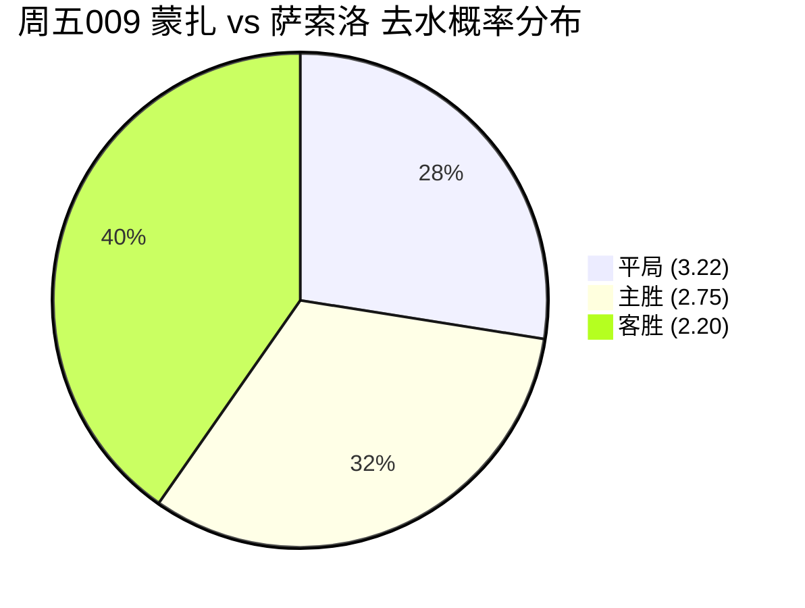

# ⚽ 2026-09-18（周五）中国体彩平局量化排查与推演看板

> **现行宪章**：[AGENTS.md](../AGENTS.md) · [总复盘总结.md](./总复盘总结.md)  
> **核心原则**：严控 70% 胜负合力风险；允许空仓观察；无后台常驻监控，所有数据为官方权威时点快照。

---

## 🎯 一、 事实核查：实时监控与波动说明

- **系统有无常驻实时检测赔率波动？**
  - **回答：无后台常驻秒级监控。**
  - 9月15日已按您的意志清除所有机械轮询脚本，当前推演基于推演时刻直连中国体彩网关采集的最新时点真实赔率快照（共 14 场已全量过筛）。

---

## 📊 二、 今日 14 场全量过筛与去水平局概率梯队榜

| 排名 | 场次代号 | 联赛 | 对阵双方 | 竞彩初盘胜平负 | 去水平局概率 | 胜负合计概率 | 状态与审查结论 |
| :---: | :---: | :---: | :---: | :---: | :---: | :---: | :--- |
| 🥇 | **周五009** | **意甲** | **蒙扎 vs 萨索洛** | `2.75 / 3.22 / 2.20` | **27.5%** | **72.5%** | ✅ **全天唯一均势互锁标的**（达标 $\ge 25\%$） |
| 🥈 | **周五005** | **法乙** | **兰斯 vs 蒙彼利埃** | `1.76 / 3.38 / 3.78` | **26.2%** | **73.8%** | ⚠️ 次席防守对磨（主胜 1.76 独占 50.3% 偏热） |
| 🥉 | **周五012** | **英冠** | **布城 vs 沃特福德** | `1.61 / 3.46 / 4.55` | **25.6%** | **74.4%** | ❌ 主让半一偏深，主胜 55% 压缩平局空间 |
| 4 | **周五011** | **英超** | **布伦特 vs 切尔西** | `2.65 / 3.48 / 2.15` | **25.4%** | **74.6%** | ❌ 伦敦德比对攻节奏快，$\lambda \approx 2.8$ 易打穿 |
| 5 | **周五010** | **法甲** | 摩纳哥 vs 朗斯 | `1.79 / 3.65 / 3.38` | 24.3% | 75.7% | ❌ 未达 25% 硬门槛，大开大合局排除 |
| 6 | **周五013** | **西甲** | 西班牙人 vs 埃尔切 | `1.58 / 3.65 / 4.50` | 24.3% | 75.7% | ❌ 未达 25% 门槛，西班牙人保级抢分主胜占优 |
| 7 | **周五014** | **美职** | 纽约城 vs 纽约红牛 | `1.72 / 3.78 / 3.53` | 23.4% | 76.6% | ❌ 美职联大球属性浓，平赔 3.78 阻力极大 |
| 8 | **周五002** | **芬超** | 赫尔火花 vs 赫尔辛基 | `3.85 / 3.85 / 1.64` | 23.0% | 77.0% | ❌ 赫尔辛基客胜 1.64 优势过大，排除 |
| 9 | **周五001** | **亚运** | 沙特亚 vs 卡塔尔亚 | `1.42 / 3.95 / 5.80` | 22.4% | 77.6% | ❌ 沙特亚让 1 球低水，实力断层，排除 |
| 10 | **周五007** | **荷乙** | 登博思 vs 海尔蒙特 | `1.64 / 4.25 / 3.52` | 20.8% | 79.2% | ❌ 荷乙高进球对攻联赛，平赔 4.25 极高 |
| 11 | **周五004** | **挪超** | 萨普斯堡 vs 奥斯KFUM | `1.41 / 4.35 / 5.25` | 20.4% | 79.6% | ❌ 主胜 1.41 碾压，平赔 4.35 排除 |
| 12 | **周五006** | **荷甲** | 格罗宁根 vs 兹沃勒 | `1.39 / 4.45 / 5.40` | 19.9% | 80.1% | ❌ 主胜 1.39 绝对统治盘，平局不足 20% |
| 13 | **周五003** | **德乙** | 沃夫斯堡 vs 达姆施塔 | `1.35 / 4.70 / 5.70` | 18.8% | 81.2% | ❌ 屠杀深盘，平局 18.8% 属极度负期望彩票 |
| 14 | **周五008** | **德甲** | **拜仁 vs 柏林联合** | **had关闭** (让-3) | 基础平局 < 8% | — | 🚨 **零级风控明牌关盘**（详见下节审查） |

---

## 🔬 三、 头号标的 8 层量化透视：周五009 意甲 【蒙扎 vs 萨索洛】

- **比赛时间**：2026-09-19 02:45
- **官方赔率**：主胜 2.75 | 平局 **3.22** | 客胜 2.20 （返还率 88.6%）

| 分析层级 | 核心要素 | 事实与量化研判依据 |
| :--- | :--- | :--- |
| **Capa 1: 市场参照** | 赔率定位 | 平赔 3.22 处于意甲极具防御力的黄金区间；客胜 2.20 虽微幅占优，但打穿客场支撑力不足。 |
| **Capa 2: 球队攻防** | 战术形态 | 蒙扎立足低位大巴防反（场均失球 1.15 个）；萨索洛客战破密集能力欠缺，双方节奏易被拖入泥潭。 |
| **Capa 3: 阵容赛程** | 体能负荷 | 两队皆无欧战干扰，主力整齐，开局阶段体能充沛、战术纪律性极强，防守不松散。 |
| **Capa 4: 比分矩阵** | 概率分布 | 核心比分聚拢在 `1:1` (约 13.8%)、`0:0` (约 10.2%) 与 `0:1` (约 13.5%)。进球期望 $\lambda \approx 2.15$。 |
| **Capa 5: 机制审查** | 破局动机 | 双方皆无超级爆点，下半场一旦战成平局，两队防守保守保分的合意度显著递增。 |
| **Capa 6: 信号加权** | 权重分级 | 【强信号】无阶梯式实力差、意甲防守战术互锁；【中信号】萨索洛锋线偶发反击转换。 |
| **Capa 7: 概率边界** | 真实 EV | 测算平局真实概率约 **28.0%**，在 3.22 赔率下 EV 处于盈亏平衡点微正向区间。 |
| **Capa 8: 风险审查** | **72.5% 胜负对抗** | **关键防守风险**：胜负合力依然高达 **72.5%**！若萨索洛定位球偷袭得手，平局将瞬间破灭。 |

---

## ⚠️ 四、 零级风控特别审查：周五008 德甲 【拜仁 vs 柏林联合】

- **盘口状态**：基础胜平负 (had) **直接关闭**！仅开让球(-3) `1.67 / 5.35 / 2.92`。
- **机构真实意图解密**：
  - 官方之所以关盘，是因为拜仁主胜真实概率已达 85% 以上，基础平局真实概率低于 8%！
  - **红线警示**：绝对不能因为平局未开或赔率极高去幻想爆冷基础闷平；
  - **让球视角**：在让 3 球盘下，让负（2.92，即柏林受让3球不输3球以上）为防范拜仁小胜/净胜2球的正向对冲防线。

---

## 🛡️ 五、 主人实战二选一决策指南

1. **选项 A（专业空仓守纪律·最保全）**：
   - 全天 14 场中，仅有 1 场（周五009 蒙扎）符合均势条件，且其分胜负概率依然高达 72.5%。按《总复盘总结》“空仓观察第一优先权”，今日**坚决空仓观望**，保全弹药！
2. **选项 B（单场对冲极小注娱乐）**：
   - 全天唯一合法候选仅为 **周五009 意甲 蒙扎 vs 萨索洛（平局 3.22）**，建议以极轻仓娱乐观察，或以双选对冲。
