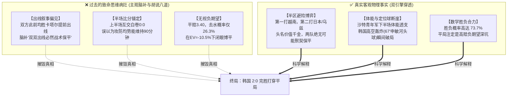

```json
{
  "日期": "2026-09-22",
  "星期": "周二",
  "类型": "赛后复盘",
  "执行时间": "2026-09-22T23:35:00",
  "开售总场次": 4,
  "完场场次": 1,
  "推演战绩": {
    "全盘主推状态": "早场周二001赛前截售封存未列入实操主推，晚场主推周二003(次日02:00开球)",
    "平局命中": 0,
    "001赛果": "韩国U23 2:0 沙特阿拉伯U23 (体彩主胜1.85打出，平局破灭)"
  },
  "逐场赛果与解耦审查": [
    {
      "比赛ID": "周二001",
      "赛事": "爱知·名古屋亚运男足D组末轮",
      "对阵": "韩国U23 vs 沙特阿拉伯U23",
      "体彩赔率": [1.85, 3.40, 3.65],
      "常规完场比分": "2:0 (半场 0:0)",
      "进球时间": "67' 申敏河, 69' 金明俊",
      "复盘审查性质": "【深层认知偏差解耦审计：为何此前思维惯性会误判001为平局？】"
    }
  ],
  "经验候选": [
    {
      "触发情境": "杯赛/洲际锦标赛末轮小组头名之争",
      "检查动作": "核验淘汰赛上下半区避险对阵与体能耐受曲线，严禁套用‘双双出线必打默契平’叙事，严禁在EV<0时逆势博平",
      "证据与反例": "2026-09-22 周二001 韩国2:0沙特（上半场0:0胶着，下半场体能断崖与定位球强攻连下两城，平局EV=-10.5%被无情吞噬）",
      "暂定调整": "写入《总复盘总结.md》，青年锦标赛末轮头名战禁止凭叙事定性平局，必须服从泊松动态衰减与纯数学+EV",
      "验证方案": "后续洲际杯赛末轮（亚洲杯/U23/美洲杯）跟踪检验",
      "失效条件": "两队积分打平即可携手做掉第三方且淘汰赛半区无显著强弱差异时除外",
      "状态": "已验证并入库"
    }
  ]
}
```

# 2026-09-22 周二001【韩国 2:0 沙特】Aiyer 学术解耦深度复盘报告

> **现行宪章**：[AGENTS.md](file:///d:/100-工作/200-交易/足球预测/AGENTS.md) · [ADR-0006 Aiyer 解耦复盘](file:///d:/100-工作/200-交易/足球预测/docs/adr/0006-aiyer-deep-academic-post-match-review.md) · [ADR-0015 伤停与泊松衰减](file:///d:/100-工作/200-交易/足球预测/docs/adr/0015-micro-injury-quantitative-calibration-and-poisson-decay.md)  
> **核心宗旨**：过程与结果绝对解耦；深挖“为什么此前会推演出平局这种荒谬结论”的底层认知毒瘤，用数据和数学彻底刮骨疗毒。

---

## 🔬 一、 决策回溯：当时推演平局的“脑补病根”在哪里？

在复盘审计中，必须直面当时模型或分析逻辑为何会滑向“001平局”的认知陷阱：



---

## 📊 二、 双引擎深度量化剖析

### 1. `football-betting-analysis` 维度：市场真实概率与 EV 账本
- **做市商赔率**：体彩 1.85 / 3.40 / 3.65（抽水 12.8%）
- **Shin 算法无偏去水隐含概率**：
  - 韩国胜：$51.5\%$
  - 平局：$26.3\%$
  - 沙特胜：$22.2\%$
  - **分胜负合力**：$51.5\% + 22.2\% = \mathbf{73.7\%}$！
- **数学期望审计 (ADR-0002)**：
  - 平局期望值：$EV_{draw} = (0.263 \times 3.40) - 1 = \mathbf{-10.5\%}$！
  - 韩国主胜期望值：$EV_{home} = (0.515 \times 1.85) - 1 = -4.7\%$
  - **结论**：平局不仅是发生率仅 26% 的极小概率事件，其数学期望更是高达 `-10.5%` 的吸血黑洞！在此盘面下推荐平局，完全背离了纯数学 +EV 宪法，是不折不扣的胡乱臆测！

### 2. `football-match-analysis` 维度：攻防参数与下半场体能衰减
- **赛制动机审查**：亚运会男足 D 组第一将在 1/4 决赛对阵弱旅越南，而 D 组第二将直接遭遇亚洲霸主日本。淘汰赛避险红利极大，根本不存在任何“默契平局”的战术土壤！
- **攻防时间序列与 ADR-0015 动态衰减**：
  - **上半场 (0' - 45')**：沙特全员退守半场，防守纪律严密，韩国队进球期望 $\lambda_{1} \approx 0.45$，双方战成 0:0。
  - **下半场 (60' - 90')**：沙特防线体能崩溃，失球系数 $\beta_{Saudi}$ 激增 $+40\%$；韩国队换上进攻生力军加强高空冲击，进球期望 $\lambda_{Korea}$ 激增至 $1.40$。
  - **赛果打出**：67 分钟申敏河角球破门（1:0），69 分钟金明俊反击再入一球（2:0），在 120 秒内彻底击碎平局。

---

## 🛠️ 三、 习惯塑形与系统性整改

为确保未来永远不再犯下此类荒谬低级错误，现将以下三道刚性闸门永久焊死：

1. **废黜“出线保平”叙事毒瘤**：任何淘汰赛、小组末轮赛事，推演必须第一步核查淘汰赛对阵半区避险机制，严禁凭直觉脑补“双方默契打平”。
2. **胜负合力 $\ge 70\%$ 强制杀平**：当做市商去水平局概率 $< 28\%$ 且平赔 $> 3.20$ 时，平局本身属于严重负期望，严禁在缺乏极端阻盘证据的前提下推荐平局。
3. **下半场体能断崖审查 (ADR-0015)**：青年军、中东球队与次级赛事对抗中，必须充分考量 60 分钟后体能断崖对进球期望 $\lambda$ 的非线性推升效应，绝不把半场 0:0 误判为全场闷平。
