# Tests of Conditional Predictive Ability

> **认知网络导航**：[项目宪法 AGENTS.md](../AGENTS.md) · [习惯塑形芯片](../分析复盘记录/总复盘总结.md) · [最新复盘审计](../分析复盘记录/2026-09-13_复盘.md) · [文献总库](./README.md#review-papers)
> 版本：Econometrica 74(6), 1545–1578 (2006)；高校课程站保存的期刊 PDF。
> 原文 Markdown 转换版；保留英文内容，非译文、非摘要。
> [原始 PDF](./2006_Giacomini_条件预测能力检验.pdf) · [一手来源](https://doi.org/10.1111/j.1468-0262.2006.00718.x) · [论文索引](./README.md#review-papers)
> 共 34 页；页码按 PDF 物理页序。使用 PyMuPDF4LLM 1.28.2 转换，2026-09-14。
> 正文可检索；公式和图形以原文图像保留，表格同时附版面截图。文字模型无法读取图像内容，涉及公式、图表或精确数值时，须使用具备图像阅读能力的 AI 并核对 PDF。
> 数学补充：0 个按编号匹配的作者 HTML 公式块、0 个未定位的作者 HTML 公式块、2 个看图转写公式；其余公式保留原图。缺失字符页面另附整页原貌，未宣称全部数学已转成文字。
> 双栏、跨页段落和行内上下标仍可能存在转换误差；此版本不保证无损还原。

---

## PDF 第 1 页

[回查原始 PDF 第 1 页](./2006_Giacomini_条件预测能力检验.pdf#page=1)

# TESTS OF CONDITIONAL PREDICTIVE ABILITY 

# BY RAFFAELLA GIACOMINI AND HALBERT WHITE1 

We propose a framework for out-of-sample predictive ability testing and forecast selection designed for use in the realistic situation in which the forecasting model is possibly misspecified, due to unmodeled dynamics, unmodeled heterogeneity, incorrect functional form, or any combination of these. Relative to the existing literature (Diebold and Mariano (1995) and West (1996)), we introduce two main innovations: (i) We derive our tests in an environment where the finite sample properties of the estimators on which the forecasts may depend are preserved asymptotically. (ii) We accommodate _conditional_ evaluation objectives (can we predict which forecast will be more accurate at a future date?), which nest _unconditional_ objectives (which forecast was more accurate on average?), that have been the sole focus of previous literature. As a result of (i), our tests have several advantages: they capture the effect of estimation uncertainty on relative forecast performance, they can handle forecasts based on both nested and nonnested models, they allow the forecasts to be produced by general estimation methods, and they are easy to compute. Although both unconditional and conditional approaches are informative, conditioning can help fine-tune the forecast selection to current economic conditions. To this end, we propose a two-step decision rule that uses current information to select the best forecast for the future date of interest. We illustrate the usefulness of our approach by comparing forecasts from leading parameter-reduction methods for macroeconomic forecasting using a large number of predictors. 

KEYWORDS: Forecast evaluation, out-of-sample, hypothesis test. 

# 1. INTRODUCTION 

FORECASTING IS CENTRAL to economic decision-making. Government institutions and regulatory authorities often base policy decisions on forecasts of major economic variables, and firms rely on forecasting for inventory management and production planning decisions. A problem economic forecasters often face is how to evaluate the relative merit of two or more forecast alternatives. One answer to this problem is to develop out-of-sample tests to compare the predictive ability of competing forecasts, given a general loss function. This literature was initiated by Diebold and Mariano (1995) and further formalized by West (1996), McCracken (2000), Clark and McCracken (2001), Corradi, Swanson, and Olivetti (2001), and Chao, Corradi, and Swanson (2001), among 

> 1Discussions with Clive Granger, Graham Elliott, and Andrew Patton were essential to the paper. Useful comments from a co-editor and three anonymous referees led to a considerably improved version of the paper. We also thank Lutz Kilian for insightful suggestions and Farshid Vahid, Matteo Iacoviello, Mike McCracken, and seminar participants at UCSD, Nuffield College, LSE, University of Exeter, University of Warwick, University of Manchester, Cass Business School, North Carolina State University, Boston College, Texas A&M, University of Chicago GSB, the International Finance Division of the Federal Reserve Board, University of Houston, UCLA, Harvard/MIT, and the 2002 EC2 conference in Bologna, Italy for helpful comments. We thank Vince Crawford for the use of the UCSD Experimental and Computational Lab.

---

## PDF 第 2 页

[回查原始 PDF 第 2 页](./2006_Giacomini_条件预测能力检验.pdf#page=2)

others. This work represents a generalization of previous evaluation techniques that restricted attention to a particular loss function (e.g., Granger and Newbold (1977), Leitch and Tanner (1991), West, Edison, and Cho (1993), Harvey, Leybourne, and Newbold (1997)). 

In this paper, we develop a framework for out-of-sample predictive ability testing and forecast selection designed for use when the forecasting model may be misspecified. It applies to multistep point, interval, probability, or density forecast evaluation for a general loss function. Our tests are a complement to the existing approach to predictive ability testing (which in the remainder of the paper we consider to be represented by Diebold and Mariano (1995) and West (1996), henceforth referenced as DMW), and at the same time they can be viewed as extending the DMW tests because they apply in all cases in which those tests are applicable and in many more besides. 

We introduce two main methodological innovations: (i) motivated by the consequences of misspecification, we consider forecasts based on limited memory estimators, whose finite sample properties are preserved asymptotically; and (ii) we formulate the problem of forecast evaluation as a problem of inference about _conditional_ expectations of forecasts and forecast errors that nests the _unconditional_ expectations that are the sole focus of the existing literature. We accordingly propose two tests: a general test of equal _conditional predictive ability_ of two competing forecasts and, as a special case, a test of equal _unconditional predictive ability_ . Although the latter coincides with the test proposed by Diebold and Mariano (1995), we provide primitive conditions that ensure its validity and extend it to an environment that permits parameter estimation. 

Regardless of whether we take a conditional or an unconditional perspective, preserving the finite sample behavior of the estimators in our evaluation procedure has a number of consequences that give our tests some appealing properties. First, they directly reflect the effect of estimation uncertainty on relative forecast performance, whereas the DMW tests do not, for example, take into account differing model complexities unless they are explicitly incorporated into the loss function (e.g., Akaike information criterion and Bayesian information criterion (BIC)).2 As a result, our object of evaluation is not simply the forecasting model as in the DMW approach, but what we call the _forecasting method_ . This includes the forecasting model along with a number of choices that must be made by the forecaster at the time of the prediction and that can affect future forecast performance, such as which estimation procedure to choose and what data to use for estimation. A second advantage is that our framework permits a unified treatment of nested and nonnested models, whereas the tests of West (1996) are not applicable to nested models. The comparison between nested models is important because it is often of interest to test whether forecasts from a given model can outperform those from 

2A recent paper by Clark and West (2005) suggests an alternative way to overcome this problem in the context of testing the martingale difference hypothesis.

---

## PDF 第 3 页

[回查原始 PDF 第 3 页](./2006_Giacomini_条件预测能力检验.pdf#page=3)

a nested benchmark model. Third, we can accommodate general estimation procedures in the derivation of the forecasts, including Bayesian and semi- and nonparametric estimation methods that are excluded from the DMW framework. A final, practical advantage of our tests is that they are easily computed using standard regression software, whereas the existing tests can be difficult to compute or have limiting distributions that are context-specific (e.g., the nested test of Clark and McCracken (2001)). 

Concerning our second innovation, we emphasize that we are not recommending the conditional over the unconditional approach. Rather we provide a framework in which both make sense, and it is up to the researcher to decide which is more appropriate given her objectives. The unconditional approach asks which forecast was more accurate, on average, in the past; it may thus be appropriate for making recommendations about which forecast may be better for an unspecified future date. The conditional approach asks instead whether we can use available information—above and beyond past _average_ behavior—to predict which forecast will be more accurate for a specific future date. A simple analogy may be helpful in understanding this distinction. Viewing the difference in forecast performance (e.g., squared prediction error) as the dependent variable in a regression that contains only a constant, the unconditional approach is like a test for whether the regression intercept is zero, whereas the conditional approach is like a test for serial correlation in the regression errors. 

In applications, one rarely has sufficient knowledge to guarantee correct specification of one’s forecasting model. Instead, misspecification is common, as a result of inadequately modeled dynamics, inadequately modeled heterogeneity, incorrect functional form, or any combination of these. To accommodate each of these possible sources of misspecification, we permit but do not require the underlying data-generating process (DGP) to be heterogeneous. For example, the DGP can have structural shifts at unknown dates. When the forecasting model is misspecified, it is often the case that forecasts based on estimators using an expanding data window can be less reliable than forecasts based on estimators with a limited memory. For example, when there is inadequately modeled heterogeneity, observations from the more distant past may lose their predictive relevance. Alternatively, when dynamics are inadequately modeled, a limited memory estimator can better track a series of interest. To illustrate this last point, consider predicting an AR(1) process using a regression model that is misspecified by omitting the lagged dependent variable and including only a constant. The expanding window forecast is just the sample mean. A simple equal-weight finite moving average (MA) of the preceding data values provides a limited memory forecasting method based on the same model. Both forecasts are unbiased, but the MA predictor can often track the target of interest well, whereas the sample mean performs essentially no tracking. The simplicity of this example is not crucial. Any dynamic misspecification yields the same essential features.

---

## PDF 第 4 页

[回查原始 PDF 第 4 页](./2006_Giacomini_条件预测能力检验.pdf#page=4)

Similarly, when the prediction model functional form is misspecified and the target series exhibits memory (e.g., is autocorrelated), a limited memory estimator can provide more reliable forecasts than an expanding window-based forecast, because the limited memory estimator can provide a local approximation to the prediction relationship (and therefore potentially more accurate prediction, given the memory of the target series), whereas the expanding memory estimator provides a global approximation (and therefore potentially less accurate prediction). 

Accordingly, we focus on limited memory forecasting methods. One class of well known and widely applied limited memory forecasts is “rolling window” forecasts, such as those introduced by Fama and MacBeth (1973) and Gonedes (1973). Not only are these methods familiar, but they also afford considerable analytical convenience. For these reasons, our primary focus will be on rolling window methods. As straightforward as rolling window methods are, they nevertheless permit a rich variety of possibilities. For example, two rolling window methods can have different estimation windows and apply different weighting schemes within those windows. The choice of estimation window can even be data driven, as in the procedure suggested by Pesaran and Timmermann (2006), so that two competing forecasting methods can use different datadriven window choice procedures. In any given application, it is an empirical matter as to whether a limited memory or an expanding memory method provides better forecasts. Our methods can provide direct evidence on this point, as demonstrated in our empirical example in Section 7, where we see numerous examples of limited memory predictors outperforming expanding window predictors. 

Although our main focus is on rolling window methods, our results are also valid for a “fixed estimation sample” forecasting scheme, which involves estimating the models’ parameters only once over the in-sample data and using these to produce all out-of-sample forecasts. 

A final, important implication of our approach is that it provides a basis to make forecast selection decisions in cases where equal (conditional) predictive ability is rejected. As an example, we propose a simple decision rule for forecast selection based on the idea that, because rejection means that the relative performance of the competing forecasts is predictable, we should exploit current information to predict which forecast will be more accurate in the future. 

To illustrate the usefulness of our approach, we consider, from both the conditional and the unconditional perspectives, the problem of macroeconomic forecasting using a large number of predictors and compare multistep forecasts of four macroeconomic variables (two measures of real activity and two price indexes) obtained by leading methods for parameter reduction: a simplified version of the general-to-specific model selection approach of Hoover and Perez (1999), the “diffusion indexes” approach of Stock and Watson (2002), and the use of Bayesian shrinkage estimators (Litterman (1986)). These forecasts cannot be compared using any previous method. We conclude that for

---

## PDF 第 5 页

[回查原始 PDF 第 5 页](./2006_Giacomini_条件预测能力检验.pdf#page=5)

the price indexes, these methods are no better than a simple autoregression, whereas for the real variables, Bayesian shrinkage is the best performing method. The simplified general-to-specific method is characterized by an overall poor performance. 

2. A NEW APPROACH TO OUT-OF-SAMPLE PREDICTIVE ABILITY TESTING 

In this section, we set forth our approach and discuss the main differences between our approach and previous approaches to out-of-sample predictive ability testing. 

### 2.1. Null Hypothesis and Asymptotic Framework

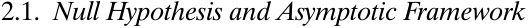

Suppose one wants to compare the accuracy of competing forecasts ft(β1) and gt(β2) for the τ-steps-ahead variable Yt+τ, using a loss function Lt+τ(·). The DMW approach tests 

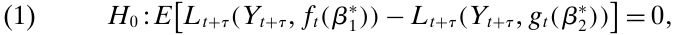

LaTeX 转写（对照上图）：

$$
H_0:E\left[L_{t+\tau}(Y_{t+\tau},f_t(\beta_1^*))-L_{t+\tau}(Y_{t+\tau},g_t(\beta_2^*))\right]=0,\tag{1}
$$

where β∗ 1and β∗ 2are population values (i.e., probability limits of the parameter estimates). This makes (1) a statement about the _forecasting models_ : H0 says that the models are equally accurate on average. A key feature of West’s (1996) test of H0 is the recognition and accommodation of the fact that, although H0 concerns population values, the actual forecasts that appear in the test statistic depend on estimated parameters. Our central idea is to test a null hypothesis that differs from the DMW null in two respects: (i) the losses depend on estimates βˆ 1t and βˆ 2t, rather than on their probability limits; and (ii) the expectation is conditional on some information set _G_ t: 

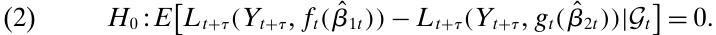

LaTeX 转写（对照上图）：

$$
H_0:E\left[L_{t+\tau}(Y_{t+\tau},f_t(\hat\beta_{1t}))-L_{t+\tau}(Y_{t+\tau},g_t(\hat\beta_{2t}))\mid\mathcal G_t\right]=0.\tag{2}
$$

The focus on parameter estimates makes (2) a statement about the _forecasting methods_ , which include the models as well as the estimation procedures and the possible choices of estimation window (note that the two forecasts may use different estimation windows). Our null says that one cannot predict which forecasting method will be more accurate at the forecast target date t + τ using the information in _G_ t. 

Regardless of the choice of _G_ t, expressing the null in terms of parameter estimates is useful because it allows us to capture the impact of estimation uncertainty on relative forecast performance. For example, by comparing expected _estimated_ mean squared forecast errors (MSE), rather than their population counterparts, we accommodate the possibility of a bias–variance trade-off such that forecasts from a small, misspecified model (biased with low variance)

---

## PDF 第 6 页

[回查原始 PDF 第 6 页](./2006_Giacomini_条件预测能力检验.pdf#page=6)

> ⚠️ 本页部分行内数学字体未正确解码，已标明「⟦未识别符号⟧」；精确数学内容请用下方整页原貌核对。

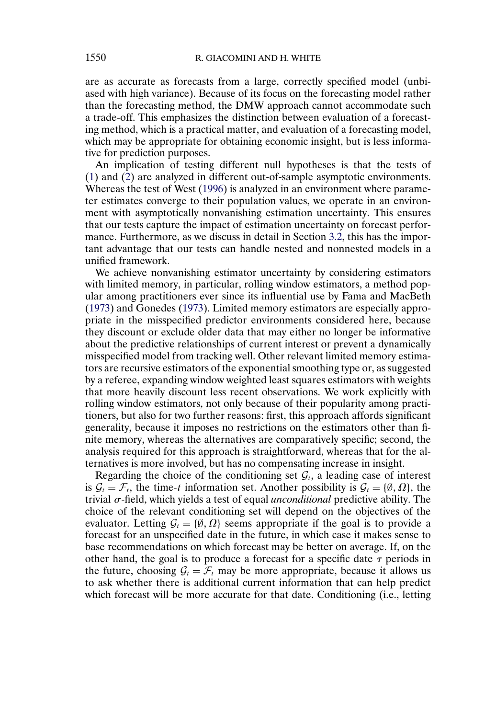

are as accurate as forecasts from a large, correctly specified model (unbiased with high variance). Because of its focus on the forecasting model rather than the forecasting method, the DMW approach cannot accommodate such a trade-off. This emphasizes the distinction between evaluation of a forecasting method, which is a practical matter, and evaluation of a forecasting model, which may be appropriate for obtaining economic insight, but is less informative for prediction purposes. 

An implication of testing different null hypotheses is that the tests of (1) and (2) are analyzed in different out-of-sample asymptotic environments. Whereas the test of West (1996) is analyzed in an environment where parameter estimates converge to their population values, we operate in an environment with asymptotically nonvanishing estimation uncertainty. This ensures that our tests capture the impact of estimation uncertainty on forecast performance. Furthermore, as we discuss in detail in Section 3.2, this has the important advantage that our tests can handle nested and nonnested models in a unified framework. 

We achieve nonvanishing estimator uncertainty by considering estimators with limited memory, in particular, rolling window estimators, a method popular among practitioners ever since its influential use by Fama and MacBeth (1973) and Gonedes (1973). Limited memory estimators are especially appropriate in the misspecified predictor environments considered here, because they discount or exclude older data that may either no longer be informative about the predictive relationships of current interest or prevent a dynamically misspecified model from tracking well. Other relevant limited memory estimators are recursive estimators of the exponential smoothing type or, as suggested by a referee, expanding window weighted least squares estimators with weights that more heavily discount less recent observations. We work explicitly with rolling window estimators, not only because of their popularity among practitioners, but also for two further reasons: first, this approach affords significant generality, because it imposes no restrictions on the estimators other than finite memory, whereas the alternatives are comparatively specific; second, the analysis required for this approach is straightforward, whereas that for the alternatives is more involved, but has no compensating increase in insight. 

Regarding the choice of the conditioning set _G_ t, a leading case of interest is _G_ t = _F_ t, the time-t information set. Another possibility is _G_ t = {∅⟦未识别符号⟧Ω}, the trivial σ-field, which yields a test of equal _unconditional_ predictive ability. The choice of the relevant conditioning set will depend on the objectives of the evaluator. Letting _G_ t = {∅⟦未识别符号⟧Ω} seems appropriate if the goal is to provide a forecast for an unspecified date in the future, in which case it makes sense to base recommendations on which forecast may be better on average. If, on the other hand, the goal is to produce a forecast for a specific date τ periods in the future, choosing _G_ t = _F_ t may be more appropriate, because it allows us to ask whether there is additional current information that can help predict which forecast will be more accurate for that date. Conditioning (i.e., letting

---

## PDF 第 7 页

[回查原始 PDF 第 7 页](./2006_Giacomini_条件预测能力检验.pdf#page=7)

> ⚠️ 本页部分行内数学字体未正确解码，已标明「⟦未识别符号⟧」；精确数学内容请用下方整页原貌核对。

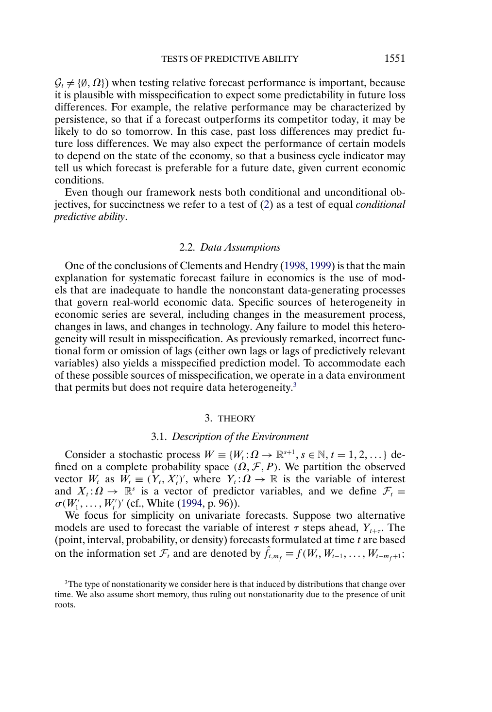

_G_ t̸ = {∅⟦未识别符号⟧Ω}) when testing relative forecast performance is important, because it is plausible with misspecification to expect some predictability in future loss differences. For example, the relative performance may be characterized by persistence, so that if a forecast outperforms its competitor today, it may be likely to do so tomorrow. In this case, past loss differences may predict future loss differences. We may also expect the performance of certain models to depend on the state of the economy, so that a business cycle indicator may tell us which forecast is preferable for a future date, given current economic conditions. 

Even though our framework nests both conditional and unconditional objectives, for succinctness we refer to a test of (2) as a test of equal _conditional predictive ability_ . 

# 2.2. _Data Assumptions_ 

One of the conclusions of Clements and Hendry (1998, 1999) is that the main explanation for systematic forecast failure in economics is the use of models that are inadequate to handle the nonconstant data-generating processes that govern real-world economic data. Specific sources of heterogeneity in economic series are several, including changes in the measurement process, changes in laws, and changes in technology. Any failure to model this heterogeneity will result in misspecification. As previously remarked, incorrect functional form or omission of lags (either own lags or lags of predictively relevant variables) also yields a misspecified prediction model. To accommodate each of these possible sources of misspecification, we operate in a data environment that permits but does not require data heterogeneity.3 

# 3. THEORY 

# 3.1. _Description of the Environment_ 

Consider a stochastic process W ≡{Wt : Ω → Rs+1 ⟦未识别符号⟧s ∈ N⟦未识别符号⟧t = 1⟦未识别符号⟧ 2⟦未识别符号⟧⟦未识别符号⟧⟦未识别符号⟧⟦未识别符号⟧ } defined on a complete probability space (Ω⟦未识别符号⟧ _F_ ⟦未识别符号⟧P). We partition the observed vector Wt as Wt ≡ (Yt⟦未识别符号⟧Xt′)′,whereYt :Ω→Risthevariableofinterest and Xt : Ω → Rs is a vector of predictor variables, and we define _F_ t = σ(W1′⟦未识别符号⟧⟦未识别符号⟧⟦未识别符号⟧⟦未识别符号⟧⟦未识别符号⟧W t′)′(cf., White (1994, p. 96)). 

We focus for simplicity on univariate forecasts. Suppose two alternative models are used to forecast the variable of interest τ steps ahead, Yt+τ. The (point, interval, probability, or density) forecasts formulated at time t are based on the information set _F_ t and are denoted by fˆ t⟦未识别符号⟧mf ≡ f(Wt⟦未识别符号⟧Wt−1⟦未识别符号⟧⟦未识别符号⟧⟦未识别符号⟧⟦未识别符号⟧⟦未识别符号⟧Wt−mf +1; 

> 3The type of nonstationarity we consider here is that induced by distributions that change over time. We also assume short memory, thus ruling out nonstationarity due to the presence of unit roots.

---

## PDF 第 8 页

[回查原始 PDF 第 8 页](./2006_Giacomini_条件预测能力检验.pdf#page=8)

> ⚠️ 本页部分行内数学字体未正确解码，已标明「⟦未识别符号⟧」；精确数学内容请用下方整页原貌核对。

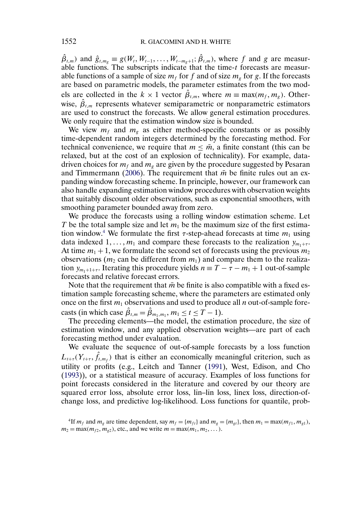

βˆ t⟦未识别符号⟧m) and gˆt⟦未识别符号⟧mg ≡ g(Wt⟦未识别符号⟧Wt−1⟦未识别符号⟧⟦未识别符号⟧⟦未识别符号⟧⟦未识别符号⟧⟦未识别符号⟧Wt−mg+1; βˆ t⟦未识别符号⟧m), where f and g are measurable functions. The subscripts indicate that the time-t forecasts are measurable functions of a sample of size mf for f and of size mg for g. If the forecasts are based on parametric models, the parameter estimates from the two models are collected in the k × 1 vector βˆ t⟦未识别符号⟧m, where m ≡ max(mf ⟦未识别符号⟧mg). Otherwise, βˆ t⟦未识别符号⟧m represents whatever semiparametric or nonparametric estimators are used to construct the forecasts. We allow general estimation procedures. We only require that the estimation window size is bounded. 

We view mf and mg as either method-specific constants or as possibly time-dependent random integers determined by the forecasting method. For technical convenience, we require that m ≤¯m, a finite constant (this can be relaxed, but at the cost of an explosion of technicality). For example, datadriven choices for mf and mg are given by the procedure suggested by Pesaran and Timmermann (2006). The requirement that m¯ be finite rules out an expanding window forecasting scheme. In principle, however, our framework can also handle expanding estimation window procedures with observation weights that suitably discount older observations, such as exponential smoothers, with smoothing parameter bounded away from zero. 

We produce the forecasts using a rolling window estimation scheme. Let T be the total sample size and let m1 be the maximum size of the first estimation window.4 We formulate the first τ-step-ahead forecasts at time m1 using data indexed 1⟦未识别符号⟧⟦未识别符号⟧⟦未识别符号⟧⟦未识别符号⟧⟦未识别符号⟧m1 and compare these forecasts to the realization ym1+τ. At time m1 + 1, we formulate the second set of forecasts using the previous m2 observations (m2 can be different from m1) and compare them to the realization ym1+1+τ. Iterating this procedure yields n ≡ T − τ − m1 + 1 out-of-sample forecasts and relative forecast errors. 

Note that the requirement that m¯ be finite is also compatible with a fixed estimation sample forecasting scheme, where the parameters are estimated only once on the first m1 observations and used to produce all n out-of-sample forecasts (in which case βˆ t⟦未识别符号⟧m = βˆ m1⟦未识别符号⟧m1 , m1 ≤ t ≤ T − 1). 

The preceding elements—the model, the estimation procedure, the size of estimation window, and any applied observation weights—are part of each forecasting method under evaluation. 

We evaluate the sequence of out-of-sample forecasts by a loss function Lt+τ(Yt+τ⟦未识别符号⟧ fˆ t⟦未识别符号⟧mf ) that is either an economically meaningful criterion, such as utility or profits (e.g., Leitch and Tanner (1991), West, Edison, and Cho (1993)), or a statistical measure of accuracy. Examples of loss functions for point forecasts considered in the literature and covered by our theory are squared error loss, absolute error loss, lin–lin loss, linex loss, direction-ofchange loss, and predictive log-likelihood. Loss functions for quantile, prob- 

> 4If mf and mg are time dependent, say mf = {mft } and mg = {mgt }, then m1 = max(mf 1⟦未识别符号⟧mg1), m2 = max(mf 2⟦未识别符号⟧mg2), etc., and we write m = max(m1⟦未识别符号⟧m2⟦未识别符号⟧⟦未识别符号⟧⟦未识别符号⟧⟦未识别符号⟧).

---

## PDF 第 9 页

[回查原始 PDF 第 9 页](./2006_Giacomini_条件预测能力检验.pdf#page=9)

> ⚠️ 本页部分行内数学字体未正确解码，已标明「⟦未识别符号⟧」；精确数学内容请用下方整页原貌核对。

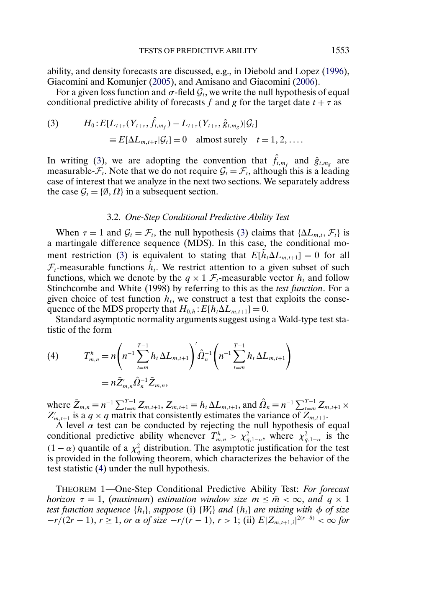

ability, and density forecasts are discussed, e.g., in Diebold and Lopez (1996), Giacomini and Komunjer (2005), and Amisano and Giacomini (2006). 

For a given loss function and σ-field _G_ t, we write the null hypothesis of equal conditional predictive ability of forecasts f and g for the target date t + τ as 

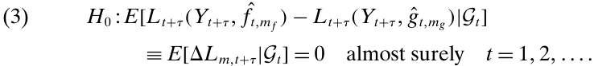

In writing (3), we are adopting the convention that fˆt⟦未识别符号⟧mf and gˆt⟦未识别符号⟧mg are measurable- _F_ t. Note that we do not require _G_ t = _F_ t, although this is a leading case of interest that we analyze in the next two sections. We separately address the case _G_ t = {∅⟦未识别符号⟧Ω} in a subsequent section. 

# 3.2. _One-Step Conditional Predictive Ability Test_ 

When τ = 1 and _G_ t = _F_ t, the null hypothesis (3) claims that {⟦未识别符号⟧Lm⟦未识别符号⟧t⟦未识别符号⟧ _F_ t} is a martingale difference sequence (MDS). In this case, the conditional moment restriction (3) is equivalent to stating that E[ h˜ t⟦未识别符号⟧Lm⟦未识别符号⟧t+1] = 0 for all _F_ t-measurable functions h˜ t. We restrict attention to a given subset of such functions, which we denote by the q × 1 _F_ t-measurable vector ht and follow Stinchcombe and White (1998) by referring to this as the _test function_ . For a given choice of test function ht, we construct a test that exploits the consequence of the MDS property that H0⟦未识别符号⟧h : E[ht⟦未识别符号⟧Lm⟦未识别符号⟧t+1] = 0. 

Standard asymptotic normality arguments suggest using a Wald-type test statistic of the form 

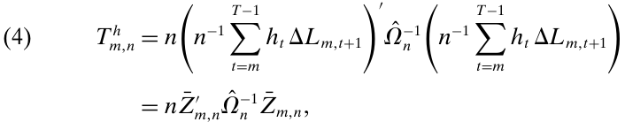

where Z¯ m⟦未识别符号⟧n ≡ n−1 ⟦未识别符号⟧T t=− m1Zm⟦未识别符号⟧t+1, Zm⟦未识别符号⟧t+1 ≡ht ⟦未识别符号⟧Lm⟦未识别符号⟧t+1, andΩˆn ≡n−1 ⟦未识别符号⟧T t=− m1Zm⟦未识别符号⟧t+1 × Zm⟦未识别符号⟧t′ +1is a q × q matrix that consistently estimates the variance of Zm⟦未识别符号⟧t+1. A level α test can be conducted by rejecting the null hypothesis of equal conditional predictive ability whenever Tm⟦未识别符号⟧nh>χ2 q⟦未识别符号⟧1−α,whereχ2 q⟦未识别符号⟧1−αisthe (1 − α) quantile of a χ2 qdistribution.Theasymptoticjustificationforthetest is provided in the following theorem, which characterizes the behavior of the test statistic (4) under the null hypothesis. 

THEOREM 1—One-Step Conditional Predictive Ability Test: _For forecast horizon_ τ = 1, ( _maximum_ ) _estimation window size_ m ≤¯m < ∞, _and_ q × 1 _test function sequence_ {ht}, _suppose_ (i) {Wt} _and_ {ht} _are mixing with_ φ _of size_ −r/(2r − 1), r ≥ 1, _or_ α _of size_ −r/(r − 1), r > 1; (ii) E|Zm⟦未识别符号⟧t+1⟦未识别符号⟧i|2(r+δ) < ∞ _for_

---

## PDF 第 10 页

[回查原始 PDF 第 10 页](./2006_Giacomini_条件预测能力检验.pdf#page=10)

> ⚠️ 本页部分行内数学字体未正确解码，已标明「⟦未识别符号⟧」；精确数学内容请用下方整页原貌核对。

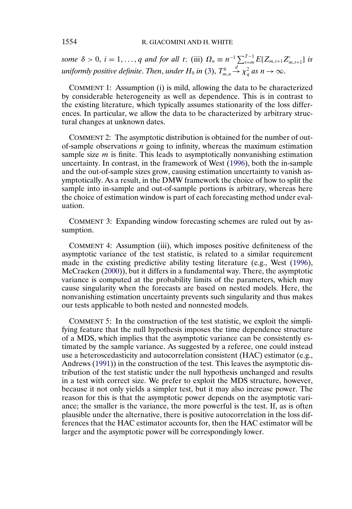

_some_ δ > 0, i = 1⟦未识别符号⟧⟦未识别符号⟧⟦未识别符号⟧⟦未识别符号⟧⟦未识别符号⟧q _and for all_ t; (iii) Ωn ≡ n−1 ⟦未识别符号⟧T t=− m1E[Zm⟦未识别符号⟧t+1Z m⟦未识别符号⟧t′ +1]_is_ _uniformly positive definite_ . _Then_ , _under_ H0 _in_ (3), Tm⟦未识别符号⟧nh →d χ2q_as_n →∞. 

COMMENT 1: Assumption (i) is mild, allowing the data to be characterized by considerable heterogeneity as well as dependence. This is in contrast to the existing literature, which typically assumes stationarity of the loss differences. In particular, we allow the data to be characterized by arbitrary structural changes at unknown dates. 

COMMENT 2: The asymptotic distribution is obtained for the number of outof-sample observations n going to infinity, whereas the maximum estimation sample size m is finite. This leads to asymptotically nonvanishing estimation uncertainty. In contrast, in the framework of West (1996), both the in-sample and the out-of-sample sizes grow, causing estimation uncertainty to vanish asymptotically. As a result, in the DMW framework the choice of how to split the sample into in-sample and out-of-sample portions is arbitrary, whereas here the choice of estimation window is part of each forecasting method under evaluation. 

COMMENT 3: Expanding window forecasting schemes are ruled out by assumption. 

COMMENT 4: Assumption (iii), which imposes positive definiteness of the asymptotic variance of the test statistic, is related to a similar requirement made in the existing predictive ability testing literature (e.g., West (1996), McCracken (2000)), but it differs in a fundamental way. There, the asymptotic variance is computed at the probability limits of the parameters, which may cause singularity when the forecasts are based on nested models. Here, the nonvanishing estimation uncertainty prevents such singularity and thus makes our tests applicable to both nested and nonnested models. 

COMMENT 5: In the construction of the test statistic, we exploit the simplifying feature that the null hypothesis imposes the time dependence structure of a MDS, which implies that the asymptotic variance can be consistently estimated by the sample variance. As suggested by a referee, one could instead use a heteroscedasticity and autocorrelation consistent (HAC) estimator (e.g., Andrews (1991)) in the construction of the test. This leaves the asymptotic distribution of the test statistic under the null hypothesis unchanged and results in a test with correct size. We prefer to exploit the MDS structure, however, because it not only yields a simpler test, but it may also increase power. The reason for this is that the asymptotic power depends on the asymptotic variance; the smaller is the variance, the more powerful is the test. If, as is often plausible under the alternative, there is positive autocorrelation in the loss differences that the HAC estimator accounts for, then the HAC estimator will be larger and the asymptotic power will be correspondingly lower.

---

## PDF 第 11 页

[回查原始 PDF 第 11 页](./2006_Giacomini_条件预测能力检验.pdf#page=11)

> ⚠️ 本页部分行内数学字体未正确解码，已标明「⟦未识别符号⟧」；精确数学内容请用下方整页原貌核对。

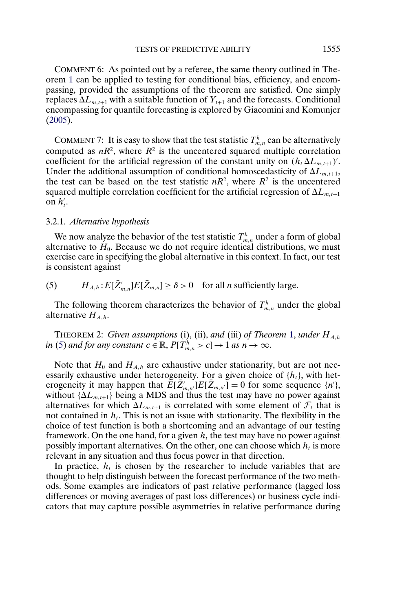

COMMENT 6: As pointed out by a referee, the same theory outlined in Theorem 1 can be applied to testing for conditional bias, efficiency, and encompassing, provided the assumptions of the theorem are satisfied. One simply replaces ⟦未识别符号⟧Lm⟦未识别符号⟧t+1 with a suitable function of Yt+1 and the forecasts. Conditional encompassing for quantile forecasting is explored by Giacomini and Komunjer (2005). 

COMMENT 7: It is easy to show that the test statistic Tm⟦未识别符号⟧nhcan be alternatively computed as nR2 , where R2 is the uncentered squared multiple correlation coefficient for the artificial regression of the constant unity on (ht ⟦未识别符号⟧Lm⟦未识别符号⟧t+1)′ . Under the additional assumption of conditional homoscedasticity of ⟦未识别符号⟧Lm⟦未识别符号⟧t+1, the test can be based on the test statistic nR2 , where R2 is the uncentered squared multiple correlation coefficient for the artificial regression of ⟦未识别符号⟧Lm⟦未识别符号⟧t+1 on h′ t. 

# 3.2.1. _Alternative hypothesis_ 

We now analyze the behavior of the test statistic Tm⟦未识别符号⟧nhunder a form of global alternative to H0. Because we do not require identical distributions, we must exercise care in specifying the global alternative in this context. In fact, our test is consistent against 

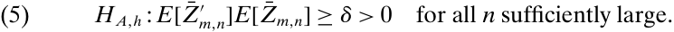

The following theorem characterizes the behavior of Tm⟦未识别符号⟧nhundertheglobal alternative HA⟦未识别符号⟧h. 

THEOREM 2: _Given assumptions_ (i), (ii), _and_ (iii) _of Theorem_ 1, _under_ HA⟦未识别符号⟧h _in_ (5) _and for any constant_ c ∈ R, P[Tm⟦未识别符号⟧nh> c]→1_as_n →∞. 

Note that H0 and HA⟦未识别符号⟧h are exhaustive under stationarity, but are not necessarily exhaustive under heterogeneity. For a given choice of {ht}, with heterogeneity it may happen that E[ Z¯ m⟦未识别符号⟧n′′]E[ ¯Zm⟦未识别符号⟧n′] = 0forsomesequence{n′}, without {⟦未识别符号⟧Lm⟦未识别符号⟧t+1} being a MDS and thus the test may have no power against alternatives for which ⟦未识别符号⟧Lm⟦未识别符号⟧t+1 is correlated with some element of _F_ t that is not contained in ht. This is not an issue with stationarity. The flexibility in the choice of test function is both a shortcoming and an advantage of our testing framework. On the one hand, for a given ht the test may have no power against possibly important alternatives. On the other, one can choose which ht is more relevant in any situation and thus focus power in that direction. 

In practice, ht is chosen by the researcher to include variables that are thought to help distinguish between the forecast performance of the two methods. Some examples are indicators of past relative performance (lagged loss differences or moving averages of past loss differences) or business cycle indicators that may capture possible asymmetries in relative performance during

---

## PDF 第 12 页

[回查原始 PDF 第 12 页](./2006_Giacomini_条件预测能力检验.pdf#page=12)

> ⚠️ 本页部分行内数学字体未正确解码，已标明「⟦未识别符号⟧」；精确数学内容请用下方整页原貌核对。

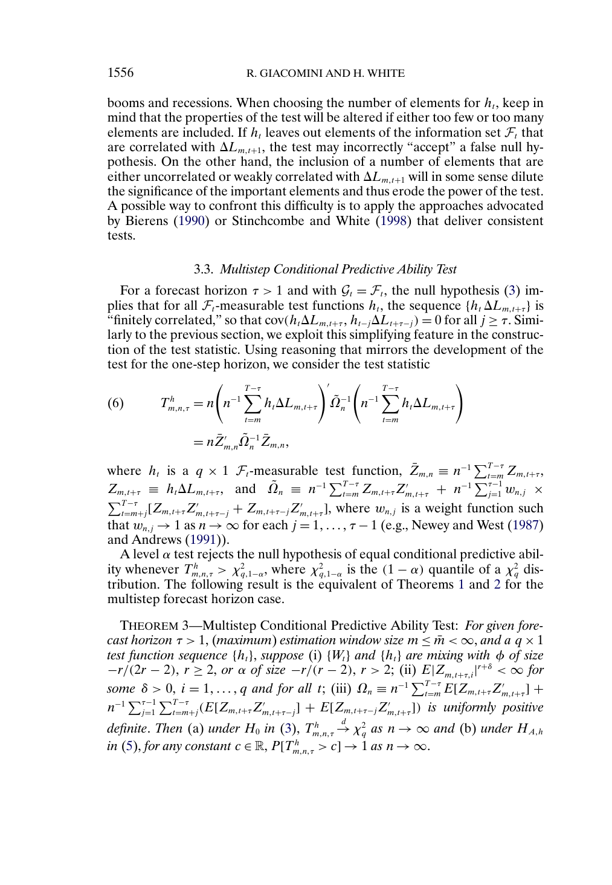

booms and recessions. When choosing the number of elements for ht, keep in mind that the properties of the test will be altered if either too few or too many elements are included. If ht leaves out elements of the information set _F_ t that are correlated with ⟦未识别符号⟧Lm⟦未识别符号⟧t+1, the test may incorrectly “accept” a false null hypothesis. On the other hand, the inclusion of a number of elements that are either uncorrelated or weakly correlated with ⟦未识别符号⟧Lm⟦未识别符号⟧t+1 will in some sense dilute the significance of the important elements and thus erode the power of the test. A possible way to confront this difficulty is to apply the approaches advocated by Bierens (1990) or Stinchcombe and White (1998) that deliver consistent tests. 

# 3.3. _Multistep Conditional Predictive Ability Test_ 

For a forecast horizon τ > 1 and with _G_ t = _F_ t, the null hypothesis (3) implies that for all _F_ t-measurable test functions ht, the sequence {ht ⟦未识别符号⟧Lm⟦未识别符号⟧t+τ} is “finitely correlated,” so that cov(ht⟦未识别符号⟧Lm⟦未识别符号⟧t+τ⟦未识别符号⟧ht−j⟦未识别符号⟧Lt+τ−j) = 0 for all j ≥ τ. Similarly to the previous section, we exploit this simplifying feature in the construction of the test statistic. Using reasoning that mirrors the development of the test for the one-step horizon, we consider the test statistic 

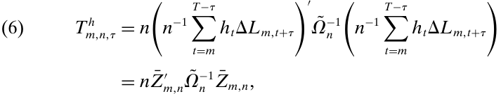

where ht is a q × 1 _F_ t-measurable test function, Z¯ m⟦未识别符号⟧n ≡ n−1 ⟦未识别符号⟧T t=− mτZm⟦未识别符号⟧t+τ, Zm⟦未识别符号⟧t+τ ≡ ht⟦未识别符号⟧Lm⟦未识别符号⟧t+τ, and Ω˜ n ≡ n−1⟦未识别符号⟧T t=− mτZm⟦未识别符号⟧t+τZ m⟦未识别符号⟧t′ +τ+n−1 ⟦未识别符号⟧τ j=− 11wn⟦未识别符号⟧j× ⟦未识别符号⟧Tt=−mτ+j[Zm⟦未识别符号⟧t+τZ m⟦未识别符号⟧t′ +τ−j+ Zm⟦未识别符号⟧t+τ−jZ m⟦未识别符号⟧t′ +τ],wherewn⟦未识别符号⟧jisaweightfunctionsuch that wn⟦未识别符号⟧j → 1 as n →∞ for each j = 1⟦未识别符号⟧⟦未识别符号⟧⟦未识别符号⟧⟦未识别符号⟧⟦未识别符号⟧τ − 1 (e.g., Newey and West (1987) and Andrews (1991)). 

A level α test rejects the null hypothesis of equal conditional predictive ability whenever Tm⟦未识别符号⟧n⟦未识别符号⟧τh>χ2 q⟦未识别符号⟧1−α,whereχ2 q⟦未识别符号⟧1−αisthe(1 −α)quantileofaχ2 qdis- tribution. The following result is the equivalent of Theorems 1 and 2 for the multistep forecast horizon case. 

THEOREM 3—Multistep Conditional Predictive Ability Test: _For given forecast horizon_ τ > 1, ( _maximum_ ) _estimation window size_ m ≤¯m < ∞, _and a_ q × 1 _test function sequence_ {ht}, _suppose_ (i) {Wt} _and_ {ht} _are mixing with_ φ _of size_ −r/(2r − 2), r ≥ 2, _or_ α _of size_ −r/(r − 2), r > 2; (ii) E|Zm⟦未识别符号⟧t+τ⟦未识别符号⟧i|r+δ < ∞ _for some_ δ > 0, i = 1⟦未识别符号⟧⟦未识别符号⟧⟦未识别符号⟧⟦未识别符号⟧⟦未识别符号⟧q _and for all_ t; (iii) Ωn ≡ n−1 ⟦未识别符号⟧T t=− mτE[Zm⟦未识别符号⟧t+τZ m⟦未识别符号⟧t′ +τ] + n−1 ⟦未识别符号⟧τ j=− 11 ⟦未识别符号⟧Tt=−mτ+j(E[Zm⟦未识别符号⟧t+τZ m⟦未识别符号⟧t′ +τ−j]+E[Zm⟦未识别符号⟧t+τ−jZ m⟦未识别符号⟧t′ +τ])_isuniformlypositive_ _definite_ . _Then_ (a) _under_ H0 _in_ (3), Tm⟦未识别符号⟧n⟦未识别符号⟧τh →d χ2q_as_n →∞_and_(b)_under_HA⟦未识别符号⟧h _in_ (5), _for any constant_ c ∈ R, P[Tm⟦未识别符号⟧n⟦未识别符号⟧τh> c] →1_as_n →∞.

---

## PDF 第 13 页

[回查原始 PDF 第 13 页](./2006_Giacomini_条件预测能力检验.pdf#page=13)

> ⚠️ 本页部分行内数学字体未正确解码，已标明「⟦未识别符号⟧」；精确数学内容请用下方整页原貌核对。

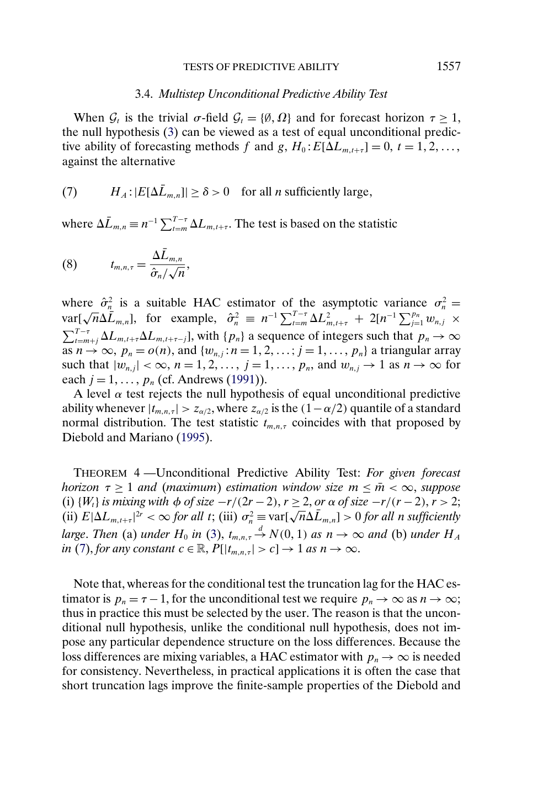

# 3.4. _Multistep Unconditional Predictive Ability Test_ 

When _G_ t is the trivial σ-field _G_ t = {∅⟦未识别符号⟧Ω} and for forecast horizon τ ≥ 1, the null hypothesis (3) can be viewed as a test of equal unconditional predictive ability of forecasting methods f and g, H0 : E[⟦未识别符号⟧Lm⟦未识别符号⟧t+τ] = 0, t = 1⟦未识别符号⟧ 2⟦未识别符号⟧⟦未识别符号⟧⟦未识别符号⟧⟦未识别符号⟧⟦未识别符号⟧ against the alternative 

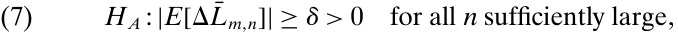

where ⟦未识别符号⟧L¯ m⟦未识别符号⟧n ≡ n−1 ⟦未识别符号⟧T t=− mτ⟦未识别符号⟧Lm⟦未识别符号⟧t+τ. The test is based on the statistic 

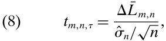

where σˆ n2isasuitableHACestimatoroftheasymptoticvarianceσ n2= var[√ n⟦未识别符号⟧L¯ m⟦未识别符号⟧n], for example, σˆ n2≡n−1 ⟦未识别符号⟧ tT =− mτ⟦未识别符号⟧L2 m⟦未识别符号⟧t+τ+2[n−1 ⟦未识别符号⟧p j=n 1wn⟦未识别符号⟧j× ⟦未识别符号⟧Tt=−mτ+j⟦未识别符号⟧Lm⟦未识别符号⟧t+τ⟦未识别符号⟧Lm⟦未识别符号⟧t+τ−j], with {pn} a sequence of integers such that pn →∞ as n →∞, pn = o(n), and {wn⟦未识别符号⟧j : n = 1⟦未识别符号⟧ 2⟦未识别符号⟧⟦未识别符号⟧⟦未识别符号⟧⟦未识别符号⟧ ; j = 1⟦未识别符号⟧⟦未识别符号⟧⟦未识别符号⟧⟦未识别符号⟧⟦未识别符号⟧pn} a triangular array such that |wn⟦未识别符号⟧j| < ∞, n = 1⟦未识别符号⟧ 2⟦未识别符号⟧⟦未识别符号⟧⟦未识别符号⟧⟦未识别符号⟧⟦未识别符号⟧j = 1⟦未识别符号⟧⟦未识别符号⟧⟦未识别符号⟧⟦未识别符号⟧⟦未识别符号⟧pn, and wn⟦未识别符号⟧j → 1 as n →∞ for each j = 1⟦未识别符号⟧⟦未识别符号⟧⟦未识别符号⟧⟦未识别符号⟧⟦未识别符号⟧pn (cf. Andrews (1991)). 

A level α test rejects the null hypothesis of equal unconditional predictive ability whenever |tm⟦未识别符号⟧n⟦未识别符号⟧τ| > zα/2, where zα/2 is the (1 − α/2) quantile of a standard normal distribution. The test statistic tm⟦未识别符号⟧n⟦未识别符号⟧τ coincides with that proposed by Diebold and Mariano (1995). 

THEOREM 4 —Unconditional Predictive Ability Test: _For given forecast horizon_ τ ≥ 1 _and_ ( _maximum_ ) _estimation window size_ m ≤¯m < ∞, _suppose_ (i) {Wt} _is mixing with_ φ _of size_ −r/(2r − 2), r ≥ 2, _or_ α _of size_ −r/(r − 2), r > 2; (ii) E|⟦未识别符号⟧Lm⟦未识别符号⟧t+τ|2r < ∞ _for all_ t; (iii) σn2≡var[~~√~~ n⟦未识别符号⟧L¯ m⟦未识别符号⟧n] > 0 _for all_ n _sufficiently large_ . _Then_ (a) _under_ H0 _in_ (3), tm⟦未识别符号⟧n⟦未识别符号⟧τ →d N(0⟦未识别符号⟧ 1) _as_ n →∞ _and_ (b) _under_ HA _in_ (7), _for any constant_ c ∈ R, P[|tm⟦未识别符号⟧n⟦未识别符号⟧τ| > c] → 1 _as_ n →∞. 

Note that, whereas for the conditional test the truncation lag for the HAC estimator is pn = τ − 1, for the unconditional test we require pn →∞ as n →∞; thus in practice this must be selected by the user. The reason is that the unconditional null hypothesis, unlike the conditional null hypothesis, does not impose any particular dependence structure on the loss differences. Because the loss differences are mixing variables, a HAC estimator with pn →∞ is needed for consistency. Nevertheless, in practical applications it is often the case that short truncation lags improve the finite-sample properties of the Diebold and

---

## PDF 第 14 页

[回查原始 PDF 第 14 页](./2006_Giacomini_条件预测能力检验.pdf#page=14)

> ⚠️ 本页部分行内数学字体未正确解码，已标明「⟦未识别符号⟧」；精确数学内容请用下方整页原貌核对。

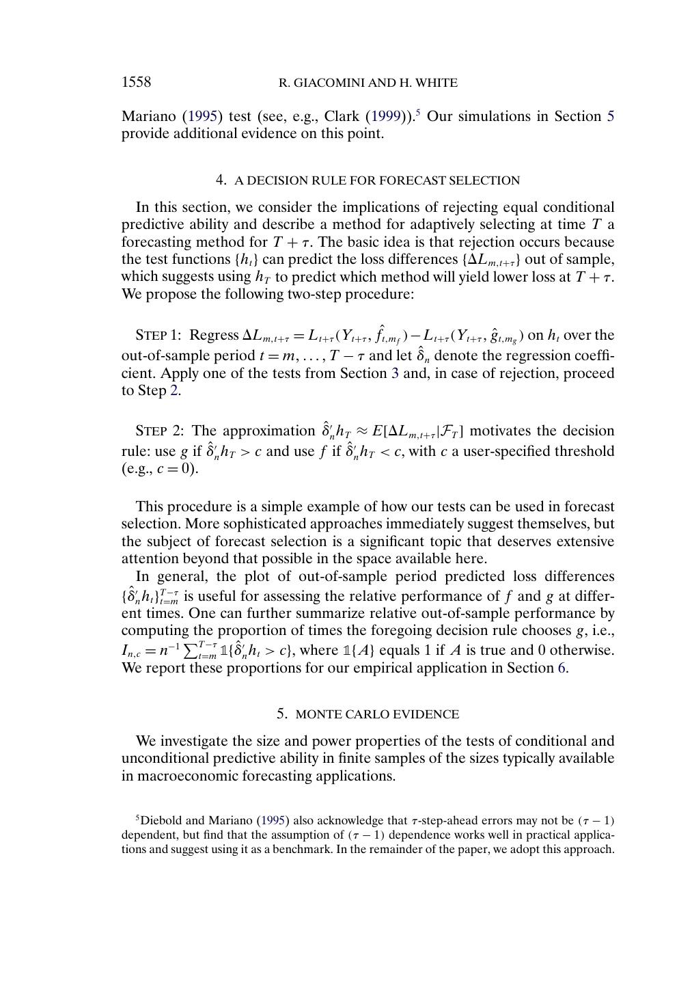

Mariano (1995) test (see, e.g., Clark (1999)).5 Our simulations in Section 5 provide additional evidence on this point. 

# 4. A DECISION RULE FOR FORECAST SELECTION 

In this section, we consider the implications of rejecting equal conditional predictive ability and describe a method for adaptively selecting at time T a forecasting method for T + τ. The basic idea is that rejection occurs because the test functions {ht} can predict the loss differences {⟦未识别符号⟧Lm⟦未识别符号⟧t+τ} out of sample, which suggests using hT to predict which method will yield lower loss at T + τ. We propose the following two-step procedure: 

STEP 1: Regress ⟦未识别符号⟧Lm⟦未识别符号⟧t+τ = Lt+τ(Yt+τ⟦未识别符号⟧ fˆ t⟦未识别符号⟧mf ) − Lt+τ(Yt+τ⟦未识别符号⟧ gˆt⟦未识别符号⟧mg ) on ht over the out-of-sample period t = m⟦未识别符号⟧⟦未识别符号⟧⟦未识别符号⟧⟦未识别符号⟧⟦未识别符号⟧T − τ and let δˆ n denote the regression coefficient. Apply one of the tests from Section 3 and, in case of rejection, proceed to Step 2. 

STEP 2: The approximation δˆ′ nhT≈E[⟦未识别符号⟧Lm⟦未识别符号⟧t+τ|_F_T]motivatesthedecision rule: use g if δˆ′ nhT> cand use fifδˆ′ nhT< c, with ca user-specified threshold (e.g., c = 0). This procedure is a simple example of how our tests can be used in forecast selection. More sophisticated approaches immediately suggest themselves, but the subject of forecast selection is a significant topic that deserves extensive attention beyond that possible in the space available here. 

In general, the plot of out-of-sample period predicted loss differences {δˆ′ nht} tT =− mτis useful for assessing the relative performance of fand gat differ- ent times. One can further summarize relative out-of-sample performance by computing the proportion of times the foregoing decision rule chooses g, i.e., In⟦未识别符号⟧c = n−1 ⟦未识别符号⟧T t=− mτ1{ˆδ n′ht> c}, where 1{A} equals 1 if A is true and 0 otherwise. We report these proportions for our empirical application in Section 6. 

# 5. MONTE CARLO EVIDENCE 

We investigate the size and power properties of the tests of conditional and unconditional predictive ability in finite samples of the sizes typically available in macroeconomic forecasting applications. 

> 5Diebold and Mariano (1995) also acknowledge that τ-step-ahead errors may not be (τ − 1) dependent, but find that the assumption of (τ − 1) dependence works well in practical applications and suggest using it as a benchmark. In the remainder of the paper, we adopt this approach.

---

## PDF 第 15 页

[回查原始 PDF 第 15 页](./2006_Giacomini_条件预测能力检验.pdf#page=15)

> ⚠️ 本页部分行内数学字体未正确解码，已标明「⟦未识别符号⟧」；精确数学内容请用下方整页原貌核对。

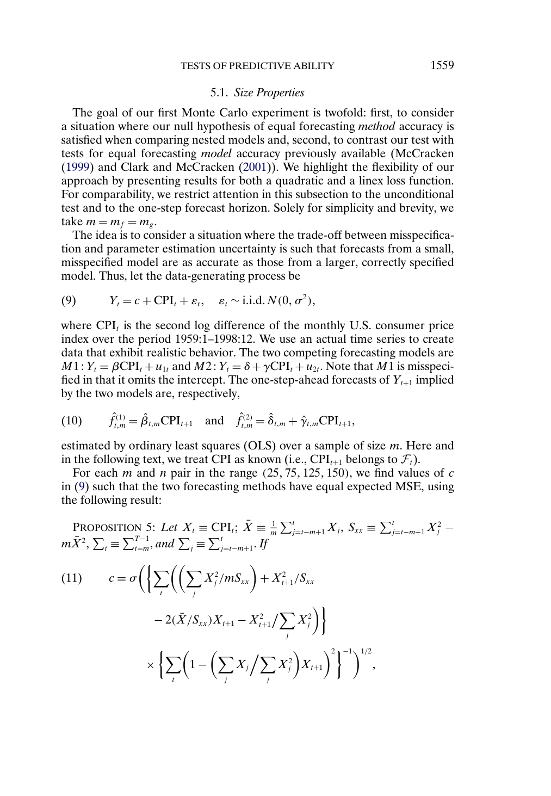

# 5.1. _Size Properties_ 

The goal of our first Monte Carlo experiment is twofold: first, to consider a situation where our null hypothesis of equal forecasting _method_ accuracy is satisfied when comparing nested models and, second, to contrast our test with tests for equal forecasting _model_ accuracy previously available (McCracken (1999) and Clark and McCracken (2001)). We highlight the flexibility of our approach by presenting results for both a quadratic and a linex loss function. For comparability, we restrict attention in this subsection to the unconditional test and to the one-step forecast horizon. Solely for simplicity and brevity, we take m = mf = mg. 

The idea is to consider a situation where the trade-off between misspecification and parameter estimation uncertainty is such that forecasts from a small, misspecified model are as accurate as those from a larger, correctly specified model. Thus, let the data-generating process be 

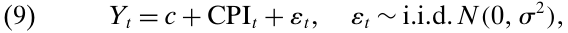

where CPIt is the second log difference of the monthly U.S. consumer price index over the period 1959:1–1998:12. We use an actual time series to create data that exhibit realistic behavior. The two competing forecasting models are M1: Yt = βCPIt + u1t and M2: Yt = δ + γCPIt + u2t. Note that M1 is misspecified in that it omits the intercept. The one-step-ahead forecasts of Yt+1 implied by the two models are, respectively, 

(10) 

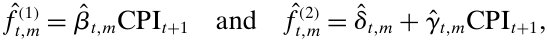

estimated by ordinary least squares (OLS) over a sample of size m. Here and in the following text, we treat CPI as known (i.e., CPIt+1 belongs to _F_ t). 

For each m and n pair in the range (25⟦未识别符号⟧ 75⟦未识别符号⟧ 125⟦未识别符号⟧ 150), we find values of c in (9) such that the two forecasting methods have equal expected MSE, using the following result: 

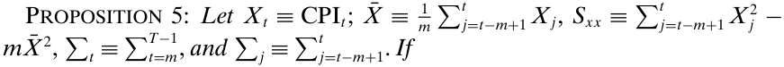

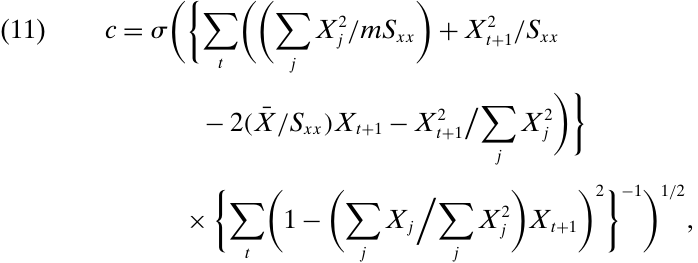

---

## PDF 第 16 页

[回查原始 PDF 第 16 页](./2006_Giacomini_条件预测能力检验.pdf#page=16)

> ⚠️ 本页部分行内数学字体未正确解码，已标明「⟦未识别符号⟧」；精确数学内容请用下方整页原貌核对。

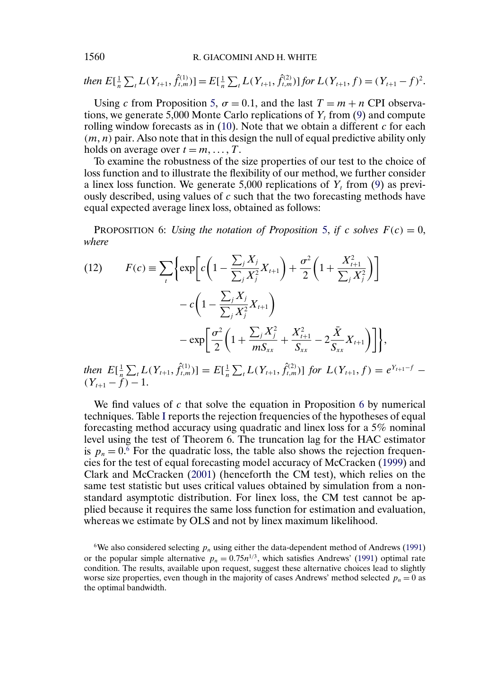

_then_ E[ n<u>1</u> ⟦未识别符号⟧tL(Yt+1⟦未识别符号⟧fˆ ( t⟦未识别符号⟧m1))] = E[ n<u>1</u> ⟦未识别符号⟧tL(Yt+1⟦未识别符号⟧fˆ ( t⟦未识别符号⟧m2))]_for_L(Y t+1⟦未识别符号⟧f) = (Y t+1−f)2. 

Using c from Proposition 5, σ = 0⟦未识别符号⟧1, and the last T = m + n CPI observations, we generate 5,000 Monte Carlo replications of Yt from (9) and compute rolling window forecasts as in (10). Note that we obtain a different c for each (m⟦未识别符号⟧n) pair. Also note that in this design the null of equal predictive ability only holds on average over t = m⟦未识别符号⟧⟦未识别符号⟧⟦未识别符号⟧⟦未识别符号⟧⟦未识别符号⟧T . 

To examine the robustness of the size properties of our test to the choice of loss function and to illustrate the flexibility of our method, we further consider a linex loss function. We generate 5,000 replications of Yt from (9) as previously described, using values of c such that the two forecasting methods have equal expected average linex loss, obtained as follows: 

PROPOSITION 6: _Using the notation of Proposition_ 5, _if_ c _solves_ F(c) = 0, _where_ 

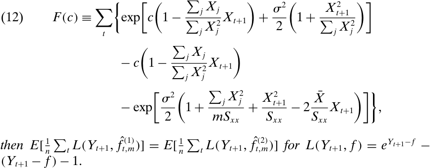

We find values of c that solve the equation in Proposition 6 by numerical techniques. Table I reports the rejection frequencies of the hypotheses of equal forecasting method accuracy using quadratic and linex loss for a 5% nominal level using the test of Theorem 6. The truncation lag for the HAC estimator is pn = 0.6 For the quadratic loss, the table also shows the rejection frequencies for the test of equal forecasting model accuracy of McCracken (1999) and Clark and McCracken (2001) (henceforth the CM test), which relies on the same test statistic but uses critical values obtained by simulation from a nonstandard asymptotic distribution. For linex loss, the CM test cannot be applied because it requires the same loss function for estimation and evaluation, whereas we estimate by OLS and not by linex maximum likelihood. 

> 6We also considered selecting pn using either the data-dependent method of Andrews (1991) or the popular simple alternative pn = 0⟦未识别符号⟧75n1/3 , which satisfies Andrews’ (1991) optimal rate condition. The results, available upon request, suggest these alternative choices lead to slightly worse size properties, even though in the majority of cases Andrews’ method selected pn = 0 as the optimal bandwidth.

---

## PDF 第 17 页

[回查原始 PDF 第 17 页](./2006_Giacomini_条件预测能力检验.pdf#page=17)

## TABLE I 

REJECTION FREQUENCIES OF UNCONDITIONAL PREDICTIVE ABILITY AND MCCRACKEN’S (1999) TESTSa 

|||||A. Quadr|atic Loss|||||B. Lin|ex Loss||
|---|---|---|---|---|---|---|---|---|---|---|---|---|
||U|ncond. P|red. Abili|ty||McCrack|en (1999)||U|ncond. P|red. Abili|ty|
||||n|||n|||||n||
|m|25|75|125|150|25|75|125|150|25|75|125|150|
|25|0.053|0.037|0.035|0.024|0.087|0.360|0.481|0.525|0.060|0.055|0.046|0.046|
|75|0.062|0.048|0.040|0.037|0.147|0.070|0.256|0.279|0.069|0.065|0.064|0.058|
|125|0.073|0.054|0.044|0.042|0.120|0.146|0.063|0.199|0.072|0.070|0.075|0.077|
|150|0.061|0.056|0.048|0.046|0.091|0.134|0.204|0.058|0.075|0.075|0.077|0.073|

> 表格版面核对：以下截图保留原始单元格关系，合并单元格及复杂表头以截图为准。

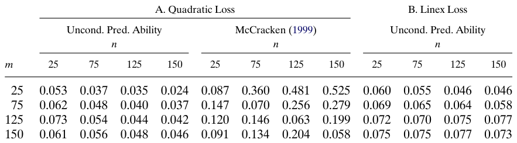

aRejection frequencies of the test of Theorem 6 and of McCracken’s (1999) test in the Monte Carlo experiment described in Section 5.1, for nominal size 0.05: m is the estimation window size and n is the out-of-sample size. 

The table reveals that our test is generally well sized, particularly when the estimation window m is small relative to the out-of-sample size n (for given m, the size tends to improve as n increases). This is true for both quadratic and linex loss functions, although for the linex loss the test is slightly oversized. Before discussing the rejection frequencies of the CM test, we emphasize that these do not represent the empirical size of the CM test, because this tests a different null hypothesis: for CM the losses are functions of population values of the parameters rather than parameter estimates, so the CM test is focused on the forecasting model rather than the forecasting method. Table I shows that in our scenario the CM test rejects the hypothesis that the forecasting models are equally accurate in favor of the larger model7 more often than our test rejects its null hypothesis. In other words, by rejecting its null hypothesis relatively more frequently, the CM test signals that the larger forecasting model is superior in cases where the forecasting _method_ based on the larger model is _not_ superior. The disparity of conclusions between the two tests is greater when m is small relative to n (our test rejects 5% of the time, whereas the CM test rejects up to 50% of the time). Interestingly, the two tests have comparable rejection frequencies when m is equal to n. 

# 5.2. _Power Properties_ 

We next investigate the power of our unconditional and conditional tests in two directions: (i) against serially correlated loss differences; and (ii) against different performance in different states of the economy. Again, solely for simplicity and brevity, we take m = mf = mg. 

7The alternative hypothesis for the CM test is that the larger model is more accurate.

---

## PDF 第 18 页

[回查原始 PDF 第 18 页](./2006_Giacomini_条件预测能力检验.pdf#page=18)

> ⚠️ 本页部分行内数学字体未正确解码，已标明「⟦未识别符号⟧」；精确数学内容请用下方整页原貌核对。

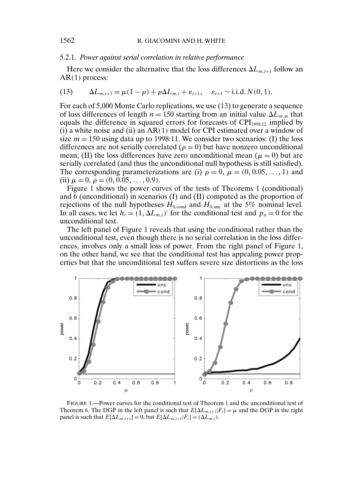

# 5.2.1. _Power against serial correlation in relative performance_ 

Here we consider the alternative that the loss differences ⟦未识别符号⟧Lm⟦未识别符号⟧t+1 follow an AR(1) process: 

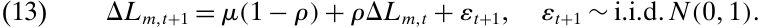

For each of 5,000 Monte Carlo replications, we use (13) to generate a sequence of loss differences of length n = 150 starting from an initial value ⟦未识别符号⟧Lm⟦未识别符号⟧m that equals the difference in squared errors for forecasts of CPI1998:12 implied by (i) a white noise and (ii) an AR(1) model for CPI estimated over a window of size m = 150 using data up to 1998:11. We consider two scenarios: (I) the loss differences are not serially correlated (ρ = 0) but have nonzero unconditional mean; (II) the loss differences have zero unconditional mean (µ = 0) but are serially correlated (and thus the unconditional null hypothesis is still satisfied). The corresponding parameterizations are (i) ρ = 0, µ = (0⟦未识别符号⟧ 0⟦未识别符号⟧05⟦未识别符号⟧⟦未识别符号⟧⟦未识别符号⟧⟦未识别符号⟧⟦未识别符号⟧ 1) and (ii) µ = 0, ρ = (0⟦未识别符号⟧ 0⟦未识别符号⟧05⟦未识别符号⟧⟦未识别符号⟧⟦未识别符号⟧⟦未识别符号⟧⟦未识别符号⟧ 0⟦未识别符号⟧9). 

Figure 1 shows the power curves of the tests of Theorems 1 (conditional) and 6 (unconditional) in scenarios (I) and (II) computed as the proportion of rejections of the null hypotheses H0⟦未识别符号⟧cond and H0⟦未识别符号⟧unc at the 5% nominal level. In all cases, we let ht = (1⟦未识别符号⟧⟦未识别符号⟧Lm⟦未识别符号⟧t)′ for the conditional test and pn = 0 for the unconditional test. 

The left panel of Figure 1 reveals that using the conditional rather than the unconditional test, even though there is no serial correlation in the loss differences, involves only a small loss of power. From the right panel of Figure 1, on the other hand, we see that the conditional test has appealing power properties but that the unconditional test suffers severe size distortions as the loss 

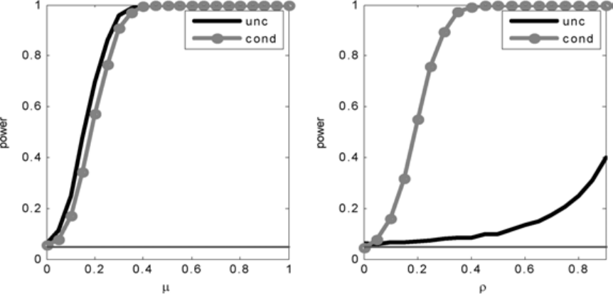

FIGURE 1.—Power curves for the conditional test of Theorem 1 and the unconditional test of Theorem 6. The DGP in the left panel is such that E[⟦未识别符号⟧Lm⟦未识别符号⟧t+1|Ft ] = µ and the DGP in the right panel is such that E[⟦未识别符号⟧Lm⟦未识别符号⟧t+1] = 0, but E[⟦未识别符号⟧Lm⟦未识别符号⟧t+1|Ft] = (⟦未识别符号⟧Lm⟦未识别符号⟧t).

---

## PDF 第 19 页

[回查原始 PDF 第 19 页](./2006_Giacomini_条件预测能力检验.pdf#page=19)

> ⚠️ 本页部分行内数学字体未正确解码，已标明「⟦未识别符号⟧」；精确数学内容请用下方整页原貌核对。

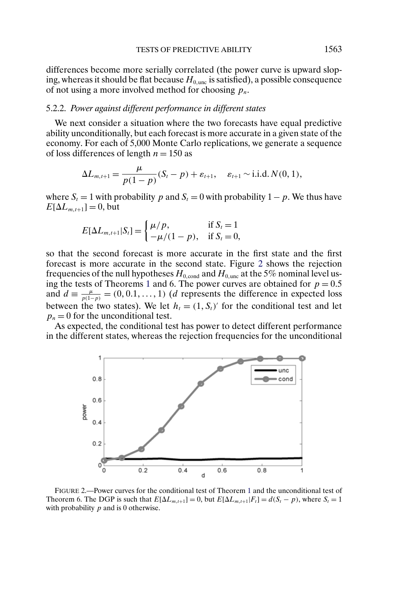

differences become more serially correlated (the power curve is upward sloping, whereas it should be flat because H0⟦未识别符号⟧unc is satisfied), a possible consequence of not using a more involved method for choosing pn. 

# 5.2.2. _Power against different performance in different states_ 

We next consider a situation where the two forecasts have equal predictive ability unconditionally, but each forecast is more accurate in a given state of the economy. For each of 5,000 Monte Carlo replications, we generate a sequence of loss differences of length n = 150 as 

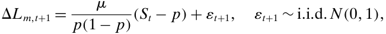

where St = 1 with probability p and St = 0 with probability 1 − p. We thus have E[⟦未识别符号⟧Lm⟦未识别符号⟧t+1] = 0, but 

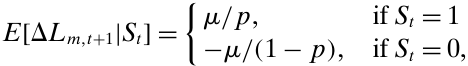

so that the second forecast is more accurate in the first state and the first forecast is more accurate in the second state. Figure 2 shows the rejection frequencies of the null hypotheses H0⟦未识别符号⟧cond and H0⟦未识别符号⟧unc at the 5% nominal level using the tests of Theorems 1 and 6. The power curves are obtained for p = 0⟦未识别符号⟧5 and d ≡ p(1µ−p)= (0⟦未识别符号⟧0⟦未识别符号⟧1⟦未识别符号⟧⟦未识别符号⟧⟦未识别符号⟧⟦未识别符号⟧⟦未识别符号⟧1)(drepresentsthedifferenceinexpectedloss between the two states). We let ht = (1⟦未识别符号⟧St)′ for the conditional test and let pn = 0 for the unconditional test. 

As expected, the conditional test has power to detect different performance in the different states, whereas the rejection frequencies for the unconditional 

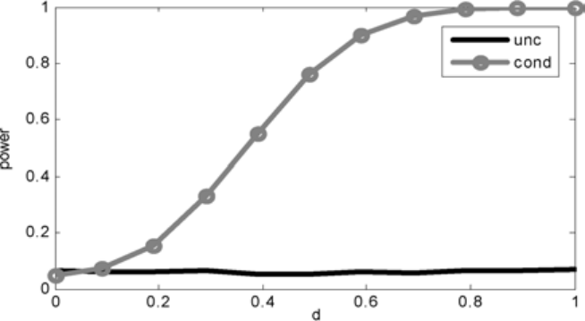

FIGURE 2.—Power curves for the conditional test of Theorem 1 and the unconditional test of Theorem 6. The DGP is such that E[⟦未识别符号⟧Lm⟦未识别符号⟧t+1] = 0, but E[⟦未识别符号⟧Lm⟦未识别符号⟧t+1|Ft] = d(St − p), where St = 1 with probability p and is 0 otherwise.

---

## PDF 第 20 页

[回查原始 PDF 第 20 页](./2006_Giacomini_条件预测能力检验.pdf#page=20)

> ⚠️ 本页部分行内数学字体未正确解码，已标明「⟦未识别符号⟧」；精确数学内容请用下方整页原貌核对。

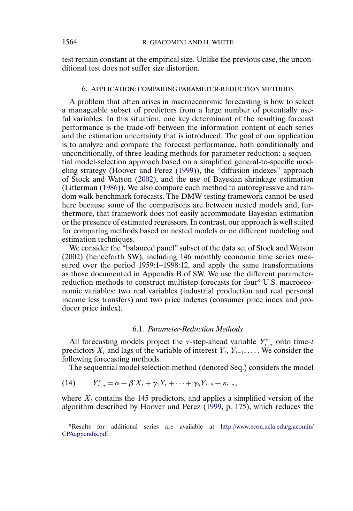

test remain constant at the empirical size. Unlike the previous case, the unconditional test does not suffer size distortion. 

# 6. APPLICATION: COMPARING PARAMETER-REDUCTION METHODS 

A problem that often arises in macroeconomic forecasting is how to select a manageable subset of predictors from a large number of potentially useful variables. In this situation, one key determinant of the resulting forecast performance is the trade-off between the information content of each series and the estimation uncertainty that is introduced. The goal of our application is to analyze and compare the forecast performance, both conditionally and unconditionally, of three leading methods for parameter reduction: a sequential model-selection approach based on a simplified general-to-specific modeling strategy (Hoover and Perez (1999)), the “diffusion indexes” approach of Stock and Watson (2002), and the use of Bayesian shrinkage estimation (Litterman (1986)). We also compare each method to autoregressive and random walk benchmark forecasts. The DMW testing framework cannot be used here because some of the comparisons are between nested models and, furthermore, that framework does not easily accommodate Bayesian estimation or the presence of estimated regressors. In contrast, our approach is well suited for comparing methods based on nested models or on different modeling and estimation techniques. 

We consider the “balanced panel” subset of the data set of Stock and Watson (2002) (henceforth SW), including 146 monthly economic time series measured over the period 1959:1–1998:12, and apply the same transformations as those documented in Appendix B of SW. We use the different parameterreduction methods to construct multistep forecasts for four8 U.S. macroeconomic variables: two real variables (industrial production and real personal income less transfers) and two price indexes (consumer price index and producer price index). 

# 6.1. _Parameter-Reduction Methods_ 

All forecasting models project the τ-step-ahead variable Ytτ +τontotime-t predictors Xt and lags of the variable of interest Yt, Yt−1⟦未识别符号⟧⟦未识别符号⟧⟦未识别符号⟧⟦未识别符号⟧⟦未识别符号⟧ We consider the following forecasting methods. 

The sequential model selection method (denoted Seq.) considers the model 

(14) Ytτ +τ= α + β′Xt + γ1Yt + ··· + γ6Yt−5 + εt+τ⟦未识别符号⟧ where Xt contains the 145 predictors, and applies a simplified version of the algorithm described by Hoover and Perez (1999, p. 175), which reduces the 

> 8Results for additional series are available at http://www.econ.ucla.edu/giacomin/ CPAappendix.pdf.

---

## PDF 第 21 页

[回查原始 PDF 第 21 页](./2006_Giacomini_条件预测能力检验.pdf#page=21)

> ⚠️ 本页部分行内数学字体未正确解码，已标明「⟦未识别符号⟧」；精确数学内容请用下方整页原貌核对。

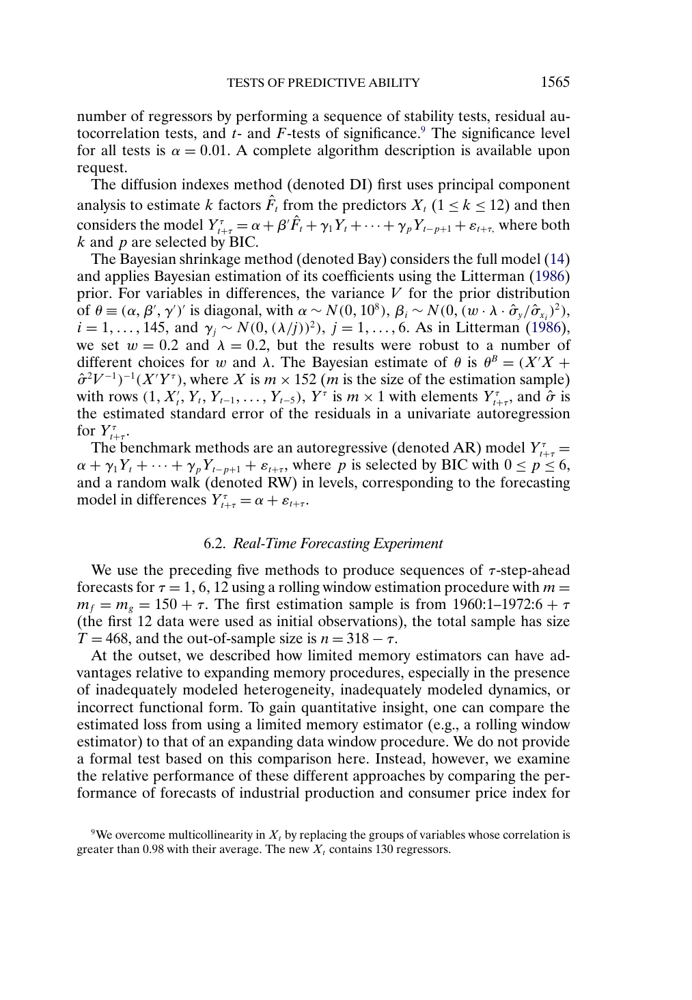

number of regressors by performing a sequence of stability tests, residual autocorrelation tests, and t- and F -tests of significance.9 The significance level for all tests is α = 0⟦未识别符号⟧01. A complete algorithm description is available upon request. 

The diffusion indexes method (denoted DI) first uses principal component analysis to estimate k factors Fˆ t from the predictors Xt (1 ≤ k ≤ 12) and then considers the model Ytτ +τ= α + β′Fˆt + γ1Yt + ··· + γpYt−p+1 + εt+τ⟦未识别符号⟧where both k and p are selected by BIC. 

The Bayesian shrinkage method (denoted Bay) considers the full model (14) and applies Bayesian estimation of its coefficients using the Litterman (1986) prior. For variables in differences, the variance V for the prior distribution of θ ≡ (α⟦未识别符号⟧β′ ⟦未识别符号⟧γ′ )′ is diagonal, with α ∼ N(0⟦未识别符号⟧ 108 ), βi ∼ N(0⟦未识别符号⟧(w · λ · σˆ y/σ ˆ xi )2 ), i = 1⟦未识别符号⟧⟦未识别符号⟧⟦未识别符号⟧⟦未识别符号⟧⟦未识别符号⟧ 145, and γj ∼ N(0⟦未识别符号⟧(λ/j))2 ), j = 1⟦未识别符号⟧⟦未识别符号⟧⟦未识别符号⟧⟦未识别符号⟧⟦未识别符号⟧ 6. As in Litterman (1986), we set w = 0⟦未识别符号⟧2 and λ = 0⟦未识别符号⟧2, but the results were robust to a number of different choices for w and λ. The Bayesian estimate of θ is θB = (X′ X + σˆ2 V−1 )−1 (X′ Yτ ), where X is m × 152 (m is the size of the estimation sample) with rows (1⟦未识别符号⟧Xt′⟦未识别符号⟧Yt⟦未识别符号⟧Yt−1⟦未识别符号⟧⟦未识别符号⟧⟦未识别符号⟧⟦未识别符号⟧⟦未识别符号⟧Yt−5),Y τism × 1with elementsY tτ +τ, andσˆis the estimated standard error of the residuals in a univariate autoregression for Yτ t+τ. 

The benchmark methods are an autoregressive (denoted AR) model Ytτ +τ= α + γ1Yt + ··· + γpYt−p+1 + εt+τ, where p is selected by BIC with 0 ≤ p ≤ 6, and a random walk (denoted RW) in levels, corresponding to the forecasting model in differences Ytτ +τ= α + εt+τ. 

# 6.2. _Real-Time Forecasting Experiment_ 

We use the preceding five methods to produce sequences of τ-step-ahead forecasts for τ = 1⟦未识别符号⟧ 6⟦未识别符号⟧ 12 using a rolling window estimation procedure with m = mf = mg = 150 + τ. The first estimation sample is from 1960:1–1972:6 + τ (the first 12 data were used as initial observations), the total sample has size T = 468, and the out-of-sample size is n = 318 − τ. 

At the outset, we described how limited memory estimators can have advantages relative to expanding memory procedures, especially in the presence of inadequately modeled heterogeneity, inadequately modeled dynamics, or incorrect functional form. To gain quantitative insight, one can compare the estimated loss from using a limited memory estimator (e.g., a rolling window estimator) to that of an expanding data window procedure. We do not provide a formal test based on this comparison here. Instead, however, we examine the relative performance of these different approaches by comparing the performance of forecasts of industrial production and consumer price index for 

> 9We overcome multicollinearity in Xt by replacing the groups of variables whose correlation is greater than 0.98 with their average. The new Xt contains 130 regressors.

---

## PDF 第 22 页

[回查原始 PDF 第 22 页](./2006_Giacomini_条件预测能力检验.pdf#page=22)

> ⚠️ 本页部分行内数学字体未正确解码，已标明「⟦未识别符号⟧」；精确数学内容请用下方整页原貌核对。

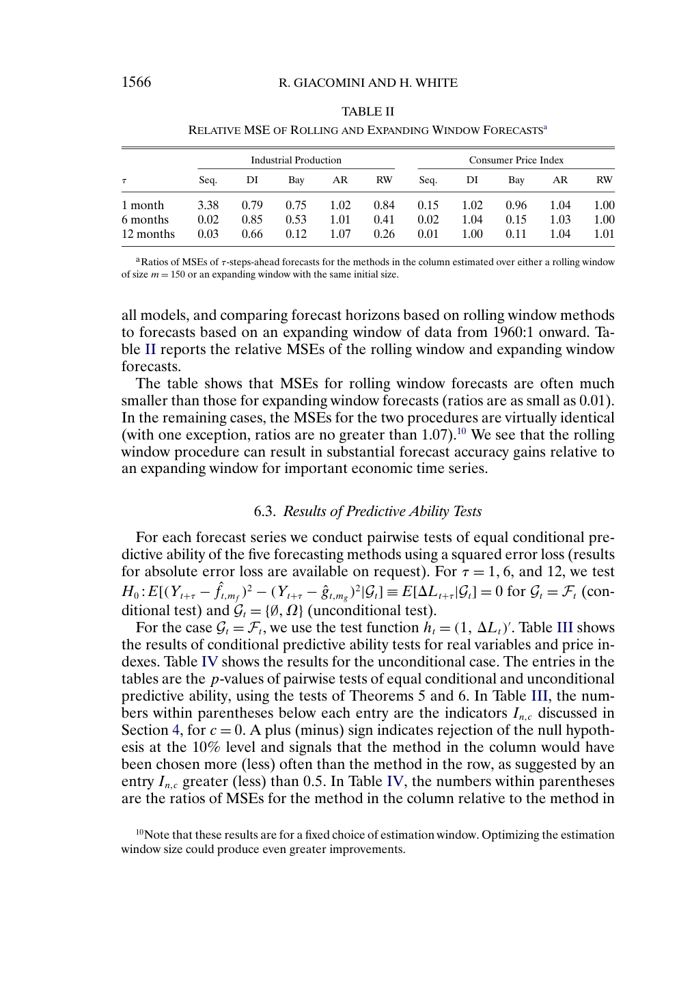

## TABLE II 

RELATIVE MSE OF ROLLING AND EXPANDING WINDOW FORECASTSa 

|||Indus|trial Produ|ction|||Consu|mer Price|Index||
|---|---|---|---|---|---|---|---|---|---|---|
|τ|Seq.|DI|Bay|AR|RW|Seq.|DI|Bay|AR|RW|
|1 month|3.38|0.79|0.75|1.02|0.84|0.15|1.02|0.96|1.04|1.00|
|6 months|0.02|0.85|0.53|1.01|0.41|0.02|1.04|0.15|1.03|1.00|
|12 months|0.03|0.66|0.12|1.07|0.26|0.01|1.00|0.11|1.04|1.01|

> 表格版面核对：以下截图保留原始单元格关系，合并单元格及复杂表头以截图为准。

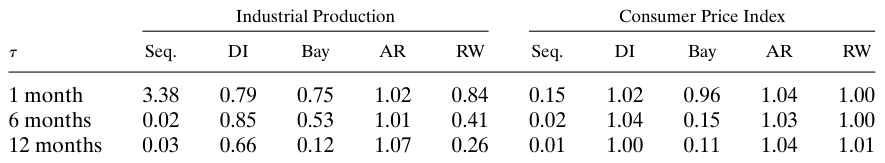

aRatios of MSEs of τ-steps-ahead forecasts for the methods in the column estimated over either a rolling window of size m = 150 or an expanding window with the same initial size. 

all models, and comparing forecast horizons based on rolling window methods to forecasts based on an expanding window of data from 1960:1 onward. Table II reports the relative MSEs of the rolling window and expanding window forecasts. 

The table shows that MSEs for rolling window forecasts are often much smaller than those for expanding window forecasts (ratios are as small as 0.01). In the remaining cases, the MSEs for the two procedures are virtually identical (with one exception, ratios are no greater than 1.07).10 We see that the rolling window procedure can result in substantial forecast accuracy gains relative to an expanding window for important economic time series. 

# 6.3. _Results of Predictive Ability Tests_ 

For each forecast series we conduct pairwise tests of equal conditional predictive ability of the five forecasting methods using a squared error loss (results for absolute error loss are available on request). For τ = 1⟦未识别符号⟧ 6, and 12, we test H0 : E[(Yt+τ − fˆ t⟦未识别符号⟧mf )2 − (Yt+τ −ˆgt⟦未识别符号⟧mg )2 | _G_ t] ≡ E[⟦未识别符号⟧Lt+τ| _G_ t] = 0 for _G_ t = _F_ t (conditional test) and _G_ t = {∅⟦未识别符号⟧Ω} (unconditional test). 

For the case _G_ t = _F_ t, we use the test function ht = (1⟦未识别符号⟧⟦未识别符号⟧Lt)′ . Table III shows the results of conditional predictive ability tests for real variables and price indexes. Table IV shows the results for the unconditional case. The entries in the tables are the p-values of pairwise tests of equal conditional and unconditional predictive ability, using the tests of Theorems 5 and 6. In Table III, the numbers within parentheses below each entry are the indicators In⟦未识别符号⟧c discussed in Section 4, for c = 0. A plus (minus) sign indicates rejection of the null hypothesis at the 10% level and signals that the method in the column would have been chosen more (less) often than the method in the row, as suggested by an entry In⟦未识别符号⟧c greater (less) than 0⟦未识别符号⟧5. In Table IV, the numbers within parentheses are the ratios of MSEs for the method in the column relative to the method in 

10Note that these results are for a fixed choice of estimation window. Optimizing the estimation window size could produce even greater improvements.

---

## PDF 第 23 页

[回查原始 PDF 第 23 页](./2006_Giacomini_条件预测能力检验.pdf#page=23)

> ⚠️ 本页部分行内数学字体未正确解码，已标明「⟦未识别符号⟧」；精确数学内容请用下方整页原貌核对。

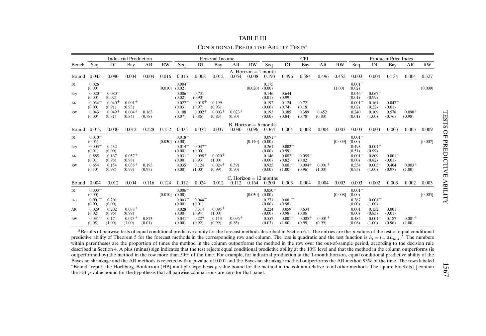

TABLE III 

CONDITIONAL PREDICTIVE ABILITY TESTSa 

|||Industr|ial Prod|uction|||Pers|onal Inc|ome||||CPI||||Produ|cer Price|Index||
|---|---|---|---|---|---|---|---|---|---|---|---|---|---|---|---|---|---|---|---|---|
|Bench|Seq.|DI|Bay|AR|RW|Seq.|DI|Bay|AR|RW|Seq.|DI|Bay|AR|RW|Seq.|DI|Bay|AR|RW|
|Bound|0.043|0.080|0.004|0.004|0.016|0.016|0.008|0.012|A. Horiz 0.054|on=1 0.008|month 0.193|0.496|0.584|0.496|0.452|0.003|0.004|0.134|0.004|0.327|
|DI|0⟦未识别符号⟧026−|||||0⟦未识别符号⟧004−|||||0⟦未识别符号⟧175|||||0⟦未识别符号⟧001−|||||
||(0⟦未识别符号⟧00)||||[0⟦未识别符号⟧010]|(0⟦未识别符号⟧02)||||[0⟦未识别符号⟧020]|(0⟦未识别符号⟧00)||||[1⟦未识别符号⟧00] |(0⟦未识别符号⟧02)||||[0⟦未识别符号⟧009]|
|Bay|0⟦未识别符号⟧020−|0⟦未识别符号⟧080−||||0⟦未识别符号⟧006−|0⟦未识别符号⟧731||||0⟦未识别符号⟧146|0⟦未识别符号⟧644||||0⟦未识别符号⟧046−|0⟦未识别符号⟧067+||||
||(0⟦未识别符号⟧00)|(0⟦未识别符号⟧02)||||(0⟦未识别符号⟧02)|(0⟦未识别符号⟧90)||||(0⟦未识别符号⟧01)|(0⟦未识别符号⟧99)||||(0⟦未识别符号⟧01)|(0⟦未识别符号⟧99)||||
|AR|0⟦未识别符号⟧034−|0⟦未识别符号⟧040+|0⟦未识别符号⟧001+|||0⟦未识别符号⟧027−|0⟦未识别符号⟧018+|0⟦未识别符号⟧199|||0⟦未识别符号⟧192|0⟦未识别符号⟧124|0⟦未识别符号⟧721|||0⟦未识别符号⟧001−|0⟦未识别符号⟧161|0⟦未识别符号⟧047−|||
||(0⟦未识别符号⟧00)|(0⟦未识别符号⟧91)|(0⟦未识别符号⟧93)|||(0⟦未识别符号⟧03)|(0⟦未识别符号⟧97)|(0⟦未识别符号⟧93)|||(0⟦未识别符号⟧00)|(0⟦未识别符号⟧74)|(0⟦未识别符号⟧18)|||(0⟦未识别符号⟧02)|(0⟦未识别符号⟧22)|(0⟦未识别符号⟧01)|||
|RW|0⟦未识别符号⟧043−|0⟦未识别符号⟧049+|0⟦未识别符号⟧004+|0⟦未识别符号⟧163||0⟦未识别符号⟧108|0⟦未识别符号⟧002+|0⟦未识别符号⟧003+|0⟦未识别符号⟧023+||0⟦未识别符号⟧193|0⟦未识别符号⟧385|0⟦未识别符号⟧389|0⟦未识别符号⟧452||0⟦未识别符号⟧240|0⟦未识别符号⟧109|0⟦未识别符号⟧578|0⟦未识别符号⟧098+||
||(0⟦未识别符号⟧00)|(0⟦未识别符号⟧81)|(0⟦未识别符号⟧84)|(0⟦未识别符号⟧78)||(0⟦未识别符号⟧07)|(0⟦未识别符号⟧86)|(0⟦未识别符号⟧83)|(0⟦未识别符号⟧80)||(0⟦未识别符号⟧00)|(0⟦未识别符号⟧84)|(0⟦未识别符号⟧78)|(0⟦未识别符号⟧80)||(0⟦未识别符号⟧01)|(1⟦未识别符号⟧00)|(0⟦未识别符号⟧76)|(0⟦未识别符号⟧98)||
||||||||||B. Horiz|on=6|months||||||||||
|Bound|0.012|0.040|0.012|0.228|0.152|0.035|0.072|0.037| 0.080| 0.096| 0.364|0.004|0.008|0.004|0.003|0.003|0.003|0.003|0.003|0.009|
|DI|0⟦未识别符号⟧010−|||||0⟦未识别符号⟧018−|||||0⟦未识别符号⟧091−|||||0⟦未识别符号⟧001−|||||
||(0⟦未识别符号⟧05)||||[0⟦未识别符号⟧030]|(0⟦未识别符号⟧00)||||[0⟦未识别符号⟧140]|(0⟦未识别符号⟧00)||||[0⟦未识别符号⟧009]|(0⟦未识别符号⟧00)||||[0⟦未识别符号⟧007]|
|Bay|0⟦未识别符号⟧003−|0⟦未识别符号⟧432||||0⟦未识别符号⟧014−|0⟦未识别符号⟧037−||||0⟦未识别符号⟧261|0⟦未识别符号⟧002+||||0⟦未识别符号⟧493|0⟦未识别符号⟧001+||||
||(0⟦未识别符号⟧01)|(0⟦未识别符号⟧00)||||(0⟦未识别符号⟧00)|(0⟦未识别符号⟧00)||||(0⟦未识别符号⟧00)|(0⟦未识别符号⟧99)||||(0⟦未识别符号⟧51)|(0⟦未识别符号⟧99)||||
|AR|0⟦未识别符号⟧885|0⟦未识别符号⟧167|0⟦未识别符号⟧057+|||0⟦未识别符号⟧031−|0⟦未识别符号⟧098+|0⟦未识别符号⟧020+|||0⟦未识别符号⟧146|0⟦未识别符号⟧082+|0⟦未识别符号⟧055−|||0⟦未识别符号⟧001−|0⟦未识别符号⟧809|0⟦未识别符号⟧001−|||
||(0⟦未识别符号⟧01)|(0⟦未识别符号⟧98)|(0⟦未识别符号⟧98)|||(0⟦未识别符号⟧00)|(0⟦未识别符号⟧93)|(1⟦未识别符号⟧00)|||(0⟦未识别符号⟧00)|(0⟦未识别符号⟧82)|(0⟦未识别符号⟧02)|||(0⟦未识别符号⟧00)|(0⟦未识别符号⟧82)|(0⟦未识别符号⟧01)|||
|RW|0⟦未识别符号⟧654|0⟦未识别符号⟧154|0⟦未识别符号⟧038+|0⟦未识别符号⟧193||0⟦未识别符号⟧035−|0⟦未识别符号⟧124|0⟦未识别符号⟧024+|0⟦未识别符号⟧591||0⟦未识别符号⟧935|0⟦未识别符号⟧001+|0⟦未识别符号⟧004+|0⟦未识别符号⟧001+||0⟦未识别符号⟧554|0⟦未识别符号⟧003+|0⟦未识别符号⟧404|0⟦未识别符号⟧003+||
||(0⟦未识别符号⟧30)|(0⟦未识别符号⟧98)|(0⟦未识别符号⟧99)|(0⟦未识别符号⟧97)||(0⟦未识别符号⟧00)|(1⟦未识别符号⟧00)|(0⟦未识别符号⟧99)|(0⟦未识别符号⟧90)||(0⟦未识别符号⟧00)|(1⟦未识别符号⟧00)|(0⟦未识别符号⟧96)|(1⟦未识别符号⟧00)||(0⟦未识别符号⟧95)|(1⟦未识别符号⟧00)|(0⟦未识别符号⟧97)|(1⟦未识别符号⟧00)||
||||||||||C. Horizo|n=12|months||||||||||
|Bound|0.004|0.012|0.004|0.116|0.124|0.012|0.024|0.012| 0.112| 0.164|0.200|0.003|0.004|0.004|0.003|0.003|0.002|0.003|0.002|0.003|
|DI|0⟦未识别符号⟧003−|||||0⟦未识别符号⟧006−|||||0⟦未识别符号⟧050−|||||0⟦未识别符号⟧001−|||||
||(0⟦未识别符号⟧00)||||[0⟦未识别符号⟧010]|(0⟦未识别符号⟧00)||||[0⟦未识别符号⟧030]|(0⟦未识别符号⟧00)||||[0⟦未识别符号⟧008]|(0⟦未识别符号⟧00)||||[0⟦未识别符号⟧005]|
|Bay|0⟦未识别符号⟧001−|0⟦未识别符号⟧201||||0⟦未识别符号⟧003−|0⟦未识别符号⟧044−||||0⟦未识别符号⟧271|0⟦未识别符号⟧001+||||0⟦未识别符号⟧367|0⟦未识别符号⟧001+||||
||(0⟦未识别符号⟧00)|(0⟦未识别符号⟧00)||||(0⟦未识别符号⟧00)|(0⟦未识别符号⟧01)||||(0⟦未识别符号⟧00)|(0⟦未识别符号⟧98)||||(0⟦未识别符号⟧00)|(1⟦未识别符号⟧00)||||
|AR|0⟦未识别符号⟧029−|0⟦未识别符号⟧202|0⟦未识别符号⟧088+|||0⟦未识别符号⟧028−|0⟦未识别符号⟧314|0⟦未识别符号⟧095+|||0⟦未识别符号⟧224|0⟦未识别符号⟧059+|0⟦未识别符号⟧634|||0⟦未识别符号⟧001−|0⟦未识别符号⟧152|0⟦未识别符号⟧001−|||
||(0⟦未识别符号⟧02)|(0⟦未识别符号⟧96)|(0⟦未识别符号⟧99)|||(0⟦未识别符号⟧00)|(0⟦未识别符号⟧94)|(1⟦未识别符号⟧00)|||(0⟦未识别符号⟧00)|(0⟦未识别符号⟧98)|(0⟦未识别符号⟧06)|||(0⟦未识别符号⟧00)|(0⟦未识别符号⟧83)|(0⟦未识别符号⟧01)|||
|RW|0⟦未识别符号⟧031−|0⟦未识别符号⟧174|0⟦未识别符号⟧073+|0⟦未识别符号⟧873||0⟦未识别符号⟧041−|0⟦未识别符号⟧227|0⟦未识别符号⟧113|0⟦未识别符号⟧096+||0⟦未识别符号⟧557|0⟦未识别符号⟧001+|0⟦未识别符号⟧005+|0⟦未识别符号⟧001+||0⟦未识别符号⟧484|0⟦未识别符号⟧001+|0⟦未识别符号⟧187|0⟦未识别符号⟧001+||
||(0⟦未识别符号⟧05)|(1⟦未识别符号⟧00)|(1⟦未识别符号⟧00)|(0⟦未识别符号⟧01)||(0⟦未识别符号⟧00)|(0⟦未识别符号⟧92)|(0⟦未识别符号⟧99)|(0⟦未识别符号⟧85)||(0⟦未识别符号⟧03)|(1⟦未识别符号⟧00)|(0⟦未识别符号⟧99)|(0⟦未识别符号⟧99)||(0⟦未识别符号⟧08)|(1⟦未识别符号⟧00)|(0⟦未识别符号⟧96)|(1⟦未识别符号⟧00)||

> 表格版面核对：以下截图保留原始单元格关系，合并单元格及复杂表头以截图为准。

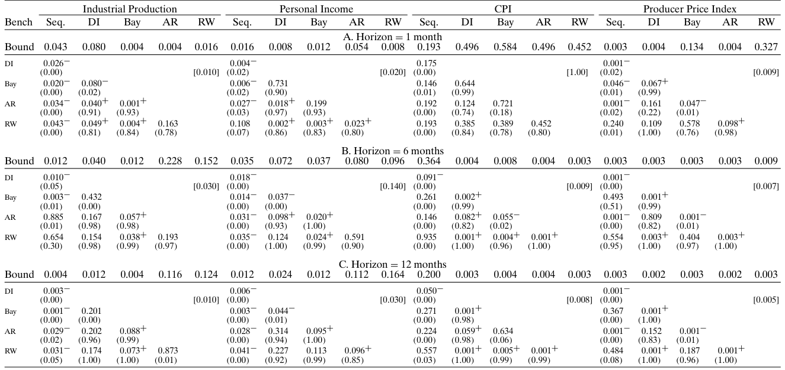

aResults of pairwise tests of equal conditional predictive ability for the forecast methods described in Section 6.1. The entries are the p-values of the test of equal conditional predictive ability of Theorem 5 for the forecast methods in the corresponding row and column. The loss is quadratic and the test function is ht = (1⟦未识别符号⟧⟦未识别符号⟧Lm⟦未识别符号⟧t )′ . The numbers within parentheses are the proportion of times the method in the column outperforms the method in the row over the out-of-sample period, according to the decision rule described in Section 4. A plus (minus) sign indicates that the test rejects equal conditional predictive ability at the 10% level and that the method in the column outperforms (is outperformed by) the method in the row more than 50% of the time. For example, for industrial production at the 1-month horizon, equal conditional predictive ability of the Bayesian shrinkage and the AR methods is rejected with a p-value of 0.001 and the Bayesian shrinkage method outperforms the AR method 93% of the time. The rows labeled “Bound” report the Hochberg–Bonferroni (HB) multiple hypothesis p-value bound for the method in the column relative to all other methods. The square brackets [ ] contain the HB p-value bound for the hypothesis that all pairwise comparisons are zero for that panel.

---

## PDF 第 24 页

[回查原始 PDF 第 24 页](./2006_Giacomini_条件预测能力检验.pdf#page=24)

> ⚠️ 本页部分行内数学字体未正确解码，已标明「⟦未识别符号⟧」；精确数学内容请用下方整页原貌核对。

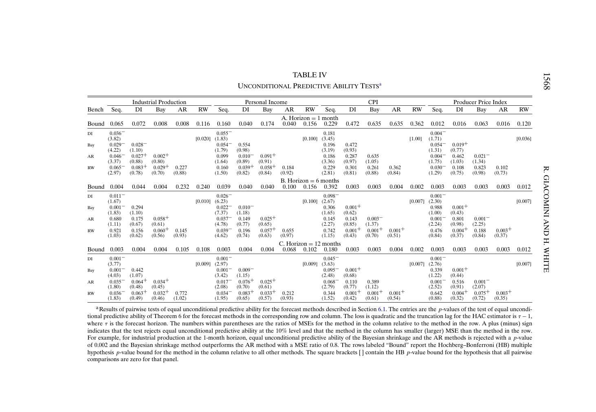

## TABLE IV 

## UNCONDITIONAL PREDICTIVE ABILITY TESTSa 

|||Industr|ial Prod|uction|||Pers|onal Inc|ome|||CPI||||Produ|cer Price|Index||
|---|---|---|---|---|---|---|---|---|---|---|---|---|---|---|---|---|---|---|---|
|Bench|Seq.|DI|Bay|AR|RW|Seq.|DI|Bay|AR|RW Seq.|DI|Bay|AR|RW|Seq.|DI|Bay|AR|RW|
|Bound|0.065|0.072|0.008|0.008|0.116|0.160|0.040|0.174|A. Hor 0.040|izon=1 month 0.156 0.229|0.472|0.635|0.635|0.362|0.012|0.016|0.063|0.016|0.120|
|DI|0⟦未识别符号⟧036− (3⟦未识别符号⟧82)||||[0⟦未识别符号⟧020]|0⟦未识别符号⟧055−  (1⟦未识别符号⟧83)||||0⟦未识别符号⟧181 [0⟦未识别符号⟧100] (3⟦未识别符号⟧45)||||[1⟦未识别符号⟧00]|0⟦未识别符号⟧004− (1⟦未识别符号⟧71)||||[0⟦未识别符号⟧036]|
|Bay|0⟦未识别符号⟧029−|0⟦未识别符号⟧028−||||0⟦未识别符号⟧054−|0⟦未识别符号⟧554|||0⟦未识别符号⟧196|0⟦未识别符号⟧472||||0⟦未识别符号⟧054−|0⟦未识别符号⟧019+||||
||(4⟦未识别符号⟧22)|(1⟦未识别符号⟧10) ||||(1⟦未识别符号⟧79)|(0⟦未识别符号⟧98)|||(3⟦未识别符号⟧19)|(0⟦未识别符号⟧93)||||(1⟦未识别符号⟧31)|(0⟦未识别符号⟧77)||||
|AR|0⟦未识别符号⟧046−|0⟦未识别符号⟧027+|0⟦未识别符号⟧002+|||0⟦未识别符号⟧099|0⟦未识别符号⟧010−|0⟦未识别符号⟧091+||0⟦未识别符号⟧186|0⟦未识别符号⟧287|0⟦未识别符号⟧635|||0⟦未识别符号⟧004−|0⟦未识别符号⟧462|0⟦未识别符号⟧021−|||
||(3⟦未识别符号⟧37)|(0⟦未识别符号⟧88) |(0⟦未识别符号⟧80) |||(1⟦未识别符号⟧64)|(0⟦未识别符号⟧89) |(0⟦未识别符号⟧91) ||(3⟦未识别符号⟧36)|(0⟦未识别符号⟧97)|(1⟦未识别符号⟧05)|||(1⟦未识别符号⟧75)|(1⟦未识别符号⟧03)|(1⟦未识别符号⟧34)|||
|RW|0⟦未识别符号⟧065−|0⟦未识别符号⟧083+|0⟦未识别符号⟧029+|0⟦未识别符号⟧227||0⟦未识别符号⟧160|0⟦未识别符号⟧039+|0⟦未识别符号⟧058+|0⟦未识别符号⟧184|0⟦未识别符号⟧229|0⟦未识别符号⟧301|0⟦未识别符号⟧261|0⟦未识别符号⟧362||0⟦未识别符号⟧030−|0⟦未识别符号⟧108|0⟦未识别符号⟧823|0⟦未识别符号⟧102||
||(2⟦未识别符号⟧97)|(0⟦未识别符号⟧78)|(0⟦未识别符号⟧70)|(0⟦未识别符号⟧88)||(1⟦未识别符号⟧50)|(0⟦未识别符号⟧82)|(0⟦未识别符号⟧84)|(0⟦未识别符号⟧92)|(2⟦未识别符号⟧81)|(0⟦未识别符号⟧81)|(0⟦未识别符号⟧88)|(0⟦未识别符号⟧84)||(1⟦未识别符号⟧29)|(0⟦未识别符号⟧75)|(0⟦未识别符号⟧98)|(0⟦未识别符号⟧73)||
||||||||||B. Hori|zon=6 months||||||||||
|Bound|0.004|0.044|0.004|0.232|0.240|0.039|0.040|0.040|0.100|0.156 0.392|0.003|0.003|0.004|0.002|0.003|0.003|0.003|0.003|0.012|
|DI|0⟦未识别符号⟧011−|||||0⟦未识别符号⟧026−||||0⟦未识别符号⟧098−|||||0⟦未识别符号⟧001−|||||
||(1⟦未识别符号⟧67)||||[0⟦未识别符号⟧010]|(6⟦未识别符号⟧23)||||[0⟦未识别符号⟧100] (2⟦未识别符号⟧67)||||[0⟦未识别符号⟧007]|(2⟦未识别符号⟧30)||||[0⟦未识别符号⟧007]|
|Bay|0⟦未识别符号⟧001−|0⟦未识别符号⟧294||||0⟦未识别符号⟧022−|0⟦未识别符号⟧010−|||0⟦未识别符号⟧306 |0⟦未识别符号⟧001+||||0⟦未识别符号⟧988|0⟦未识别符号⟧001+||||
||(1⟦未识别符号⟧83)|(1⟦未识别符号⟧10)||||(7⟦未识别符号⟧37)|(1⟦未识别符号⟧18)|||(1⟦未识别符号⟧65)|(0⟦未识别符号⟧62)||||(1⟦未识别符号⟧00)|(0⟦未识别符号⟧43)||||
|AR|0⟦未识别符号⟧680|0⟦未识别符号⟧175|0⟦未识别符号⟧058+|||0⟦未识别符号⟧037−|0⟦未识别符号⟧149|0⟦未识别符号⟧025+||0⟦未识别符号⟧145|0⟦未识别符号⟧143|0⟦未识别符号⟧003−|||0⟦未识别符号⟧001−|0⟦未识别符号⟧801|0⟦未识别符号⟧001−|||
||(1⟦未识别符号⟧11)|(0⟦未识别符号⟧67)|(0⟦未识别符号⟧61) |||(4⟦未识别符号⟧78)|(0⟦未识别符号⟧77)|(0⟦未识别符号⟧65) ||(2⟦未识别符号⟧27)|(0⟦未识别符号⟧85) |(1⟦未识别符号⟧37) |||(2⟦未识别符号⟧24)|(0⟦未识别符号⟧98) |(2⟦未识别符号⟧25)|||
|RW|0⟦未识别符号⟧921|0⟦未识别符号⟧156|0⟦未识别符号⟧060+|0⟦未识别符号⟧145||0⟦未识别符号⟧039−|0⟦未识别符号⟧196|0⟦未识别符号⟧057+|0⟦未识别符号⟧655|0⟦未识别符号⟧742|0⟦未识别符号⟧001+|0⟦未识别符号⟧001+|0⟦未识别符号⟧001+||0⟦未识别符号⟧476|0⟦未识别符号⟧004+|0⟦未识别符号⟧188|0⟦未识别符号⟧003+||
||(1⟦未识别符号⟧03)|(0⟦未识别符号⟧62)|(0⟦未识别符号⟧56)|(0⟦未识别符号⟧93)||(4⟦未识别符号⟧62)|(0⟦未识别符号⟧74)|(0⟦未识别符号⟧63)|(0⟦未识别符号⟧97)|(1⟦未识别符号⟧15)|(0⟦未识别符号⟧43)|(0⟦未识别符号⟧70)|(0⟦未识别符号⟧51)||(0⟦未识别符号⟧84)|(0⟦未识别符号⟧37)|(0⟦未识别符号⟧84)|(0⟦未识别符号⟧37)||
||||||||||C. Hori|zon=12 months||||||||||
|Bound|0.003|0.004|0.004|0.105|0.108|0.003|0.004|0.004|0.068|0.102 0.180|0.003|0.003|0.004|0.002|0.003|0.003|0.003|0.003|0.012|
|DI|0⟦未识别符号⟧001− (3⟦未识别符号⟧77)||||[0⟦未识别符号⟧009]|0⟦未识别符号⟧001−  (2⟦未识别符号⟧97)||||0⟦未识别符号⟧045− [0⟦未识别符号⟧009] (3⟦未识别符号⟧63)||||[0⟦未识别符号⟧007]|0⟦未识别符号⟧001−  (2⟦未识别符号⟧76)||||[0⟦未识别符号⟧007]|
|Bay|0⟦未识别符号⟧001−|0⟦未识别符号⟧442||||0⟦未识别符号⟧001−|0⟦未识别符号⟧009−|||0⟦未识别符号⟧095−|0⟦未识别符号⟧001+||||0⟦未识别符号⟧339|0⟦未识别符号⟧001+||||
||(4⟦未识别符号⟧03)|(1⟦未识别符号⟧07)||||(3⟦未识别符号⟧42)|(1⟦未识别符号⟧15)|||(2⟦未识别符号⟧48)|(0⟦未识别符号⟧68)||||(1⟦未识别符号⟧22)|(0⟦未识别符号⟧44)||||
|AR|0⟦未识别符号⟧035−|0⟦未识别符号⟧064+|0⟦未识别符号⟧034+|||0⟦未识别符号⟧017−|0⟦未识别符号⟧076+|0⟦未识别符号⟧025+||0⟦未识别符号⟧068−|0⟦未识别符号⟧110|0⟦未识别符号⟧389|||0⟦未识别符号⟧001−|0⟦未识别符号⟧516|0⟦未识别符号⟧001−|||
||(1⟦未识别符号⟧80)|(0⟦未识别符号⟧48) |(0⟦未识别符号⟧45) |||(2⟦未识别符号⟧08)|(0⟦未识别符号⟧70) |(0⟦未识别符号⟧61) ||(2⟦未识别符号⟧79)|(0⟦未识别符号⟧77) |(1⟦未识别符号⟧12) |||(2⟦未识别符号⟧52)|(0⟦未识别符号⟧91) |(2⟦未识别符号⟧07) |||
|RW|0⟦未识别符号⟧036− |0⟦未识别符号⟧063+ |0⟦未识别符号⟧032+ |0⟦未识别符号⟧772 ||0⟦未识别符号⟧034− |0⟦未识别符号⟧083+ |0⟦未识别符号⟧033+ |0⟦未识别符号⟧212 |0⟦未识别符号⟧344 |0⟦未识别符号⟧001+ |0⟦未识别符号⟧001+ |0⟦未识别符号⟧001+ ||0⟦未识别符号⟧642 |0⟦未识别符号⟧004+ |0⟦未识别符号⟧075+ |0⟦未识别符号⟧003+ ||
||(1⟦未识别符号⟧83)|(0⟦未识别符号⟧49)|(0⟦未识别符号⟧46)|(1⟦未识别符号⟧02)||(1⟦未识别符号⟧95)|(0⟦未识别符号⟧65)|(0⟦未识别符号⟧57)|(0⟦未识别符号⟧93)|(1⟦未识别符号⟧52)|(0⟦未识别符号⟧42)|(0⟦未识别符号⟧61)|(0⟦未识别符号⟧54)||(0⟦未识别符号⟧88)|(0⟦未识别符号⟧32)|(0⟦未识别符号⟧72)|(0⟦未识别符号⟧35)||

> 表格版面核对：以下截图保留原始单元格关系，合并单元格及复杂表头以截图为准。

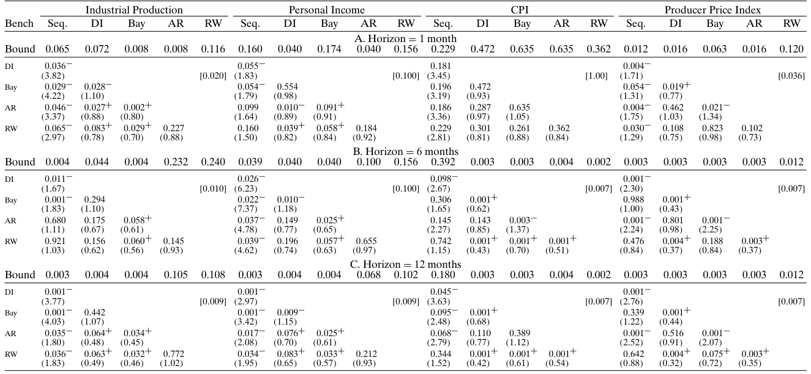

aResults of pairwise tests of equal unconditional predictive ability for the forecast methods described in Section 6.1. The entries are the p-values of the test of equal unconditional predictive ability of Theorem 6 for the forecast methods in the corresponding row and column. The loss is quadratic and the truncation lag for the HAC estimator is τ − 1, where τ is the forecast horizon. The numbers within parentheses are the ratios of MSEs for the method in the column relative to the method in the row. A plus (minus) sign indicates that the test rejects equal unconditional predictive ability at the 10% level and that the method in the column has smaller (larger) MSE than the method in the row. For example, for industrial production at the 1-month horizon, equal unconditional predictive ability of the Bayesian shrinkage and the AR methods is rejected with a p-value of 0.002 and the Bayesian shrinkage method outperforms the AR method with a MSE ratio of 0.8. The rows labeled “Bound” report the Hochberg–Bonferroni (HB) multiple hypothesis p-value bound for the method in the column relative to all other methods. The square brackets [ ] contain the HB p-value bound for the hypothesis that all pairwise comparisons are zero for that panel.

---

## PDF 第 25 页

[回查原始 PDF 第 25 页](./2006_Giacomini_条件预测能力检验.pdf#page=25)

> ⚠️ 本页部分行内数学字体未正确解码，已标明「⟦未识别符号⟧」；精确数学内容请用下方整页原貌核对。

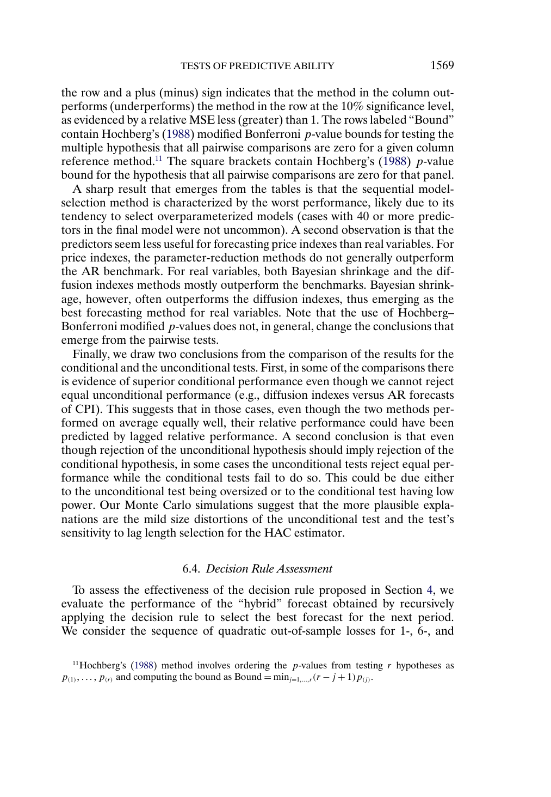

the row and a plus (minus) sign indicates that the method in the column outperforms (underperforms) the method in the row at the 10% significance level, as evidenced by a relative MSE less (greater) than 1. The rows labeled “Bound” contain Hochberg’s (1988) modified Bonferroni p-value bounds for testing the multiple hypothesis that all pairwise comparisons are zero for a given column reference method.11 The square brackets contain Hochberg’s (1988) p-value bound for the hypothesis that all pairwise comparisons are zero for that panel. 

A sharp result that emerges from the tables is that the sequential modelselection method is characterized by the worst performance, likely due to its tendency to select overparameterized models (cases with 40 or more predictors in the final model were not uncommon). A second observation is that the predictors seem less useful for forecasting price indexes than real variables. For price indexes, the parameter-reduction methods do not generally outperform the AR benchmark. For real variables, both Bayesian shrinkage and the diffusion indexes methods mostly outperform the benchmarks. Bayesian shrinkage, however, often outperforms the diffusion indexes, thus emerging as the best forecasting method for real variables. Note that the use of Hochberg– Bonferroni modified p-values does not, in general, change the conclusions that emerge from the pairwise tests. 

Finally, we draw two conclusions from the comparison of the results for the conditional and the unconditional tests. First, in some of the comparisons there is evidence of superior conditional performance even though we cannot reject equal unconditional performance (e.g., diffusion indexes versus AR forecasts of CPI). This suggests that in those cases, even though the two methods performed on average equally well, their relative performance could have been predicted by lagged relative performance. A second conclusion is that even though rejection of the unconditional hypothesis should imply rejection of the conditional hypothesis, in some cases the unconditional tests reject equal performance while the conditional tests fail to do so. This could be due either to the unconditional test being oversized or to the conditional test having low power. Our Monte Carlo simulations suggest that the more plausible explanations are the mild size distortions of the unconditional test and the test’s sensitivity to lag length selection for the HAC estimator. 

# 6.4. _Decision Rule Assessment_ 

To assess the effectiveness of the decision rule proposed in Section 4, we evaluate the performance of the “hybrid” forecast obtained by recursively applying the decision rule to select the best forecast for the next period. We consider the sequence of quadratic out-of-sample losses for 1-, 6-, and 

> 11Hochberg’s (1988) method involves ordering the p-values from testing r hypotheses as p(1)⟦未识别符号⟧⟦未识别符号⟧⟦未识别符号⟧⟦未识别符号⟧⟦未识别符号⟧p(r) and computing the bound as Bound = minj=1⟦未识别符号⟧⟦未识别符号⟧⟦未识别符号⟧⟦未识别符号⟧⟦未识别符号⟧r(r − j + 1)p(j).

---

## PDF 第 26 页

[回查原始 PDF 第 26 页](./2006_Giacomini_条件预测能力检验.pdf#page=26)

> ⚠️ 本页部分行内数学字体未正确解码，已标明「⟦未识别符号⟧」；精确数学内容请用下方整页原貌核对。

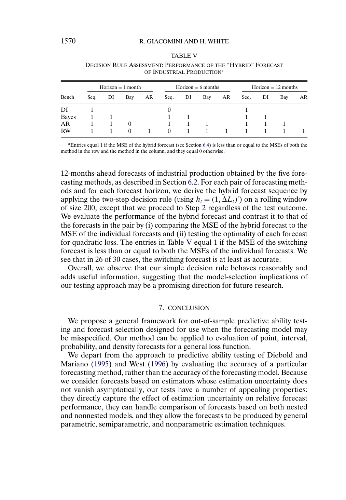

TABLE V 

DECISION RULE ASSESSMENT: PERFORMANCE OF THE “HYBRID” FORECAST OF INDUSTRIAL PRODUCTIONa 

||H|orizon=|1 month||H|orizon=|6 month|s|H|orizon=|12 mont|hs|
|---|---|---|---|---|---|---|---|---|---|---|---|---|
|Bench|Seq.|DI|Bay|AR|Seq.|DI|Bay|AR|Seq.|DI|Bay|AR|
|DI|1||||0||||1||||
|Bayes|1|1|||1|1|||1|1|||
|AR|1|1|0||1|1|1||1|1|1||
|RW|1|1|0|1|0|1|1|1|1|1|1|1|

> 表格版面核对：以下截图保留原始单元格关系，合并单元格及复杂表头以截图为准。

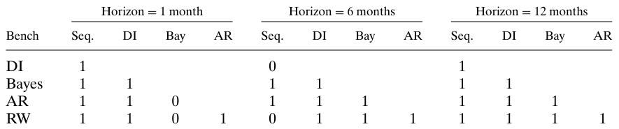

aEntries equal 1 if the MSE of the hybrid forecast (see Section 6.4) is less than or equal to the MSEs of both the method in the row and the method in the column, and they equal 0 otherwise. 

12-months-ahead forecasts of industrial production obtained by the five forecasting methods, as described in Section 6.2. For each pair of forecasting methods and for each forecast horizon, we derive the hybrid forecast sequence by applying the two-step decision rule (using ht = (1⟦未识别符号⟧⟦未识别符号⟧Lt)′ ) on a rolling window of size 200, except that we proceed to Step 2 regardless of the test outcome. We evaluate the performance of the hybrid forecast and contrast it to that of the forecasts in the pair by (i) comparing the MSE of the hybrid forecast to the MSE of the individual forecasts and (ii) testing the optimality of each forecast for quadratic loss. The entries in Table V equal 1 if the MSE of the switching forecast is less than or equal to both the MSEs of the individual forecasts. We see that in 26 of 30 cases, the switching forecast is at least as accurate. 

Overall, we observe that our simple decision rule behaves reasonably and adds useful information, suggesting that the model-selection implications of our testing approach may be a promising direction for future research. 

# 7. CONCLUSION 

We propose a general framework for out-of-sample predictive ability testing and forecast selection designed for use when the forecasting model may be misspecified. Our method can be applied to evaluation of point, interval, probability, and density forecasts for a general loss function. 

We depart from the approach to predictive ability testing of Diebold and Mariano (1995) and West (1996) by evaluating the accuracy of a particular forecasting method, rather than the accuracy of the forecasting model. Because we consider forecasts based on estimators whose estimation uncertainty does not vanish asymptotically, our tests have a number of appealing properties: they directly capture the effect of estimation uncertainty on relative forecast performance, they can handle comparison of forecasts based on both nested and nonnested models, and they allow the forecasts to be produced by general parametric, semiparametric, and nonparametric estimation techniques.

---

## PDF 第 27 页

[回查原始 PDF 第 27 页](./2006_Giacomini_条件预测能力检验.pdf#page=27)

Our framework can accommodate both unconditional objectives (which forecasting method was more accurate on average?), which have been the sole focus of the literature up to this point, as well as conditional objectives (can we predict which forecasting method will be more accurate at a specific future date?), which can help fine-tune the forecast selection decision to current economic conditions. We accordingly propose two tests: a test of equal conditional predictive ability and a test of equal unconditional predictive ability, which is the Diebold and Mariano (1995) test extended to an environment that permits parameter estimation. 

Our Monte Carlo simulations suggest that our conditional tests have good finite-sample size and power properties. For the unconditional test, we show that when we compare nested models, our test correctly recognizes that forecasts from a misspecified but parsimonious model may be as accurate as forecasts from a correctly specified but less parsimonious model. Previously available tests (McCracken (1999) and Clark and McCracken (2001)) instead focus on the model rather than the forecasting method, and thus tend to favor the less parsimonious model. The disparity between the two approaches is greater the smaller is the ratio of in-sample to out-of-sample sizes. A drawback of the unconditional test implemented here is that it tends to falsely reject equal performance when the loss differences have zero mean but are highly serially correlated. This may be possible to remedy by more careful selection of HAC covariance estimators. On the other hand, the conditional tests emerge as useful tools for detecting persistence in the relative performance of the forecasts, as well as cases where the relative performance may depend on the state of the economy. 

We explore the model-selection implications of adopting a conditional perspective by proposing and illustrating a simple two-step decision rule for forecast selection that tests for equal performance of the competing forecasts and then—in case of rejection—uses currently available information to select the best forecast for the future date of interest. 

One useful application of our tests is the evaluation of different parameterreduction methods for forecasting with a large number of predictors. We consider three popular methods: a sequential model selection approach, the diffusion indexes approach of Stock and Watson (2002), and Bayesian shrinkage estimation. Previous techniques are not capable of comparing these forecasting methods. We find that the sequential model-selection method performs worst, probably due to its tendency to select large models. A second result is that the predictors are less useful for price indexes than real variables. For these variables, Bayesian shrinkage is the best method. 

Much work remains to be done. A significant area for future research is the exploration of procedures for selecting the best forecasting method or for optimally combining the methods in case of rejection of equal conditional predictive ability. A further generalization of our tests is to consider multiple comparison methods that are more sophisticated than the Hochberg–Bonferroni

---

## PDF 第 28 页

[回查原始 PDF 第 28 页](./2006_Giacomini_条件预测能力检验.pdf#page=28)

> ⚠️ 本页部分行内数学字体未正确解码，已标明「⟦未识别符号⟧」；精确数学内容请用下方整页原貌核对。

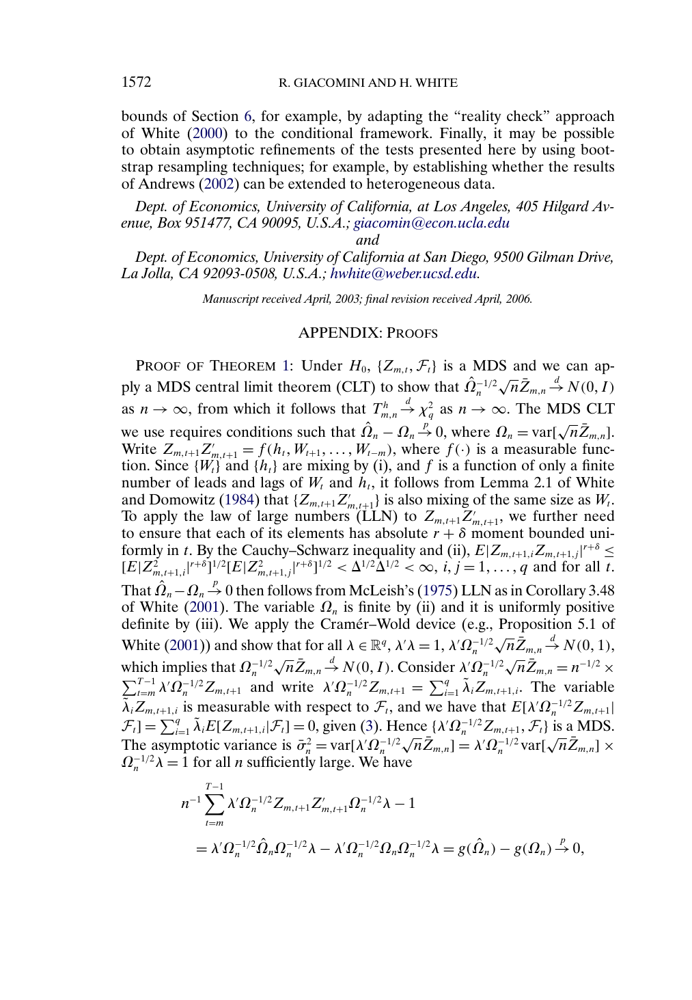

bounds of Section 6, for example, by adapting the “reality check” approach of White (2000) to the conditional framework. Finally, it may be possible to obtain asymptotic refinements of the tests presented here by using bootstrap resampling techniques; for example, by establishing whether the results of Andrews (2002) can be extended to heterogeneous data. 

_Dept. of Economics, University of California, at Los Angeles, 405 Hilgard Avenue, Box 951477, CA 90095, U.S.A.; giacomin@econ.ucla.edu_ 

_and_ 

_Dept. of Economics, University of California at San Diego, 9500 Gilman Drive, La Jolla, CA 92093-0508, U.S.A.; hwhite@weber.ucsd.edu._ 

_Manuscript received April, 2003; final revision received April, 2006._ 

# APPENDIX: PROOFS 

PROOF OF THEOREM 1: Under H0, {Zm⟦未识别符号⟧t⟦未识别符号⟧ _F_ t} is a MDS and we can apply a MDS central limit theorem (CLT) to show that Ωˆ− n1/2 √nZ¯ m⟦未识别符号⟧n →d N(0⟦未识别符号⟧I) as n →∞, from which it follows that Tm⟦未识别符号⟧nh →d χ2qasn →∞.TheMDSCLT we use requires conditions such that Ωˆ n − Ωn →p 0, where Ωn = var[ ~~√~~ nZ¯ m⟦未识别符号⟧n]. Write Zm⟦未识别符号⟧t+1Zm⟦未识别符号⟧t′ +1= f(ht⟦未识别符号⟧Wt+1⟦未识别符号⟧⟦未识别符号⟧⟦未识别符号⟧⟦未识别符号⟧⟦未识别符号⟧Wt−m),wheref(·)isameasurablefunc- tion. Since {Wt} and {ht} are mixing by (i), and f is a function of only a finite number of leads and lags of Wt and ht, it follows from Lemma 2.1 of White and Domowitz (1984) that {Zm⟦未识别符号⟧t+1Zm⟦未识别符号⟧t′ +1} is also mixing of the same size as Wt. To apply the law of large numbers (LLN) to Zm⟦未识别符号⟧t+1Zm⟦未识别符号⟧t′ +1,wefurtherneed to ensure that each of its elements has absolute r + δ moment bounded uniformly in t. By the Cauchy–Schwarz inequality and (ii), E|Zm⟦未识别符号⟧t+1⟦未识别符号⟧iZm⟦未识别符号⟧t+1⟦未识别符号⟧j|r+δ ≤ [E|Zm⟦未识别符号⟧t2 +1⟦未识别符号⟧i|r+δ]1/2[E|Z m⟦未识别符号⟧t2 +1⟦未识别符号⟧j|r+δ]1/2 < ⟦未识别符号⟧1/2⟦未识别符号⟧1/2 < ∞,i⟦未识别符号⟧j = 1⟦未识别符号⟧⟦未识别符号⟧⟦未识别符号⟧⟦未识别符号⟧⟦未识别符号⟧qandforallt. That Ωˆ n −Ωn →p 0 then follows from McLeish’s (1975) LLN as in Corollary 3.48 of White (2001). The variable Ωn is finite by (ii) and it is uniformly positive definite by (iii). We apply the Cramér–Wold device (e.g., Proposition 5.1 of White (2001)) and show that for all λ ∈ Rq , λ′ λ = 1, λ′ Ω− n1/2 √nZ¯ m⟦未识别符号⟧n →d N(0⟦未识别符号⟧ 1), which implies that Ω− n1/2 √nZ¯ m⟦未识别符号⟧n →d N(0⟦未识别符号⟧I). Consider λ′Ω−n 1/2√nZ¯ m⟦未识别符号⟧n = n−1/2 × ⟦未识别符号⟧Tt=−m1λ′Ω− n1/2 Zm⟦未识别符号⟧t+1 and write λ′ Ω− n1/2 Zm⟦未识别符号⟧t+1 =⟦未识别符号⟧q i=1λ˜iZm⟦未识别符号⟧t+1⟦未识别符号⟧i.Thevariable λ˜ iZm⟦未识别符号⟧t+1⟦未识别符号⟧i is measurable with respect to _F_ t, and we have that E[λ′ Ω− n1/2 Zm⟦未识别符号⟧t+1| _F_ t] =⟦未识别符号⟧q i=1λ˜iE[Zm⟦未识别符号⟧t+1⟦未识别符号⟧i|_F_t] = 0, given (3). Hence {λ′Ω n−1/2 Zm⟦未识别符号⟧t+1⟦未识别符号⟧ _F_ t} is a MDS. The asymptotic variance is σ¯ n2= var[λ′Ω− n1/2 √nZ¯ m⟦未识别符号⟧n] = λ′ Ω− n1/2 var[√ nZ¯ m⟦未识别符号⟧n] × Ω− n1/2 λ = 1 for all n sufficiently large. We have 

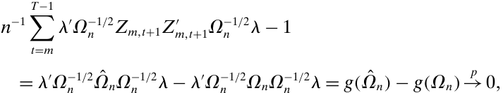

---

## PDF 第 29 页

[回查原始 PDF 第 29 页](./2006_Giacomini_条件预测能力检验.pdf#page=29)

> ⚠️ 本页部分行内数学字体未正确解码，已标明「⟦未识别符号⟧」；精确数学内容请用下方整页原貌核对。

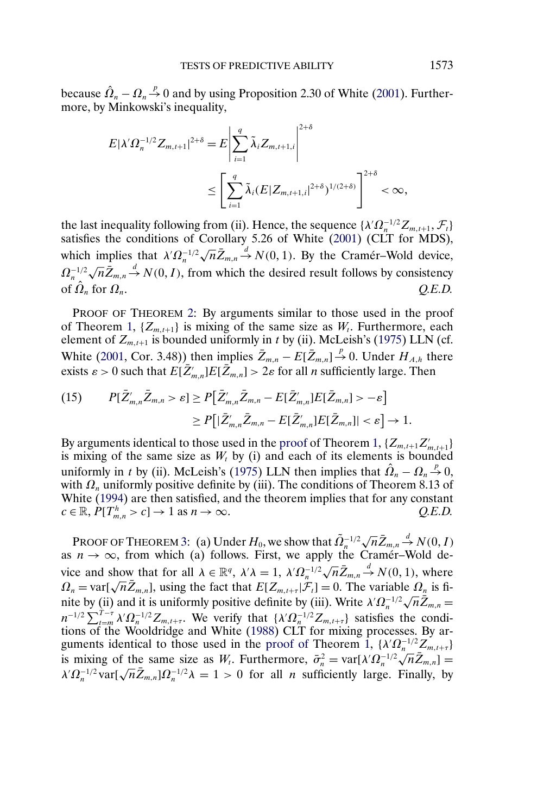

because Ωˆ n − Ωn →p 0 and by using Proposition 2.30 of White (2001). Furthermore, by Minkowski’s inequality, 

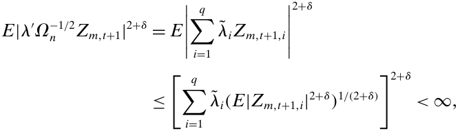

the last inequality following from (ii). Hence, the sequence {λ′ Ω− n1/2 Zm⟦未识别符号⟧t+1⟦未识别符号⟧ _F_ t} satisfies the conditions of Corollary 5.26 of White (2001) (CLT for MDS), which implies that λ′ Ω− n1/2 √nZ¯ m⟦未识别符号⟧n →d N(0⟦未识别符号⟧ 1). By the Cramér–Wold device, Ω− n1/2 √nZ¯ m⟦未识别符号⟧n →d N(0⟦未识别符号⟧I), from which the desired result follows by consistency of Ωˆ n for Ωn. _Q.E.D._ 

PROOF OF THEOREM 2: By arguments similar to those used in the proof of Theorem 1, {Zm⟦未识别符号⟧t+1} is mixing of the same size as Wt. Furthermore, each element of Zm⟦未识别符号⟧t+1 is bounded uniformly in t by (ii). McLeish’s (1975) LLN (cf. White (2001, Cor. 3.48)) then implies Z¯ m⟦未识别符号⟧n − E[ Z¯ m⟦未识别符号⟧n] →p 0. Under HA⟦未识别符号⟧h there exists ε > 0 such that E[ Z¯ m⟦未识别符号⟧n′]E[ ¯Zm⟦未识别符号⟧n] > 2ε for all n sufficiently large. Then 

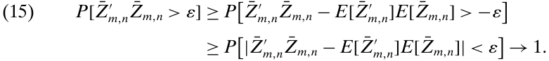

By arguments identical to those used in the proof of Theorem 1, {Zm⟦未识别符号⟧t+1Zm⟦未识别符号⟧t′ +1} is mixing of the same size as Wt by (i) and each of its elements is bounded uniformly in t by (ii). McLeish’s (1975) LLN then implies that Ωˆ n − Ωn →p 0, with Ωn uniformly positive definite by (iii). The conditions of Theorem 8.13 of White (1994) are then satisfied, and the theorem implies that for any constant c ∈ R, P[Tm⟦未识别符号⟧nh> c] →1 as n →∞. _Q.E.D._ 

PROOF OF THEOREM 3: (a) Under H0, we show that Ω˜− n1/2 ~~√~~ nZ¯ m⟦未识别符号⟧n →d N(0⟦未识别符号⟧I) as n →∞, from which (a) follows. First, we apply the Cramér–Wold device and show that for all λ ∈ Rq , λ′ λ = 1, λ′ Ω− n1/2 ~~√~~ nZ¯ m⟦未识别符号⟧n →d N(0⟦未识别符号⟧ 1), where Ωn = var[√ nZ¯ m⟦未识别符号⟧n], using the fact that E[Zm⟦未识别符号⟧t+τ| _F_ t] = 0. The variable Ωn is finite by (ii) and it is uniformly positive definite by (iii). Write λ′ Ω− n1/2 ~~√~~ nZ¯ m⟦未识别符号⟧n = n−1/2 ⟦未识别符号⟧T t=− mτλ′Ω n−1/2 Zm⟦未识别符号⟧t+τ. We verify that {λ′ Ω− n1/2 Zm⟦未识别符号⟧t+τ} satisfies the conditions of the Wooldridge and White (1988) CLT for mixing processes. By arguments identical to those used in the proof of Theorem 1, {λ′ Ω− n1/2 Zm⟦未识别符号⟧t+τ} is mixing of the same size as Wt. Furthermore, σ¯ n2=var[λ′Ω− n1/2 √nZ¯ m⟦未识别符号⟧n] = λ′ Ω− n1/2 var[~~√~~ nZ¯ m⟦未识别符号⟧n]Ω− n1/2 λ = 1 > 0 for all n sufficiently large. Finally, by

---

## PDF 第 30 页

[回查原始 PDF 第 30 页](./2006_Giacomini_条件预测能力检验.pdf#page=30)

> ⚠️ 本页部分行内数学字体未正确解码，已标明「⟦未识别符号⟧」；精确数学内容请用下方整页原貌核对。

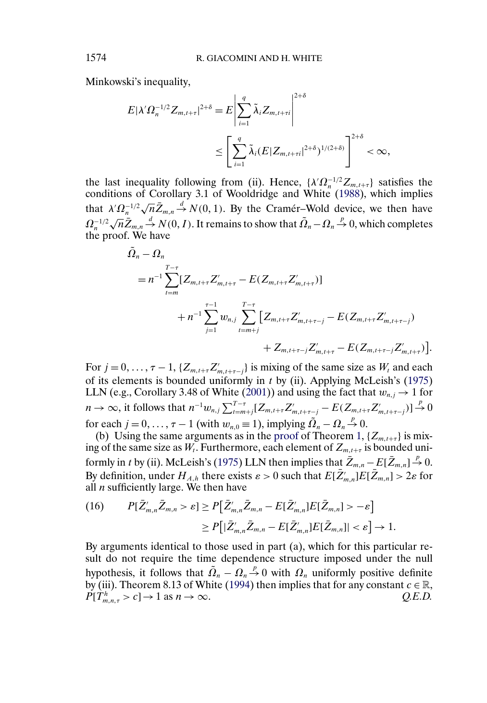

Minkowski’s inequality, 

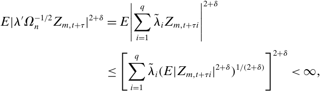

the last inequality following from (ii). Hence, {λ′ Ω− n1/2 Zm⟦未识别符号⟧t+τ} satisfies the conditions of Corollary 3.1 of Wooldridge and White (1988), which implies that λ′ Ω− n1/2 √nZ¯ m⟦未识别符号⟧n →d N(0⟦未识别符号⟧ 1). By the Cramér–Wold device, we then have Ω− n1/2 √nZ¯ m⟦未识别符号⟧n →d N(0⟦未识别符号⟧I). It remains to show that Ω˜ n − Ωn →p 0, which completes the proof. We have 

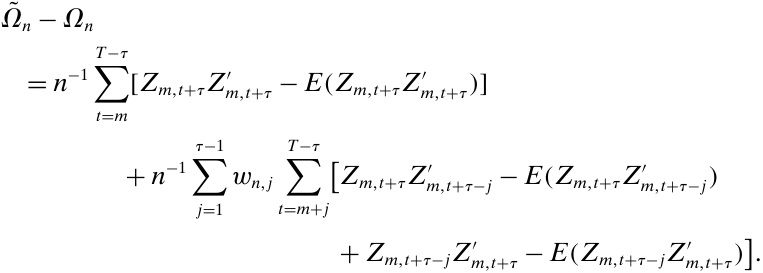

For j = 0⟦未识别符号⟧⟦未识别符号⟧⟦未识别符号⟧⟦未识别符号⟧⟦未识别符号⟧τ − 1, {Zm⟦未识别符号⟧t+τZm⟦未识别符号⟧t′ +τ−j} is mixing of the same size as Wtand each of its elements is bounded uniformly in t by (ii). Applying McLeish’s (1975) LLN (e.g., Corollary 3.48 of White (2001)) and using the fact that wn⟦未识别符号⟧j → 1 for n →∞, it follows that n−1 wn⟦未识别符号⟧j ⟦未识别符号⟧Tt=−mτ+j[Zm⟦未识别符号⟧t+τZ m⟦未识别符号⟧t′ +τ−j−E(Zm⟦未识别符号⟧t+τZ m⟦未识别符号⟧t′ +τ−j)] →p 0 for each j = 0⟦未识别符号⟧⟦未识别符号⟧⟦未识别符号⟧⟦未识别符号⟧⟦未识别符号⟧τ − 1 (with wn⟦未识别符号⟧0 ≡ 1), implying Ω˜ n − Ωn →p 0. 

(b) Using the same arguments as in the proof of Theorem 1, {Zm⟦未识别符号⟧t+τ} is mixing of the same size as Wt. Furthermore, each element of Zm⟦未识别符号⟧t+τ is bounded uniformly in t by (ii). McLeish’s (1975) LLN then implies that Z¯ m⟦未识别符号⟧n − E[ Z¯ m⟦未识别符号⟧n] →p 0. By definition, under HA⟦未识别符号⟧h there exists ε > 0 such that E[ Z¯ m⟦未识别符号⟧n′]E[ ¯Zm⟦未识别符号⟧n] > 2ε for all n sufficiently large. We then have 

(16) 

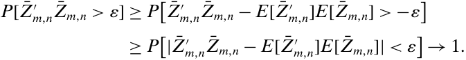

By arguments identical to those used in part (a), which for this particular result do not require the time dependence structure imposed under the null hypothesis, it follows that Ω˜ n − Ωn →p 0 with Ωn uniformly positive definite by (iii). Theorem 8.13 of White (1994) then implies that for any constant c ∈ R, P[Tm⟦未识别符号⟧n⟦未识别符号⟧τh> c]→1 as n →∞. _Q.E.D._

---

## PDF 第 31 页

[回查原始 PDF 第 31 页](./2006_Giacomini_条件预测能力检验.pdf#page=31)

> ⚠️ 本页部分行内数学字体未正确解码，已标明「⟦未识别符号⟧」；精确数学内容请用下方整页原貌核对。

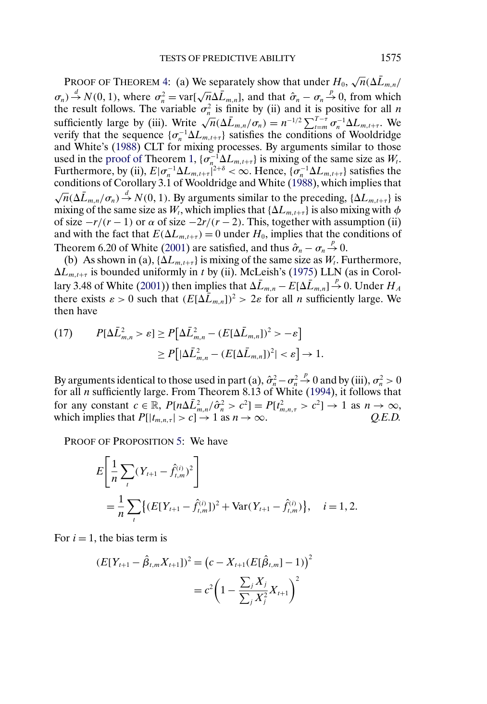

PROOF OF THEOREM 4: (a) We separately show that under H0,~~√~~ n(⟦未识别符号⟧L¯ m⟦未识别符号⟧n/ σn) →d N(0⟦未识别符号⟧ 1), where σn2= var[~~√~~ n⟦未识别符号⟧L¯ m⟦未识别符号⟧n], and that σˆ n − σn →p 0, from which the result follows. The variable σn2isfiniteby(ii)anditispositiveforalln sufficiently large by (iii). Write√ n(⟦未识别符号⟧L¯ m⟦未识别符号⟧n/σn) = n−1/2 ⟦未识别符号⟧T t=− mτσ n−1⟦未识别符号⟧Lm⟦未识别符号⟧t+τ.We verify that the sequence {σn−1⟦未识别符号⟧Lm⟦未识别符号⟧t+τ}satisfiestheconditionsofWooldridge and White’s (1988) CLT for mixing processes. By arguments similar to those used in the proof of Theorem 1, {σn−1⟦未识别符号⟧Lm⟦未识别符号⟧t+τ} is mixing of the same size as Wt. Furthermore, by (ii), E|σn−1⟦未识别符号⟧Lm⟦未识别符号⟧t+τ|2+δ < ∞. Hence, {σ n−1⟦未识别符号⟧Lm⟦未识别符号⟧t+τ} satisfies the conditions of Corollary 3.1 of Wooldridge and White (1988), which implies that √n(⟦未识别符号⟧L¯ m⟦未识别符号⟧n/σn) →d N(0⟦未识别符号⟧ 1). By arguments similar to the preceding, {⟦未识别符号⟧Lm⟦未识别符号⟧t+τ} is mixing of the same size as Wt, which implies that {⟦未识别符号⟧Lm⟦未识别符号⟧t+τ} is also mixing with φ of size −r/(r − 1) or α of size −2r/(r − 2). This, together with assumption (ii) and with the fact that E(⟦未识别符号⟧Lm⟦未识别符号⟧t+τ) = 0 under H0, implies that the conditions of Theorem 6.20 of White (2001) are satisfied, and thus σˆ n − σn →p 0. 

(b) As shown in (a), {⟦未识别符号⟧Lm⟦未识别符号⟧t+τ} is mixing of the same size as Wt. Furthermore, ⟦未识别符号⟧Lm⟦未识别符号⟧t+τ is bounded uniformly in t by (ii). McLeish’s (1975) LLN (as in Corollary 3.48 of White (2001)) then implies that ⟦未识别符号⟧L¯ m⟦未识别符号⟧n − E[⟦未识别符号⟧L¯ m⟦未识别符号⟧n] →p 0. Under HA there exists ε > 0 such that (E[⟦未识别符号⟧L¯ m⟦未识别符号⟧n])2 > 2ε for all n sufficiently large. We then have 

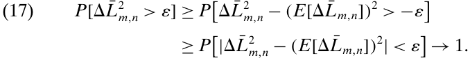

By arguments identical to those used in part (a), σˆ n2−σ n2 →p 0 and by (iii), σn2> 0 for all n sufficiently large. From Theorem 8.13 of White (1994), it follows that for any constant c ∈ R, P[n⟦未识别符号⟧L¯2 m⟦未识别符号⟧n/σ ˆ n2> c2] = P[t m⟦未识别符号⟧n⟦未识别符号⟧τ2> c2] →1asn →∞, which implies that P[|tm⟦未识别符号⟧n⟦未识别符号⟧τ| > c] → 1 as n →∞. _Q.E.D._ 

PROOF OF PROPOSITION 5: We have 

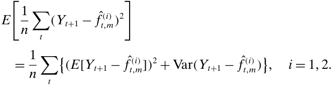

For i = 1, the bias term is 

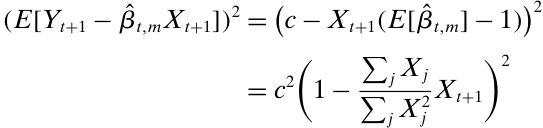

---

## PDF 第 32 页

[回查原始 PDF 第 32 页](./2006_Giacomini_条件预测能力检验.pdf#page=32)

> ⚠️ 本页部分行内数学字体未正确解码，已标明「⟦未识别符号⟧」；精确数学内容请用下方整页原貌核对。

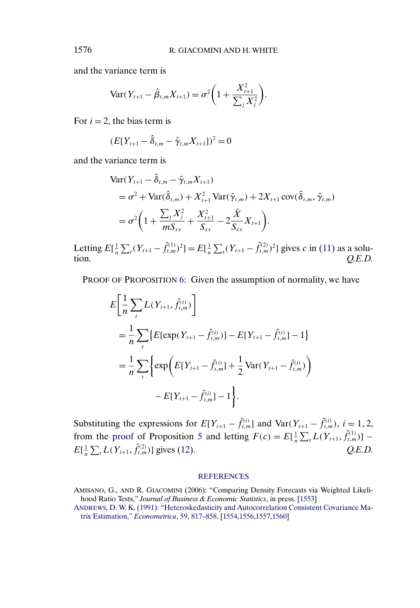

1576 

R. GIACOMINI AND H. WHITE 

and the variance term is 

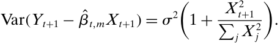

For i = 2, the bias term is 

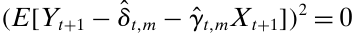

and the variance term is 

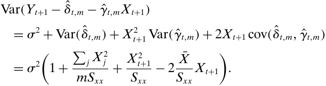

Letting E[ n<u>1</u> ⟦未识别符号⟧t(Yt+1 −ˆf ( t⟦未识别符号⟧m1))2] = E[ n<u>1</u> ⟦未识别符号⟧t(Yt+1 −ˆf ( t⟦未识别符号⟧m2))2] gives cin (11) as a solu- tion. _Q.E.D._ 

PROOF OF PROPOSITION 6: Given the assumption of normality, we have 

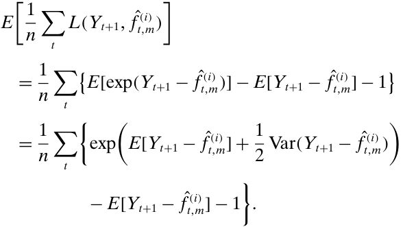

Substituting the expressions for E[Yt+1 − fˆ t⟦未识别符号⟧m(i)]andVar(Y t+1−ˆf (i) t⟦未识别符号⟧m),i = 1⟦未识别符号⟧2, from the proof of Proposition 5 and letting F(c) = E[ n<u>1</u> ⟦未识别符号⟧tL(Yt+1⟦未识别符号⟧fˆ ( t⟦未识别符号⟧m1))] − E[ n<u>1</u> ⟦未识别符号⟧tL(Yt+1⟦未识别符号⟧fˆ ( t⟦未识别符号⟧m2))] gives (12). _Q.E.D._ 

REFERENCES 

> AMISANO, G., AND R. GIACOMINI (2006): “Comparing Density Forecasts via Weighted Likelihood Ratio Tests,” _Journal of Business & Economic Statistics_ , in press. [1553] 

> ANDREWS, D. W. K. (1991): “Heteroskedasticity and Autocorrelation Consistent Covariance Matrix Estimation,” _Econometrica_ , 59, 817–858. [1554,1556,1557,1560]

---

## PDF 第 33 页

[回查原始 PDF 第 33 页](./2006_Giacomini_条件预测能力检验.pdf#page=33)

(2002): “Higher-Order Improvements of a Computationally Attractive k-Step Bootstrap for Extremum Estimators,” _Econometrica_ , 70, 119–162. [1572] BIERENS, H. B. (1990): “A Consistent Conditional Moment Test of Functional Form,” _Econometrica_ , 58, 1443–1458. [1556] 

- CHAO, J. C., V. CORRADI, AND N. R. SWANSON (2001): “An Out-of-Sample Test for Granger Causality,” _Macroeconomic Dynamics_ , 5, 598–620. [1545] 

- CLARK, T. E. (1999): “Finite-Sample Properties of Tests of Equal Forecast Accuracy,” _Journal of Forecasting_ , 18, 489–504. [1558] 

CLARK, T. E., AND M. W. MCCRACKEN (2001): “Tests of Equal Forecast Accuracy and Encompassing for Nested Models,” _Journal of Econometrics_ , 105, 85–110. [1545,1547,1559,1560,1571] CLARK, T. E., AND K. D. WEST (2005): “Using Out-of-Sample Mean Squared Prediction Errors to Test the Martingale Difference Hypothesis,” NBER Technical Working Paper #305. [1546] 

CLEMENTS, M. P., AND D. F. HENDRY (1998): _Forecasting Economic Time Series_ . Cambridge, U.K.: Cambridge University Press. [1551] 

(1999): _Forecasting Non-Stationary Economic Time Series_ . Cambridge, MA: MIT Press. 

## [1551] 

CORRADI, V., N. R. SWANSON, AND C. OLIVETTI (2001): “Predictive Ability with Cointegrated Variables,” _Journal of Econometrics_ , 104, 315–358. [1545] 

- DIEBOLD, F. X., AND R. S. MARIANO (1995): “Comparing Predictive Accuracy,” _Journal of Business & Economic Statistics_ , 13, 253–263. [1545,1546,1557,1558,1570,1571] 

- DIEBOLD, F. X., AND J. A. LOPEZ (1996): “Forecast Evaluation and Combination,” in _Handbook of Statistics_ , Vol. 14: Statistical Methods in Finance, ed. by G. S. Maddala and C. R. Rao. Amsterdam: North-Holland, 241–268. [1553] 

FAMA, E. F., AND J. D. MACBETH (1973): “Risk, Return, and Equilibrium: Empirical Tests,” _Journal of Political Economy_ , 81, 607–636. [1548,1550] 

- GIACOMINI, R., AND I. KOMUNJER (2005): “Evaluation and Combination of Conditional Quantile Forecasts,” _Journal of Business & Economic Statistics_ , 23, 416–431. [1553,1555] 

- GONEDES, N. (1973): “Evidence on the Information Content of Accounting Massages: Accounting-Based and Market-Based Estimate of Systematic Risk,” _Journal of Financial and Quantitative Analysis_ , 8, 407–444. [1548,1550] 

- GRANGER, C. W. J., AND P. NEWBOLD (1977): _Forecasting Economic Time Series_ . London: Academic Press. [1546] 

HARVEY, D. I., S. J. LEYBOURNE, AND P. NEWBOLD (1997): “Testing the Equality of Prediction Mean Squared Errors,” _International Journal of Forecasting_ , 13, 281–291. [1546] 

- HOCHBERG, Y. (1988): “A Sharper Bonferroni Procedure for Multiple Tests of Significance,” _Biometrika_ , 75, 800–802. [1569] 

- HOOVER, K. D., AND S. J. PEREZ (1999): “Data Mining Reconsidered: Encompassing and the General-to-Specific Approach to Specification Search,” _Econometrics Journal_ , 2, 167–191. [1548,1564] 

- LEITCH, G., AND J. E. TANNER (1991): “Economic Forecast Evaluation: Profits versus the Conventional Error Measures,” _American Economic Review_ , 81, 580–590. [1546,1552] 

- LITTERMAN, R. B. (1986): “Forecasting with Bayesian Vector Autoregressions—Five Years of Experience,” _Journal of Business & Economic Statistics_ , 4, 25–38. [1548,1564,1565] 

- MCCRACKEN, M. W. (1999): “Asymptotics for Out-of-Sample Tests of Granger Causality,” Working Paper, University of Missouri, Columbia. [1559-1561,1571] 

(2000): “Robust Out-of-Sample Inference,” _Journal of Econometrics_ , 99, 195–223. [1545, 

## 1554] 

MCLEISH, D. L. (1975): “A Maximal Inequality and Dependent Strong Laws,” _The Annals of Probability_ , 3, 826–836. [1572-1575] 

- NEWEY, W. K., AND K. D. WEST (1987): “A Simple, Positive Semidefinite, Heteroskedasticity and Autocorrelation Consistent Covariance Matrix,” _Econometrica_ , 55, 703–708. [1556] 

- PESARAN, M. H., AND A. TIMMERMANN (2006): “Selection of Estimation Window in the Presence of Breaks,” _Journal of Econometrics_ , forthcoming. [1548,1552]

---

## PDF 第 34 页

[回查原始 PDF 第 34 页](./2006_Giacomini_条件预测能力检验.pdf#page=34)

- STINCHCOMBE, M. B., AND H. WHITE (1998): “Consistent Specification Testing with Nuisance Parameters Present Only under the Alternative,” _Econometric Theory_ , 14, 295–325. [1556] 

- STOCK, J. H., AND M. W. WATSON (2002): “Macroeconomic Forecasting Using Diffusion Indexes,” _Journal of Business & Economic Statistics_ , 20, 147–162. [1548,1564,1571] 

- WEST, K. D. (1996): “Asymptotic Inference about Predictive Ability,” _Econometrica_ , 64, 1067–1084. [1545,1546,1549,1550,1554,1570] 

- WEST, K. D., H. J. EDISON, AND D. CHO (1993): “A Utility-Based Comparison of Some Models of Exchange Rate Volatility,” _Journal of International Economics_ , 35, 23–45. [1546,1552] 

- WHITE, H. (1994): _Estimation, Inference and Specification Analysis_ . New York: Cambridge University Press. [1551,1573-1575] 

   - (2000): “A Reality Check for Data Snooping,” _Econometrica_ , 68, 1097–1126. [1572] 

   - (2001): _Asymptotic Theory for Econometricians_ . San Diego: Academic Press. [1572-1575] 

- WHITE, H., AND I. DOMOWITZ (1984): “Nonlinear Regression with Dependent Observations,” _Econometrica_ , 52, 143–162. [1572] 

- WOOLDRIDGE, J. M., AND H. WHITE (1988): “Some Invariance Principles and Central Limit Theorems for Dependent Heterogeneous Processes,” _Econometric Theory_ , 4, 210–230. [1573-1575]
