# Bayesian weighted discrete-time dynamic models for association football prediction

> **认知网络导航**：[项目宪法 AGENTS.md](../AGENTS.md) · [习惯塑形芯片](../分析复盘记录/总复盘总结.md) · [最新复盘审计](../分析复盘记录/2026-09-13_复盘.md) · [文献总库](./README.md#review-papers)
> 版本：arXiv:2508.05891v1，2025-08-07 作者预印本；关联期刊版发表于 2026 年，DOI 10.1093/jrsssc/qlag032。
> 原文 Markdown 转换版；保留英文内容，非译文、非摘要。
> [原始 PDF](./2025_Macri_足球贝叶斯加权动态模型_arXiv.pdf) · [一手来源](https://arxiv.org/abs/2508.05891) · [论文索引](./README.md#review-papers)
> 共 26 页；页码按 PDF 物理页序。使用 PyMuPDF4LLM 1.28.2 转换，2026-09-14。
> 正文可检索；公式和图形以原文图像保留，表格同时附版面截图。文字模型无法读取图像内容，涉及公式、图表或精确数值时，须使用具备图像阅读能力的 AI 并核对 PDF。
> 数学补充：11 个按编号匹配的作者 HTML 公式块、13 个未定位的作者 HTML 公式块、0 个看图转写公式；其余公式保留原图。缺失字符页面另附整页原貌，未宣称全部数学已转成文字。
> 双栏、跨页段落和行内上下标仍可能存在转换误差；此版本不保证无损还原。

---

## PDF 第 1 页

[回查原始 PDF 第 1 页](./2025_Macri_足球贝叶斯加权动态模型_arXiv.pdf#page=1)

# **Bayesian weighted discrete-time dynamic models for association football prediction** 

**Roberto Macr`ı-Demartino** ∗, **Leonardo Egidi** , and **Nicola Torelli** 

Department of Economics, Business, Mathematics, and Statistics “Bruno de Finetti”, University of Trieste, 

Via A. Valerio 4/1, Trieste, 34127, Italy 

THIS IS A PREPRINT WHICH HAS NOT YET BEEN PEER REVIEWED 

##### **Abstract** 

In recent years, great emphasis has been placed on the prediction of association football. Due to this, several studies have proposed different types of statistical models to predict the outcome of a football match. However, most existing approaches usually assume that the offensive and defensive abilities of teams remain static over time. We introduce a Bayesian dynamic approach for football goal-based models that uses period-specific commensurate priors to flexibly weight the evolution of attacking and defensive abilities. Our approach assigns separate, time-varying precisions for each ability and period, controlled via spike-and-slab hyperpriors. This adaptive shrinkage borrows information about teams’ strength when past and current performance aligns and allows rapid adjustments when teams experience substantial changes (e.g., transfer windows or coaching changes). We integrate this framework into six standard goal-based models evaluating predictive performance using data from the last five seasons of the German Bundesliga, English Premier League, and Spanish La Liga. Compared with the other discrete-time dynamic models, our adaptive approach yields better predictive performance. The proposed methodology has also been implemented in the free and open source R package footBayes. 

**Keywords** : Commensurate prior, Hierarchical models, Historical borrowing, Posterior predictive, Sport Analytics 

## **1 Introduction** 

Quantitative analysis of association football (soccer), hereafter referred to as football, and more specifically, matches’ prediction is a rapidly evolving discipline, increasingly valued by participants, coaches, owners, and gamblers looking to gain a competitive advantage. Consequently, there is a growing demand for information that supports better decision making. 

The outcome of football matches can be predicted using two main statistical modelling frameworks. In the goal-based (or direct) approach, the actual numbers of goals scored by each team is a count variable – most commonly modelled via Poisson or Negative-Binomial regression. The expected goal counts are functions of team attributes (e.g., offensive and defensive abilities) and, when relevant, home-field advantage. In contrast, result-based (or indirect) models predict one of three outcomes – home win, draw, or away win – typically through ordered probit (Koning, 2000) or logit (Carpita et al., 2015, 2019) regressions. Furthermore, the widespread popularity of large datasets promoted the use of machine learning (ML) tools, yielding a fundamentally different 

> ∗Corresponding author e-mail: roberto.macridemartino@deams.units.it

---

## PDF 第 2 页

[回查原始 PDF 第 2 页](./2025_Macri_足球贝叶斯加权动态模型_arXiv.pdf#page=2)

modelling approach based on a random forest Breiman (2001). The potential of using this as a new results-based model was first explored by Schauberger and Groll (2018) to assess the predictive performance of different types of random forests compared to classical Poisson regression methods on data containing all matches of the FIFA World Cups 2002–2014. Along these lines, Groll et al. (2019a), Groll et al. (2019b), Groll et al. (2021), and Groll et al. (2024) further expand this framework. It is worth noting that the result-based framework is formally nested within the goal-based one. Specifically, match results are derived from the underlying goal counts, while knowing only the three-way result provides no information about the actual goals scored, potentially misestimating team strength (Egidi and Torelli, 2021). Therefore, we focus on the richer goal-based structure, which not only yields three-way predictions but also captures the magnitude of outcomes. 

In the simplest goal-based formulation, team-specific goal counts are assumed conditionally independent given team abilities or covariates, resulting in a double Poisson model (Maher, 1982; Baio and Blangiardo, 2010; Groll and Abedieh, 2013; Egidi et al., 2018, among others). To relax the strong independence assumption, several generalisations introduce score dependence. Dixon and Coles (1997) extended the work of Maher (1982) by allowing (a slightly negative) correlation between scores and incorporating a dependence parameter into their model to account for it. Karlis and Ntzoufras (2003) introduced in a frequentist framework the bivariate Poisson model, designed to account for positive goal dependencies. Furthermore, Ntzoufras (2011) extended it from a Bayesian perspective. 

A main assumption of previous models is the invariance of team-specific parameters, implying static offensive and defensive abilities over time. However, it is recognised that team performance is inherently dynamic, fluctuating over years and possibly within seasons. One simple approach is the time decay weighting used by Dixon and Coles (1997), in which older match outcomes are downweighted so that recent games have more influence on estimated abilities. However, a more formal approach is to treat team abilities as time-varying parameters. Specifically, a continuous-time dynamic extension of the double Poisson model was introduced by Rue and Øyvind Salvesen (2000), while Koopman and Lit (2015) and Koopman and Lit (2019) integrated bivariate Poisson models in a state-space framework, allowing the abilities of the team to vary according to a state vector. Alternatively, Owen (2011) proposed a Bayesian discrete-time approach based on an evolution component that describes the stochastic behaviour of time-dependent parameters. Here, the evolution component is specified as a random walk prior distribution structure for both the attack and defence parameters. Recent developments include Egidi et al. (2018), which incorporates betting odds and other refinements, and Macr`ı Demartino et al. (2025), that evaluate predictive performance improvements when the ranking of a team is added as a covariate in dynamic models. However, a key limitation of the approach proposed by Owen (2011) is the assumption of a constant and common evolution precision for both attack and defence parameters. This constraint may limit the predictive performance of the goal-based model, ignoring the fact that a team’s performance can fluctuate more during certain periods (e.g., early season transfers, midseason managerial changes). Furthermore, forcing the same evolution precision for both attack and defence neglects that these abilities can have different rates of change – defensive abilities may adapt more slowly than offensive ones, or vice versa. 

In the present work, we try to fill this gap by proposing a Bayesian weighted discrete-time approach that incorporates time-specific commensurate priors (Hobbs et al., 2011, 2012) for both attack and defence parameters. This provides a formal mechanism for letting the prior distributions at a specific time to adaptively borrow information from the previous time, but only to the extent that the data support it. By introducing flexible and dynamic evolution precision, we obtain a more accurate and adaptive modelling of team abilities over time, improving the predictive performances.

---

## PDF 第 3 页

[回查原始 PDF 第 3 页](./2025_Macri_足球贝叶斯加权动态模型_arXiv.pdf#page=3)

The paper is organised as follows. Section 2 presents the Poisson and Negative Binomial goal-based models used in this study. Furthermore, Section 3 describes the commensurate prior framework and introduces our proposed dynamic weighted approach for the offensive and defensive abilities of the teams in the goal-based models. In Section 4, we apply our methodology to some of the top European leagues, namely: the German Bundesliga, English Premier League (EPL), and Spanish La Liga. A total of five seasons from 2020 to 2025 are used from each league to perform the study. Finally, Section 5 provides concluding remarks that outline limitations, advantages, and potential future research directions. 

## **2 Goal-based models** 

This section presents the statistical goal-based models used to predict the chosen competition outcomes. Through an in-depth analysis, our aim is to provide a comprehensive overview of the methodologies applied to predict football matches, highlighting both their statistical foundations and practical implementations in sports analytics. 

### **2.1 Poisson-based models** 

Let ( _𝑥𝑖,𝑛, 𝑦 𝑗,𝑛_ ) represent the observed number of goals scored by the home and the away team in the _n_ -th match, with _𝑖_ ≠ _𝑗_ = 1 _, . . . , 𝑁𝑇_ and _𝑛_ = 1 _, . . . , 𝑁_ . A simple double Poisson (DP) model (Maher, 1982) assumes that the goal counts follow two conditionally independent Poisson distributions 

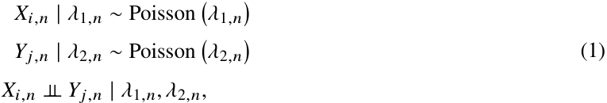

[作者 HTML 原式 (1)](https://arxiv.org/html/2508.05891v1#S2.E1)，按编号对应原图：

$$
\begin{gathered}
\displaystyle X_{i,n}\mid\lambda_{1,n} \displaystyle\sim\operatorname{Poisson}\left(\lambda_{1,n}\right) \\
\displaystyle Y_{j,n}\mid\lambda_{2,n} \displaystyle\sim\operatorname{Poisson}\left(\lambda_{2,n}\right) \\
\displaystyle X_{i,n}\perp\!\!\!\perp Y_{j,n} \displaystyle\mid\lambda_{1,n},\lambda_{2,n},
\end{gathered}
$$

where the (non-negative) parameters _𝜆_ 1 _,𝑛_ and _𝜆_ 2 _,𝑛_ are the expected scoring rates of the home and away teams, respectively, in the _n_ -match. In Maher’s model, the rate at which a team is expected to score is a function of both its own offensive ability and the defensive ability of its opponent 

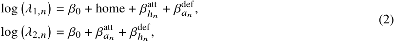

[作者 HTML 原式 (2)](https://arxiv.org/html/2508.05891v1#S2.E2)，按编号对应原图：

$$
\begin{gathered}
\displaystyle\log\left(\lambda_{1,n}\right) \displaystyle=\beta_{0}+\text{home}+\beta^{\operatorname{att}}_{h_{n}}+\beta^{\operatorname{def}}_{a_{n}}, \\
\displaystyle\log\left(\lambda_{2,n}\right) \displaystyle=\beta_{0}+\beta^{\operatorname{att}}_{a_{n}}+\beta^{\operatorname{def}}_{h_{n}},
\end{gathered}
$$

where the parameter _𝛽_ 0 is a common intercept, ”home” captures the well-known home-field advantage, and _𝛽_att and _𝛽_def represent the unknown attacking and defensive abilities of the home team _ℎ𝑛_ and the away team _𝑎𝑛_ in the _n_ -th match.. 

However, it is widely recognised that the scores of two competing football teams are positively correlated. Thus, the independence assumption in the double Poisson model (1) might be too restrictive. To account for this correlation, Karlis and Ntzoufras (2003) introduced the bivariate Poisson (BP) model, which explicitly captures the dependence between goal counts. The joint distribution for the goals scored by the home and away teams

---

## PDF 第 4 页

[回查原始 PDF 第 4 页](./2025_Macri_足球贝叶斯加权动态模型_arXiv.pdf#page=4)

under this model is given by the bivariate Poisson probability mass function 

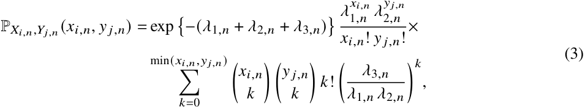

[作者 HTML 原式 (3)](https://arxiv.org/html/2508.05891v1#S2.E3)，按编号对应原图：

$$
\begin{gathered}
\displaystyle\mathbb{P}_{X_{i,n},Y_{j,n}}(x_{i,n},y_{j,n})= \displaystyle\exp\left\{-(\lambda_{1,n}+\lambda_{2,n}+\lambda_{3,n})\right\}\frac{\lambda_{1,n}^{x_{i,n}}\,\lambda_{2,n}^{y_{j,n}}}{x_{i,n}!\,y_{j,n}!}\times \\
\displaystyle\sum_{k=0}^{\min(x_{i,n},y_{j,n})}\binom{x_{i,n}}{k}\,\binom{y_{j,n}}{k}\,k!\,\biggl(\frac{\lambda_{3,n}}{\lambda_{1,n}\,\lambda_{2,n}}\biggr)^{k},
\end{gathered}
$$

where E( _𝑋𝑖,𝑛_ ) = _𝜆_ 1 _,𝑛_ + _𝜆_ 3 _,𝑛_ and E( _𝑌 𝑗,𝑛_ ) = _𝜆_ 2 _,𝑛_ + _𝜆_ 3 _,𝑛_ . The parameter _𝜆_ 3 _,𝑛_ = cov( _𝑋𝑖,𝑛,𝑌 𝑗,𝑛_ ) measures the covariance between the two goal counts, representing the dependence between the scores of the two teams. Furthermore, the scoring rates _𝜆_ 1 _,𝑛_ and _𝜆_ 2 _,𝑛_ are defined as in (2). Additionally, in Equation (3), we model the covariance _𝜆_ 3 _,𝑛_ to not depend on other predictors 

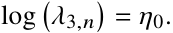

The bivariate Poisson model generalizes the double Poisson model. Specifically, when _𝜆_ 3 _,𝑛_ = 0, the goal counts become independent, and the bivariate Poisson model reduces precisely to the double Poisson model described in (1). 

### **2.2 Negative Binomial and Skellam alternatives** 

Poisson models assume equal mean and variance, which may not hold in real-world football data – especially in competitions where overdispersion (sample variance exceeds the sample mean) is observed in the number of goals. To handle this, a common approach is to replace each Poisson marginal with a negative binomial (NB) distribution (Reep et al., 1971). That is 

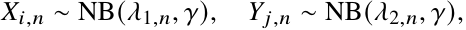

where _𝜆_ 1 _,𝑛_ and _𝜆_ 2 _,𝑛_ follow the same log-linear structure introduced in Section 2.1, and _𝛾>_ 0 is the dispersion parameter. The negative binomial model directly captures the overdispersion in the goal count of each team, with higher values of _𝛾_ indicating a greater inflation of variance compared to the Poisson models. 

Alternatively, Karlis and Ntzoufras (2009) suggest using the Skellam distribution (Skellam, 1946), which directly models the difference in goal. Notably, the Skellam distribution captures not only the overdispersion but also the intrinsic dependence between the teams’ scoring outcomes, without requiring explicit correlation modelling. Specifically, let _𝑋𝑖,𝑛_ and _𝑌 𝑗,𝑛_ represent independent Poisson counts for goals scored by teams _𝑇𝑖_ and _𝑇𝑗_ in the _n_ -th match, respectively, with _𝑖_ ≠ _𝑗_ = 1 _, . . . , 𝑁𝑇_ and _𝑛_ = 1 _, . . . , 𝑁_ . The Skellam model (SM) is then given by the difference of the two goal counts 

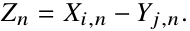

The corresponding probability mass function is given by 

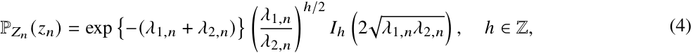

[作者 HTML 原式 (4)](https://arxiv.org/html/2508.05891v1#S2.E4)，按编号对应原图：

$$
\displaystyle\mathbb{P}_{Z_{n}}(z_{n})=\exp\left\{-(\lambda_{1,n}+\lambda_{2,n})\right\}\left(\frac{\lambda_{1,n}}{\lambda_{2,n}}\right)^{h/2}I_{h}\left(2\sqrt{\lambda_{1,n}\lambda_{2,n}}\right),\quad h\in\mathbb{Z},
$$

where E( _𝑍𝑛_ ) = _𝜆_ 1 _,𝑛_ − _𝜆_ 2 _,𝑛_ and Var( _𝑍𝑛_ ) = _𝜆_ 1 _,𝑛_ + _𝜆_ 2 _,𝑛_ . Furthermore, _𝐼ℎ_ (·) is the modified Bessel function of

---

## PDF 第 5 页

[回查原始 PDF 第 5 页](./2025_Macri_足球贝叶斯加权动态模型_arXiv.pdf#page=5)

order _ℎ_ (Skellam, 1946). The parameters _𝜆_ 1 _,𝑛_ and _𝜆_ 2 _,𝑛_ adopt the same log-linear structure as in the previous cases. 

### **2.3 Inflating the draws probability** 

Poisson goal-based models often underestimate the incidence of draws, which are the diagonal elements in goal probability matrices. To mitigate this, Karlis and Ntzoufras (2009) introduced a diagonally inflated bivariate Poisson (DIBP) model as follows 

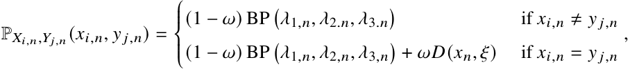

where BP(·) is the bivariate Poisson probability mass function as in (3), _𝜔_ ∈[0 _,_ 1] controls the inflation weight, and _𝐷_ ( _𝑥𝑛, 𝜉_ ) is a discrete distribution with parameter vector _𝜉_ , which favours draw outcomes. 

Similarly, to address excess draws in goal differences, the zero-inflated Skellam model (ZISM) (Karlis and Ntzoufras, 2009) can be adopted 

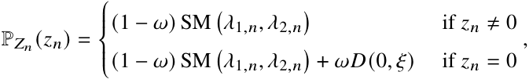

where SM(·) is the Skellam probability mass function as in (4), and _𝐷_ (0 _, 𝜉_ ) is a discrete distribution that places extra mass at zero. 

### **2.4 Dynamic prior distributions and identifiability constraints** 

A structural limitation in the previous models is the assumption of static team-specific parameters, namely, teams are assumed to have a constant performance over time, determined by attack and defence abilities _𝛽_att and _𝛽_def , respectively. However, the performance of teams tends to be dynamic – between seasons and even from week to week – due to factors such as summer and winter transfer windows reshaping lineups, injuries benching key players, or midseason coaching changes because of unsatisfactory results. 

Several approaches have been proposed to dynamically model team-specific abilities (Rue and Øyvind Salvesen, 2000; Owen, 2011; Koopman and Lit, 2015, 2019, among others). In particular, Owen (2011) extended the static framework by introducing a discrete-time evolution for team-specific effects. Specifically, the evolution component is specified as a random walk for both the attack and defence parameters by centering the effect of seasonal time _𝜏_ on the lagged effect in _𝜏_ − 1. This allows the attack and defence parameters to vary between seasons or weeks. Therefore, for each team _𝑇𝑖_ , where _𝑖_ = 1 _, . . . , 𝑁𝑇_ , and each period _𝜏_ , where _𝜏_ = 2 _, . . . ,_ T , the prior distributions for the attack and defence abilities are usually defined as follows 

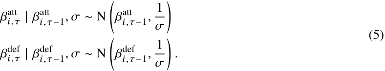

[作者 HTML 原式 (5)](https://arxiv.org/html/2508.05891v1#S2.E5)，按编号对应原图：

$$
\begin{gathered}
\displaystyle\beta^{\text{att}}_{i,\tau}\mid\beta^{\text{att}}_{i,\tau-1},\sigma\sim\mathrm{N}\left(\beta^{\text{att}}_{i,\tau-1},\dfrac{1}{\sigma}\right) \\
\displaystyle\beta^{\text{def}}_{i,\tau}\mid\beta^{\text{def}}_{i,\tau-1},\sigma\sim\mathrm{N}\left(\beta^{\text{def}}_{i,\tau-1},\dfrac{1}{\sigma}\right).
\end{gathered}
$$

---

## PDF 第 6 页

[回查原始 PDF 第 6 页](./2025_Macri_足球贝叶斯加权动态模型_arXiv.pdf#page=6)

While for the initial period _𝜏_ = 1, the prior distributions are initialised as 

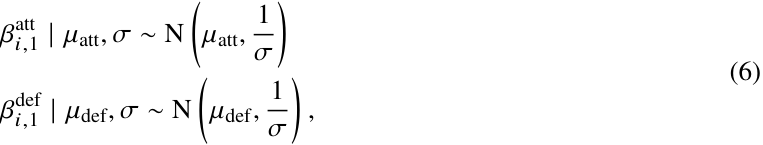

[作者 HTML 原式 (6)](https://arxiv.org/html/2508.05891v1#S2.E6)，按编号对应原图：

$$
\begin{gathered}
\displaystyle\beta^{\text{att}}_{i,1}\mid\mu_{\text{att}},\sigma\sim\mathrm{N}\left(\mu_{\operatorname{att}},\dfrac{1}{\sigma}\right) \\
\displaystyle\beta^{\text{def}}_{i,1}\mid\mu_{\text{def}},\sigma\sim\mathrm{N}\left(\mu_{\operatorname{def}},\dfrac{1}{\sigma}\right),
\end{gathered}
$$

where _𝜇_ att and _𝜇_ def are the prior means for the initial attack and defence abilities, respectively, and _𝜎_ is the common evolution precision, assumed constant over time and identical between all teams and both team-specific abilities. To ensure identifiability, a zero-sum constraint (Baio and Blangiardo, 2010; Owen, 2011) on the random effects within each period is required 

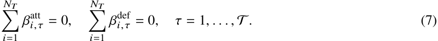

[作者 HTML 原式 (7)](https://arxiv.org/html/2508.05891v1#S2.E7)，按编号对应原图：

$$
\sum_{i=1}^{N_{T}}\beta^{\mathrm{att}}_{i,\tau}=0,\quad\sum_{i=1}^{N_{T}}\beta^{\mathrm{def}}_{i,\tau}=0,\quad\tau=1,\dots,\mathcal{T}.
$$

As a matter of parameter interpretation, once the models have been estimated, a larger team-attack parameter indicates stronger attacking quality, while a smaller team-defence parameter corresponds to stronger defensive performance. 

## **3 A weighted dynamic proposal** 

As described in Section 2.4, a key assumption of the discrete-time evolution approach as in (5) is a single constant evolution precision 1/ _𝜎_ shared by all teams and by both their attack and defence parameters. However, this assumption can compromise predictive accuracy by either overborrowing (underborrowing) strength from one period to the next. Specifically, some periods – such as the summer transfer window or a midseason coaching change – can cause rapid shifts in team abilities, justifying the discount of earlier performance information; while other periods, when the teams’ abilities are stable, borrowing more past information can improve the predictive performances. Furthermore, offensive and defensive abilities may often evolve at different rates. In this section, we propose a weighted dynamic approach based on commensurate priors, which employ separate, time-varying evolution precisions for attack and defence. By treating the matches played during a specific period as ”current data” with respect to the ”historical data” from the previous period, this approach offers an intuitive framework in which the prior at each time point adaptively borrows information from the previous period, but only to the extent that the data justify it. 

### **3.1 Commensurate priors** 

In the Bayesian framework, adaptively informative priors are valuable for synthesising results across studies, particularly in the clinical setting, where the appropriate borrowing of historical knowledge can be critical. By providing a coherent statistical framework that incorporates all relevant sources of information, these methods can substantially reduce the required sample sizes, increase statistical power, and lower both costs and ethical risks. 

Here, we focus on hierarchical models that employ commensurate priors (Hobbs et al., 2011, 2012) as the main mechanism to weight prior information according to its consistency (commensurability) with data from previous studies. Hobbs et al. (2011) consider the case in which data from a single historical study inform the

---

## PDF 第 7 页

[回查原始 PDF 第 7 页](./2025_Macri_足球贝叶斯加权动态模型_arXiv.pdf#page=7)

analysis of a new study by defining the commensurate prior for the parameter of interest _𝜃_ as follows 

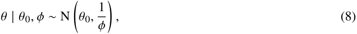

[作者 HTML 原式 (8)](https://arxiv.org/html/2508.05891v1#S3.E8)，按编号对应原图：

$$
\theta\mid\theta_{0},\phi\sim\mathrm{N}\left(\theta_{0},\frac{1}{\phi}\right),
$$

where _𝜃_ 0 is the estimate from the historical study and _𝜙_ is the precision or commensurability parameter. The formulation in (8) follows from the insight in Pocock (1976) for which historical parameters may be biased representations of their current counterparts. By modelling the unknown bias as _𝜖_ = _𝜃_ − _𝜃_ 0 the commensurate prior quantifies how much a current study parameter is allowed to vary with respect to the historical estimate in the absence of strong evidence of heterogeneity. Thus, a lack of evidence for substantial bias implies that the historical and current parameters are commensurate. 

Hobbs et al. (2012) extended this framework by proposing both empirical and fully Bayesian methods to estimate or assign _𝜙_ . Notably, by incorporating prior uncertainty when estimating _𝜙_ , the fully Bayesian approach reduces the risk of overstating commensurability. Hobbs et al. (2012) proposed two families of priors for _𝜙_ , a family of gamma distributions that leads to a full conditional posterior distribution, as well as a variant of the “spike-and-slab” distribution introduced by Mitchell and Beauchamp (1988) for Bayesian variable selection based on a mixture prior with two components, which can provide robust borrowing. Specifically, the spike-and-slab prior distribution is a discrete mixture distribution defined as locally uniform between two limits 0 ≤ _𝛼_ 1 _< 𝛼_ 2 (the slab component), and with a probability mass concentrated at a point S _> 𝛼_ 2 (the spike component), such that 

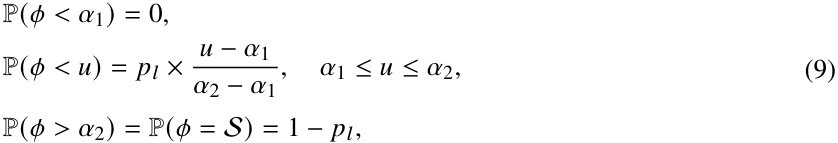

[作者 HTML 原式 (9)](https://arxiv.org/html/2508.05891v1#S3.E9)，按编号对应原图：

$$
\begin{gathered}
\displaystyle\mathbb{P}(\phi<\alpha_{1})=0, \\
\displaystyle\mathbb{P}(\phi<u)=p_{l}\times\frac{u-\alpha_{1}}{\alpha_{2}-\alpha_{1}},\quad\alpha_{1}\leq u\leq\alpha_{2}, \\
\displaystyle\mathbb{P}(\phi>\alpha_{2})=\mathbb{P}(\phi=\mathcal{S})=1-p_{l},
\end{gathered}
$$

where _𝑝𝑙_ is the probability of a slab, which can be interpreted as the prior probability of incommensurability. The spike component concentrates the probability mass near _𝜃_ 0, encouraging strong borrowing from historical data, while the slab component allows for greater deviation when current data conflict with historical evidence. Thus, commensurate priors provide a mechanism for selectively borrowing information from historical data by using the adaptive shrinkage properties of spike-and-slab distributions. Notably, when the current and historical parameters appear commensurate, the prior strongly shrinks the current parameter towards the historical estimate, improving efficiency. Conversely, when there is substantial disagreement, the prior has minimal influence on _𝜃_ , limiting bias (Murray et al., 2015). Indeed, with appropriate calibration, the spike-and-slab commensurate prior approach achieves desirable frequentist properties – such as controlled Type I error and high power – while adaptively borrowing information when it is commensurate and downweighting it when it is not (Hobbs et al., 2012). 

### **3.2 Weighted dynamic prior distributions** 

Let _𝛽𝑖,𝜏_(_𝑘_)denote team_𝑇𝑖_’s ability of type_𝑘_in period_𝜏_, where_𝑘_∈{att_,_def} and_𝜏_= 1_,_2_, . . . ,_Tindexes the time periods (e.g., seasons or weeks). In our weighted dynamic approach, each team’s ability in period _𝜏_ has a prior centred on its ability from the previous period _𝜏_ − 1, rather than assuming a fixed random walk precision across all periods. Therefore, for each team _𝑇𝑖_ , where _𝑖_ = 1 _, . . . , 𝑁𝑇_ , and each period _𝜏_ , where _𝜏_ = 2 _, . . . ,_ T , the prior

---

## PDF 第 8 页

[回查原始 PDF 第 8 页](./2025_Macri_足球贝叶斯加权动态模型_arXiv.pdf#page=8)

distributions for the attack and defence abilities are 

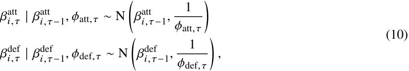

[作者 HTML 原式 (10)](https://arxiv.org/html/2508.05891v1#S3.E10)，按编号对应原图：

$$
\begin{gathered}
\displaystyle\beta^{\text{att}}_{i,\tau}\mid\beta^{\text{att}}_{i,\tau-1},\phi_{\text{att},\tau}\sim\mathrm{N}\left(\beta^{\text{att}}_{i,\tau-1},\dfrac{1}{\phi_{\text{att},\tau}}\right) \\
\displaystyle\beta^{\text{def}}_{i,\tau}\mid\beta^{\text{def}}_{i,\tau-1},\phi_{\text{def},\tau}\sim\mathrm{N}\left(\beta^{\text{def}}_{i,\tau-1},\dfrac{1}{\phi_{\text{def},\tau}}\right),
\end{gathered}
$$

where each team’s offensive (defensive) ability in period _𝜏_ has a normal prior distribution centred on the offensive (defensive) ability of that team in period _𝜏_ − 1, with a commensurate (precision) parameter _𝜙𝑘,𝜏_ that governs how closely the agreement is with previous information at time _𝜏_ − 1. If _𝜙𝑘,𝜏_ is large, the prior is tightly concentrated around the previous value – effectively assuming the team’s ability has not changed much – which leads to a heavy borrowing of strength from the previous period. Conversely, if _𝜙𝑘,𝜏_ is near zero, the prior is diffuse, indicating that we allow the current data to have a dominant influence while minimising the contribution of the previous data. Notably, we introduce separate precision _𝜙_ att _,𝜏_ and _𝜙_ def _,𝜏_ for each period _𝜏_ and, similarly to Egidi et al. (2018), for each ability type, rather than a common evolution precision. This means that the model can adjust how much it learns from the attack strength of the previous period independently of how much it learns from the defence strength of the previous period. 

To complete the model specification, we assign spike-and-slab hyperpriors to each precision parameter. Rather than using a discrete spike-and-slab with a point mass at S and a uniform slab on [ _𝛼_ 1 _, 𝛼_ 2] as in (9), we employ a continuous two-component mixture consisting of a highly concentrated spike and a diffuse slab (Hong et al., 2018). For each period and ability of type _𝑘_ , where _𝑘_ ∈{att _,_ def}, we let 

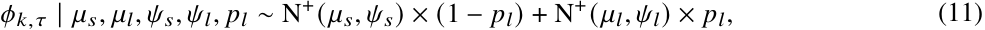

[作者 HTML 原式 (11)](https://arxiv.org/html/2508.05891v1#S3.E11)，按编号对应原图：

$$
\displaystyle\phi_{k,\tau}\mid\mu_{s},\mu_{l},\psi_{s},\psi_{l},p_{l} \displaystyle\sim\mathrm{N}^{+}(\mu_{s},\psi_{s})\times(1-p_{l})+\mathrm{N}^{+}(\mu_{l},\psi_{l})\times p_{l},
$$

where N+ ( _𝜇, 𝜓_ ) denotes a normal distribution with mean _𝜇_ and standard deviation _𝜓_ truncated from below at zero (i.e., the half-normal distribution). Specifically, _𝜇𝑠_ and _𝜇𝑙_ represent the means of the spike-and-slab components, respectively, while _𝜓𝑠_ and _𝜓𝑙_ are the corresponding standard deviations, with 0 _< 𝜓𝑠 < 𝜓𝑙_ . Each _𝜙𝑘,𝜏_ , with _𝜏_ ≥ 2, thus has a chance to be larger – implying a high commensurability with the previous period – or to be near zero – suggesting low commensurability and allowing more variability with respect to the previous period. The model will estimate an appropriate value for _𝜙_ att _,𝜏_ and _𝜙_ def _,𝜏_ based on the degree to which the new match results align with the trend of the previous period. If the performance of the teams in period _𝜏_ looks very similar to that of period _𝜏_ − 1, the posterior for _𝜙𝑘,𝜏_ will likely favour the spike, implying strong borrowing and shrinkage towards the past. In contrast, if the performance of the teams changes unexpectedly, the posterior of _𝜙𝑘,𝜏_ will move toward the slab, implying weak borrowing. For the initial period _𝜏_ = 1, no past information is available, so we use diffuse but proper priors as in (6). Furthermore, to ensure the identifiability of the model, we impose the zero sum constraints of each period as in (7). 

Our weighted dynamic approach extends the Bayesian dynamic goal-based models framework by introducing adaptive period-specific shrinkage for team abilities. By allowing the data to decide how much information about attack and defence abilities to borrow from the previous period, the model can reflect real-world changes more responsively. This yields a more flexible evolution of team strengths over time, which should improve predictive performance on match outcomes.

---

## PDF 第 9 页

[回查原始 PDF 第 9 页](./2025_Macri_足球贝叶斯加权动态模型_arXiv.pdf#page=9)

## **4 Application** 

We evaluate the efficacy of our proposed model using six Bayesian dynamic goal-based models, as described in Section 2. Our analysis uses data from the five most recent seasons (2020/2021 through 2024/2025) of three major European football leagues: the German Bundesliga , the English Premier League (EPL), and the Spanish La Liga. We compare the performance of our proposal with the discrete-time approach of Owen (2011), which uses a single evolution precision shared between all teams and for both offensive and defensive abilities. Additionally, we include the extension by Egidi et al. (2018), which introduces a constant evolution precision that is specific to either attack or defence abilities but shared among all teams. Each season in our datasets is treated as two discrete-time periods – the first half and the second half of the season, resulting in a total of ten time periods for analysis. This division is designed to capture midseason structural events, such as winter transfer windows and breaks, which can significantly alter team composition and performance. For instance, midseason often brings roster changes (through transfers), managerial turnovers, and player recovery from injuries, all of which can change the performance of a team in the last half of the season. To comprehensively assess predictive performance, we consider three distinct prediction scenarios for each league: the entire second half, the last three rounds, and the last round of the most recent season. These scenarios cover different time horizons and levels of volatility, allowing us to examine how well each model adapts to changing conditions. In particular, forecasting over an entire half-season provides a broad view that incorporates the cumulative impact of all post-midseason changes (e.g., transfers, coaching changes, tactical adjustments). In contrast, focussing on the final three rounds focusses on a crucial segment of the season often marked by intensified competitive pressure – during this phase, results can decide championships, European qualification, or relegation, and teams may adjust their strategies accordingly (e.g., rotating squads to manage fatigue, or adopting more aggressive or defensive tactics as needed). Finally, predicting only the last round represents the most uncertain scenario. In the final round, teams have widely varying motivations – some are competing for crucial objectives, while others have little or nothing to lose – which often leads to surprising outcomes. By examining performance in these three scenarios, we can assess the robustness and adaptability of our weighted dynamic models under a range of realistic competitive conditions. 

The models are implemented using the probabilistic programming language Stan (Carpenter et al., 2017), employing Markov Chain Monte Carlo (MCMC) sampling via the R package footBayes (Egidi et al., 2025). For posterior sampling, we run four independent chains, each consisting of 2000 iterations, with the initial 1000 iterations discarded as burn-in. In the spike-and-slab formulation as in (11), the spike component has mean _𝜇𝑠_ = 100 and standard deviation _𝜓𝑠_ = 0 _._ 1, while the slab component has mean _𝜇𝑙_ = 0 and standard deviation _𝜓𝑙_ = 5, that is, 

_𝜙_ att _,𝜏, 𝜙_ def _,𝜏_ | _𝑝𝑙_ ∼ N+ (100 _,_ 0 _._ 1) × (1 − _𝑝𝑙_ ) + N+ (0 _,_ 5) × _𝑝𝑙,_ 

where _𝑝𝑙_ is the prior probability of drawing from the slab that is set to 0 _._ 99 (Hobbs et al., 2012; Chen et al., 2018). The chosen half-normal slab prior is approximately uniform over [0 _,_ 3] and decays afterwards, allowing either minimal borrowing or complete discounting of prior information when necessary (Alt et al., 2025). In contrast, the spike prior is structured to yield complete pooling when the past information aligns closely with current observations (Ouma et al., 2022; Zheng and Wason, 2022; Chen et al., 2018; Hobbs et al., 2012). For the approaches proposed by Owen (2011) and Egidi et al. (2018), the evolution precisions are modelled as 

_𝜎, 𝜎_ att _, 𝜎_ def ∼ Cauchy+ (0 _,_ 5) _,_

---

## PDF 第 10 页

[回查原始 PDF 第 10 页](./2025_Macri_足球贝叶斯加权动态模型_arXiv.pdf#page=10)

where Cauchy+ (0 _, 𝜈_ ) denotes the half-Cauchy distribution with location 0 and scale _𝜈_ . As noted in Gelman (2006), the half-Cauchy distribution is a flexible and weakly informative prior for scale parameters in hierarchical models, with advantageous behaviour near zero and minimal influence on posterior estimates. Finally, for all models, a weakly informative prior (Gelman et al., 2008) is assigned to the home-effect parameter 

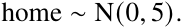

### **4.1 Predictive performance** 

One of the key aspects of sports analytics is the ability to generate accurate future predictions. Bayesian models naturally provide posterior probabilities for future matches. Considering the posterior predictive distribution for future observable data D˜ , we incorporate the predictive uncertainty of the model, propagated from the uncertainty of the posterior parameter. Predictions are generated by conditioning future observable values on the posterior parameter estimates 

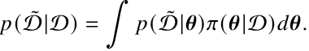

After obtaining predictions from the models, evaluating their performance is crucial to assessing their predictive power and reliability. Specifically, we focus on two predictive metrics to rigorously examine the predictive performance of the models described in Section 2. Additional analyses with two other predictive metrics are provided in Appendix A. 

#### **4.1.1 Predictive metrics** 

The evaluation of probabilistic forecasts typically involves scoring rules metrics, which assess forecast performance by comparing predictions with the corresponding outcomes. The Brier score (Brier, 1950), recommended by Spiegelhalter and Ng (2009), is a non-local and distance-insensitive scoring rule, essentially acting as a mean squared error for forecasts. It is defined as 

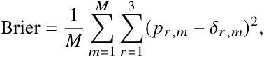

where _𝑝𝑟,𝑚_ denotes the predicted probability of outcome _𝑟_ , with _𝑟_ ∈{home win, draw, away win}, for the _𝑚_ -th match played during the forecast period. Here, _𝛿𝑟,𝑚_ is the Kronecker delta, that is, 1 if the outcome _𝑟_ occurs in the _𝑚_ -th match. The Brier score ranges from 0, indicating perfect prediction accuracy, to a maximum of 2 when predictions consistently assign probability 1 to incorrect outcomes. 

While proper scoring rules penalise squared errors, mean-based metrics provide direct, interpretable summaries of predictive accuracy. The Average of Correct Probabilities (ACP) is defined as the arithmetic mean of the probabilities assigned to outcomes that actually occurred, that is 

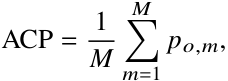

where _𝑝𝑜,𝑚_ is the probability assigned to the observed outcome of the _𝑚_ -th match. Being an arithmetic mean,

---

## PDF 第 11 页

[回查原始 PDF 第 11 页](./2025_Macri_足球贝叶斯加权动态模型_arXiv.pdf#page=11)

the ACP measures the confidence of the average forecast directly on the original probability scale. ACP values near 1 indicate that the model consistently assigns high probabilities to the true outcomes, whereas values near 0 reflect weaker predictive performance. 

Figure 1 compares the Brier score and the ACP for the proposed weighted dynamic approach compared to those of Owen (2011) and Egidi et al. (2018), evaluated in the final round of the 2024/2025 season scenario. The plot includes the bivariate Poisson, diagonal-inflated bivariate Poisson, double Poisson, negative binomial, Skellam model, and zero-inflated Skellam model. The proposed weighted dynamic approach consistently demonstrates superior predictive performance, yielding the lowest values for the Brier score and the highest values for the ACP among all models and competitions. In the Bundesliga, the bivariate Poisson model achieves the smallest Brier score with a value of 0 _._ 593 and the largest ACP value of 0 _._ 409. For the EPL, the Skellam model obtains the lowest Brier score at 0 _._ 545 while the diagonal-inflated bivariate Poisson reaches an ACP of 0 _._ 449. In La Liga, the diagonal-inflated bivariate Poisson achieves a Brier score of 0 _._ 462 and an ACP of 0 _._ 485. 

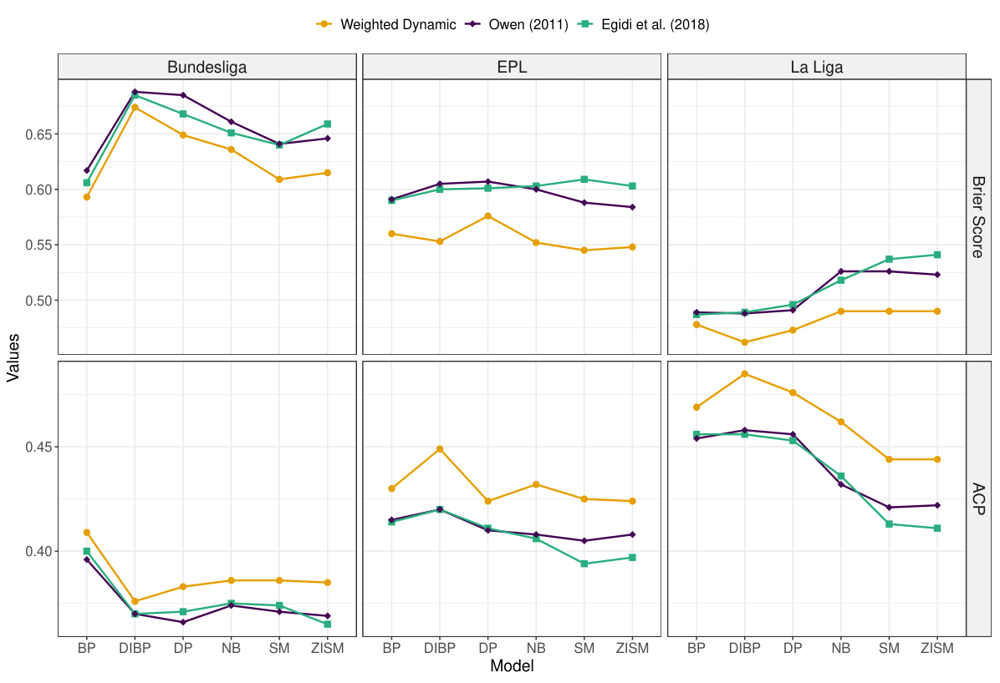

<!-- Start of picture text -->
Weighted Dynamic Owen (2011) Egidi et al. (2018) Bundesliga EPL La Liga 0.65 0.60 0.55 0.50 0.45 0.40 BP DIBP DP NB SM ZISM BP DIBP DP NB SM ZISM BP DIBP DP NB SM ZISM Model Brier Score Values ACP <!-- End of picture text -->

**Figure 1:** Lineplot comparing Brier Score and Average of Correct Probabilities (ACP) for the proposed weighted dynamic method with those of Owen (2011) and Egidi et al. (2018), evaluated on the final round of the 2024/2025 season. The comparison includes six models: Bivariate Poisson (BP), Diagonal-Inflated Bivariate Poisson (DIBP), Double Poisson (DP), Negative Binomial (NB), Skellam Model (SM), and Zero-Inflated Skellam Model (ZISM), for the Bundesliga, La Liga, and English Premier League (EPL). 

Table 1 summarises the Brier scores and ACPs for each of the six goal-based models, comparing our weighted-dynamic forecasts with those of Owen (2011) and Egidi et al. (2018) over the last three matchdays of the 2024/25 season. Among the three leagues, the weighted dynamic approach consistently achieves the lowest Brier score and the highest ACP values, reflecting more accurate predictions on decisive matches at the

---

## PDF 第 12 页

[回查原始 PDF 第 12 页](./2025_Macri_足球贝叶斯加权动态模型_arXiv.pdf#page=12)

end of the season. In the Bundesliga, our weighted dynamic approach reduces the Brier score from 0 _._ 683 to 0 _._ 678 compared to the method proposed by Egidi et al. (2018) in the bivariate Poisson model and presents the highest ACP value of 0 _._ 359. In the EPL, the weighted dynamic models outperform the other approaches, yielding the lowest and highest values for the Brier score and the ACP, respectively. Notably, in the diagonal-inflated bivariate Poisson model, the Brier score decreases to 0 _._ 602, while the ACP reaches a value of 0 _._ 421, highlighting the benefit of draw inflation combined with period-specific weighting in a highly unpredictable competition. Similarly, in La Liga, the weighted-dynamic models outperform all other approaches, achieving the best results with a Brier score of 0 _._ 499 under the diagonal-inflated bivariate Poisson model, while showing the highest ACP of 0 _._ 454. 

**Table 1:** Brier Score and Average of Correct Probabilities (ACP) for the proposed weighted dynamic method, Owen (2011) method and Egidi et al. (2018) method, evaluated on the last three rounds of the 2024/2025 season for the Bundesliga, English Premier League (EPL), and La Liga. 

|**League**|**Model**|**Weighted D**|**ynamic**|**Owen (2**|**011)**|**Egidi et al. **|**(2018)**|
|---|---|---|---|---|---|---|---|
|||**Brier Score**|**ACP**|**Brier Score**|**ACP**|**Brier Score**|**ACP**|
|Bundesliga|Bivariate Poisson|**0.678**|**0.359**|0.687|0.357|0.683|0.357|
||Diag. Infl. Bivariate Poisson|0.735|0.341|0.733|0.344|0.725|0.348|
||Double Poisson|0.718|0.344|0.719|0.346|0.702|0.353|
||Negative Binomial|0.698|0.351|0.706|0.350|0.690|0.357|
||Skellam Model|0.688|0.345|0.688|0.347|0.684|0.351|
||Zero Infl. Skellam Model|0.693|0.344|0.690|0.348|0.686|0.351|
|EPL|Bivariate Poisson|0.603|0.409|0.608|0.402|0.609|0.402|
||Diag. Infl. Bivariate Poisson|**0.602**|**0.421**|0.616|0.410|0.619|0.408|
||Double Poisson|0.612|0.408|0.622|0.401|0.626|0.399|
||Negative Binomial|0.606|0.410|0.612|0.404|0.611|0.403|
||Skellam Model|0.617|0.393|0.624|0.387|0.617|0.389|
||Zero Infl. Skellam Model|0.615|0.394|0.624|0.387|0.624|0.385|
|La Liga|Bivariate Poisson|0.502|0.448|0.520|0.438|0.518|0.439|
||Diag. Infl. Bivariate Poisson|**0.499**|**0.454**|0.518|0.444|0.521|0.442|
||Double Poisson|0.503|0.450|0.522|0.439|0.518|0.441|
||Negative Binomial|0.514|0.442|0.533|0.431|0.534|0.430|
||Skellam Model|0.553|0.408|0.554|0.407|0.556|0.406|
||Zero Infl. Skellam Model|0.548|0.411|0.554|0.407|0.555|0.407|

> 表格版面核对：以下截图保留原始单元格关系，合并单元格及复杂表头以截图为准。

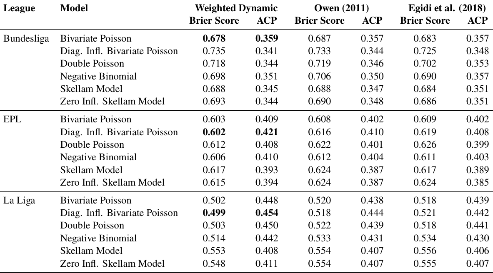

Table 2 presents the same comparisons for the second half of last season. Specifically, in the Bundesliga, the weighted dynamic bivariate Poisson model achieves the lowest Brier score of 0 _._ 661 and the highest ACP value of 0 _._ 387. In the EPL, the weighted dynamic bivariate Poisson obtains the lowest Brier Score of 0 _._ 579, while the weighted dynamic diagonal-inflated bivariate Poisson model produces an ACP of 0 _._ 429. Similarly, in La Liga, the weighted dynamic diagonal-inflated bivariate Poisson model achieves a Brier score of 0 _._ 583 and produces the highest ACP (0 _._ 425). 

### **4.2 Team abilities** 

One of the crucial aspects of our proposal is how the weighted dynamic approach in (10) influences the evolution of the attacking and defensive abilities of the teams in the evaluated periods. Figure 2 illustrates the trajectories of these abilities for the best performing model identified in Section 4.1, when forecasting the final round of the 2024/2025 season. Specifically, for the Bundesliga the best model is the bivariate Poisson model, for the

---

## PDF 第 13 页

[回查原始 PDF 第 13 页](./2025_Macri_足球贝叶斯加权动态模型_arXiv.pdf#page=13)

**Table 2:** Brier Score and Average of Correct Probabilities (ACP) for the proposed weighted dynamic method, Owen (2011) method and Egidi et al. (2018) method, evaluated on the second half of the 2024/2025 season for the Bundesliga, English Premier League (EPL), and La Liga. 

|**League**|**Model**|**Weighted D**|**ynamic**|**Owen (2**|**011)**|**Egidi et al. **|**(2018)**|
|---|---|---|---|---|---|---|---|
|||**Brier Score**|**ACP**|**Brier Score**|**ACP**|**Brier Score**|**ACP**|
|Bundesliga|Bivariate Poisson|**0.661**|**0.387**|0.664|0.382|0.662|0.384|
||Diag. Infl. Bivariate Poisson|0.694|0.386|0.691|0.383|0.694|0.383|
||Double Poisson|0.677|0.386|0.683|0.381|0.685|0.380|
||Negative Binomial|0.671|0.384|0.680|0.378|0.682|0.377|
||Skellam Model|0.664|0.370|0.668|0.368|0.667|0.370|
||Zero Infl. Skellam Model|0.664|0.372|0.668|0.369|0.667|0.371|
|EPL|Bivariate Poisson|**0.579**|0.422|0.581|0.421|0.583|0.420|
||Diag. Infl. Bivariate Poisson|0.594|**0.429**|0.592|0.427|0.588|0.428|
||Double Poisson|0.584|0.424|0.584|0.424|0.582|0.425|
||Negative Binomial|0.584|0.421|0.582|0.422|0.583|0.422|
||Skellam Model|0.601|0.399|0.600|0.399|0.597|0.401|
||Zero Infl. Skellam Model|0.604|0.398|0.597|0.401|0.596|0.402|
|La Liga|Bivariate Poisson|0.583|0.416|0.586|0.413|0.585|0.414|
||Diag. Infl. Bivariate Poisson|**0.583**|**0.425**|0.586|0.421|0.586|0.421|
||Double Poisson|0.585|0.419|0.585|0.416|0.585|0.416|
||Negative Binomial|0.590|0.415|0.591|0.411|0.587|0.413|
||Skellam Model|0.583|0.401|0.589|0.395|0.594|0.394|
||Zero Infl. Skellam Model|0.583|0.402|0.588|0.396|0.592|0.396|

> 表格版面核对：以下截图保留原始单元格关系，合并单元格及复杂表头以截图为准。

EPL the Skellam model, and for La Liga the diagonal-inflated bivariate Poisson model. Within each league, we selected two teams: one with relatively stable performance during the study period and another showing inconsistent behaviour. The plot shows that, for stable teams, the weighted dynamic model captures the temporal trends more accurately, with clearer distinctions between attacking and defensive strength. For instance, Bayern M¨unchen, typically dominant in the Bundesliga, showed a slight slump in performance during the 2023/2024 season (periods 7 and 8) when they finished third. This fluctuation is reflected in the attack and defence abilities, particularly in the weighted dynamic model. Similarly, for Real Madrid and Manchester City, both of which won their respective leagues in 2023/2024 but finished second and third in 2024/2025 (periods 9 and 10), the weighted dynamic approach captures a noticeable drop in attacking ability and a relative increase in defensive ability. These changes are more distinctly represented in our model compared to the alternatives of Owen (2011) and Egidi et al. (2018). 

The benefits of adaptive shrinkage are even more evident for teams with inconsistent performance. For instance, Manchester United, after finishing second in 2020/2021, showed a gradual decline in subsequent seasons, finally placing 15th in the 2024/2025 season. After yielding the highest and lowest values for the attack and defence abilities, respectively, compared to the other two proposals for the 2020/2021 season, the weighted dynamic model reflects this trend with a notable reduction in attacking ability and an increase in defensive vulnerability, particularly pronounced in the final periods. Similarly, Girona FC experienced an exceptional 2023/2024 season, reaching a third place in La Liga, followed by a disappointing 16th place finish in 2024/2025. The weighted dynamic approach effectively captures this volatility, showing the highest attacking ability during the best season (periods 7 and 8) and a marked decline thereafter. The model even shows a crossover point in the final period, where Girona’s defensive vulnerability is higher than its attacking ability, highlighting a shift in team abilities that other models fail to capture.

---

## PDF 第 14 页

[回查原始 PDF 第 14 页](./2025_Macri_足球贝叶斯加权动态模型_arXiv.pdf#page=14)

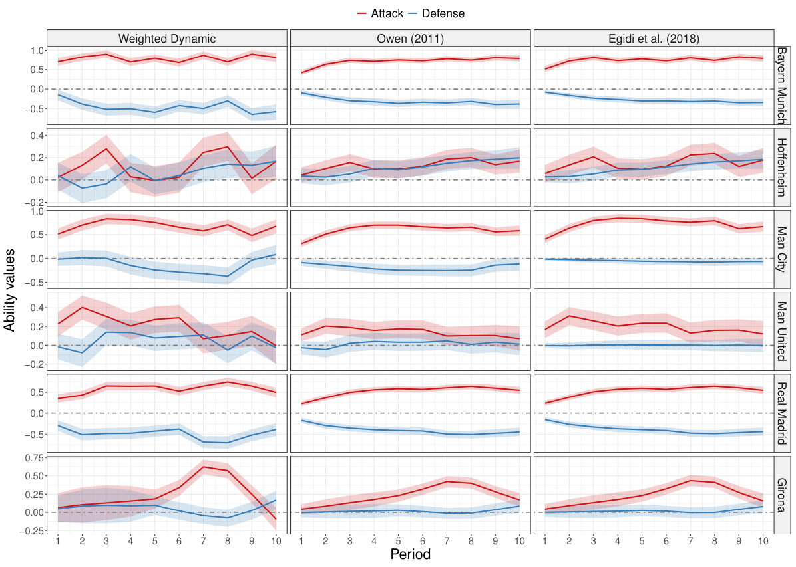

<!-- Start of picture text -->
Attack Defense Weighted Dynamic Owen (2011) Egidi et al. (2018) 1.0 0.5 0.0 −0.5 0.4 0.2 0.0 −0.2 1.0 0.5 0.0 −0.5 0.4 0.2 0.0 −0.2 0.5 0.0 −0.5 0.75 0.50 0.25 0.00 −0.25 1 2 3 4 5 6 7 8 9 10 1 2 3 4 5 6 7 8 9 10 1 2 3 4 5 6 7 8 9 10 Period Bayern Munich Hoffenheim Man City Ability values Man United Real Madrid Girona <!-- End of picture text -->

**Figure 2:** Trajectories of estimated attacking (solid red lines) and defensive (solid blue lines) abilities with their 50% credible intervals over ten periods for two representative teams in each league. Results from the proposed weighted dynamic method are shown alongside corresponding estimates from Owen (2011) and Egidi et al. (2018), all evaluated at the final round of the 2024/2025 season scenario. 

Additional analyses on the commensurate precisions for the offensive and defensive abilities parameters are provided in the Appendix B. 

## **5 Discussion** 

This work introduced a Bayesian weighted dynamic framework for football predictions that flexibly models the evolution of team-specific abilities over time. By using commensurate priors with spike-and-slab hyperparameters, our approach allows each team’s attack and defence strength in a given period to adaptively borrow information from past performance. This yields a more responsive and nuanced dynamic model compared to previous approaches that assume static abilities or a single constant evolution precision. Among six different goal-based distributions and three major European leagues, we found that this adaptive shrinkage mechanism leads to consistent improvements in predictive accuracy and a substantial reduction in computational time relative to earlier dynamic models. The weighted dynamic models captured team performance trajectories more realistically – for instance, they sharply reflected midseason form fluctuations and major transitions – while maintaining or improving forecast prediction accuracy. The greatest gains emerged in short-term prediction tasks (e.g., the final rounds of a season), where the ability to adjust quickly to recent surprises is crucial. Furthermore, in

---

## PDF 第 15 页

[回查原始 PDF 第 15 页](./2025_Macri_足球贝叶斯加权动态模型_arXiv.pdf#page=15)

terms of computation time, the proposed weighted dynamic approach outperforms the dynamic formulations of Owen (2011) and Egidi et al. (2018) while achieving satisfactory convergence diagnostics for all scenarios evaluated. Specifically, among all leagues and models, the weighted dynamic model consistently requires the least computation time to reach convergence. More details are provided in Appendix C. 

In this paper, we maintained the dependence parameter in the bivariate Poisson models constant, but future work could investigate making the covariance of scores dynamic if needed. These additions would offer a comprehensive overview of how every aspect of the game evolves, albeit at the cost of T − 1 additional parameters. Furthermore, incorporating additional predictors or team covariates may improve predictions. Our current implementation used only past match results to infer team abilities; however, information such as team market value, recent injuries, or even in-game statistics (shots, expected goals) could be included as covariates influencing the scoring rates parameters. Future extensions might also consider team-specific or hierarchical evolution parameters, so that traditionally inconsistent teams are allowed more variation than stable teams. 

Another important direction is the integration with result-based models and other comparative approaches. Although we focused on goal-based distributions (which naturally yield the three-way process as a consequence), our methodology could be extended to models that predict match outcomes directly. For instance, in an ordered probit/logit model or a multi-class logistic model for win–draw–loss, one could let each team’s latent strength parameter vary over time using the same weighted random-walk prior. In addition, a weighted dynamic Bradley–Terry-Davidson model for paired comparisons is a natural extension. Our approach could provide a fully Bayesian weighted dynamic Bradley–Terry-Davidson model by allowing each team’s strength to evolve with our weighted dynamic approach. Conceptually, this would let the probability of one team beating another adapt rapidly after major changes (e.g., if a traditionally weak team suddenly improves, the model would downweight its past information). We expect that such a model would be computationally even simpler (since it has only one strength per team rather than separate attack/defence), yet still benefit from our weighted dynamic approach. 

We emphasise that the Bayesian weighted dynamic approach presented here is quite general and may find use in other sports domains. Many sports and competitive systems (e.g., basketball, volleyball, or handball) involve teams whose skills change over time. By calibrating the commensurate prior to the specific domain, our strategy of time-specific shrinkage could be applied wherever one has sequential performance data and expects occasional shifts in the underlying ability. Furthermore, while our focus here has been on domestic leagues with complete round-robin schedules, future research will focus on high-profile tournaments feature group stages followed by knockout rounds or hybrid formats such as the UEFA Champions League, FIFA World Cup, and UEFA European Championship. Finally, the proposed method is implemented in the free and open source R package footBayes. 

## **Software and Data Availability** 

All analyses were performed in the R programming language version 4 _._ 4 _._ 3 (R Core Team, 2025). Data are freely available online at football-data.co.uk. All computational simulations in Appendix C were conducted on an Intel Core i7-1260P laptop with 16GB of RAM running Ubuntu 22.04. The code for reproducing this manuscript is openly available at https://github.com/RoMaD-96/BayesWDFM. The proposed methodology has also been implemented in the free and open source R package footBayes (from version 2.1.0).

---

## PDF 第 16 页

[回查原始 PDF 第 16 页](./2025_Macri_足球贝叶斯加权动态模型_arXiv.pdf#page=16)

## **Acknowledgments** 

This work has been supported by the project ”SMARTsports: “Statistical Models and AlgoRiThms in sports. Applications in professional and amateur contexts, with able-bodied and disabled athletes”, funded by the MIUR Progetti di Ricerca di Rilevante Interesse Nazionale (PRIN) Bando 2022 - grant n. 2022R74PLE (CUP J53D23003860006). 

## **Appendix A Ranked Probability Score and Pseudo-R**2 

For discrete outcomes, it can be beneficial for a scoring rule to account for the proximity or ordering of potential outcomes. In football, a draw is closer to a home win than an away win. The Ranked Probability Score (RPS) (Epstein, 1969) is a distance-sensitive scoring measure that evaluates the degree to which the forecast probability distribution matches the observed outcome, assigning higher scores to probabilistic forecasts that allocate higher probabilities to outcomes near the actual result. The RPS is defined as 

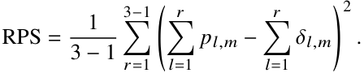

As with the Brier score, lower values indicate better predictive performance. 

The pseudo-R2 (Dobson et al., 2001) is defined as the geometric mean of the probabilities assigned to the actual result of each match. 

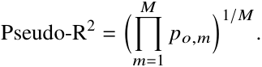

The geometric mean penalises low-probability predictions more severely than the arithmetic mean. Similarly to ACP, a pseudo-R2 close to 1 indicates high predictive accuracy, while values approaching 0 suggest weaker performance. 

Figure 3 compares the RPS and the pseudo-R2 for the proposed weighted dynamic approach compared to those of Owen (2011) and Egidi et al. (2018), evaluated in the final round of the 2024/2025 season. The proposed weighted dynamic approach consistently demonstrates superior predictive performance, yielding the lowest RPS and the highest pseudo-R2 values among all models and competitions. In the Bundesliga, the bivariate Poisson model achieves the lowest RPS with a value of 0 _._ 242 and a pseudo-R2 of 0 _._ 372. For the EPL, the zero-inflated Skellam model obtains the smallest RPS at 0 _._ 193, while the Skellam model shows the highest pseudo-R2 at 0 _._ 400. In La Liga, the diagonal-inflated bivariate Poisson model presents an RPS of 0 _._ 141 and achieves the highest pseudo-R2 at 0 _._ 448. 

Table 3 presents the RPS and Pseudo-R2 values for each of the six goal-based models, comparing our weighted-dynamic forecasts with those of Owen (2011) and Egidi et al. (2018) over the last three matchdays of the 2024/25 season. In the Bundesliga, our weighted dynamic approach slightly decreases the RPS from 0 _._ 217 to 0 _._ 216 compared to the method proposed by Egidi et al. (2018) while reaching the highest value for the Pseudo-R2 (0.328) in the bivariate Poisson model. In the EPL, the weighted dynamic models yield the smallest and largest values for the RPS and Pseudo-R2 , respectively. Notably, in the diagonal-inflated bivariate Poisson model the RPS is 0 _._ 224, while in the bivariate Poisson model the Pseudo-R2 is 0 _._ 370. Similarly, in La Liga, the

---

## PDF 第 17 页

[回查原始 PDF 第 17 页](./2025_Macri_足球贝叶斯加权动态模型_arXiv.pdf#page=17)

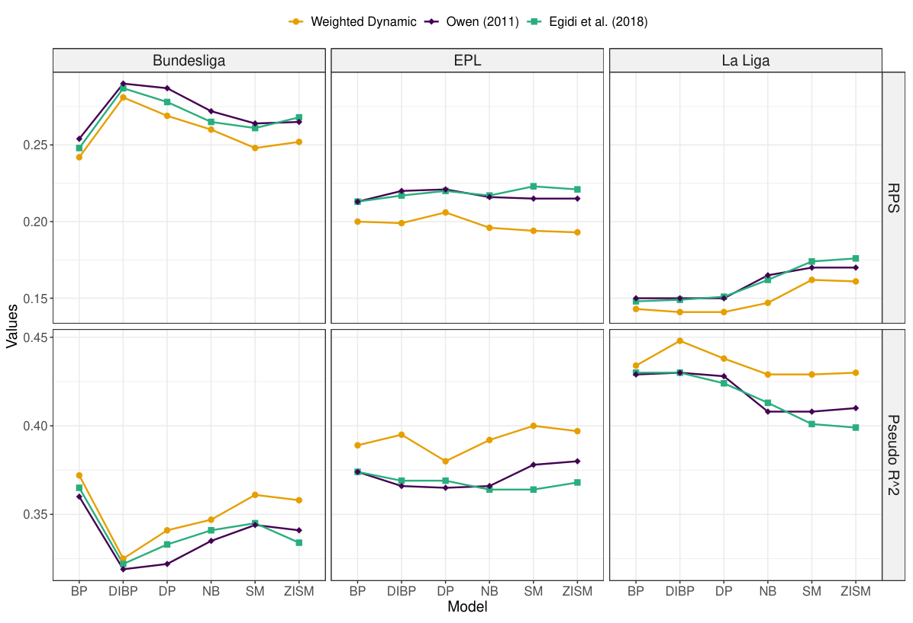

<!-- Start of picture text -->
Weighted Dynamic Owen (2011) Egidi et al. (2018) Bundesliga EPL La Liga 0.25 0.20 0.15 0.45 0.40 0.35 BP DIBP DP NB SM ZISM BP DIBP DP NB SM ZISM BP DIBP DP NB SM ZISM Model RPS Values Pseudo R^2 <!-- End of picture text -->

**Figure 3:** Lineplot comparing the Ranking Probability Score (RPS) and Pseudo-R2 for the proposed weighted dynamic method with those of Owen (2011) and Egidi et al. (2018), evaluated on the final round of the 2024/2025 season. The comparison includes six models: Bivariate Poisson (BP), Diagonal-Inflated Bivariate Poisson (DIBP), Double Poisson (DP), Negative Binomial (NB), Skellam Model (SM), and Zero-Inflated Skellam Model (ZISM), for the Bundesliga, English Premier League (EPL), and La Liga. 

weighted-dynamic models outperform all other approaches, achieving the best results with an RPS of 0 _._ 189 and a Pseudo-R2 of 0 _._ 421 under the diagonal-inflated bivariate Poisson model. 

Table 4 presents the same comparisons for the second half of last season. In the Bundesliga, the weighted dynamic bivariate Poisson model exhibits the lowest RPS (0 _._ 222) and the highest Pseudo-R2 of 0 _._ 336. In the EPL, the weighted dynamic bivariate Poisson presents the lowest RPS (0 _._ 205) and the highest Pseudo-R2 (0 _._ 380). In La Liga, the weighted dynamic version of the bivariate Poisson, Skellam model, and zero-inflated Skellam models achieve an RPS value of 0 _._ 200 and present the largest Pseudo-R2 (0 _._ 375). 

## **Appendix B Further analysis on** _𝜙_ **att and** _𝜙_ **def** 

Figure 4 shows how the posterior commensurate parameters _𝝓_ att and _𝝓_ def for the attacking and defensive abilities of the teams evolve during the evaluated periods, under the three predictive scenarios and for each of the three major European leagues. Based on the result obtained in Section 4.1.1, when predicting the final round of the 2024/2025 season, the Bundesliga is modelled with the bivariate Poisson, the EPL with the Skellam model, and La Liga with the diagonal-inflated bivariate Poisson; when forecasting the last three rounds, the Bundesliga again uses the bivariate Poisson while both the EPL and La Liga use the diagonal-inflated bivariate Poisson; and when

---

## PDF 第 18 页

[回查原始 PDF 第 18 页](./2025_Macri_足球贝叶斯加权动态模型_arXiv.pdf#page=18)

**Table 3:** Ranked Probability Score (RPS) and Pseudo-R2 for the proposed weighted dynamic method, Owen (2011) method and Egidi et al. (2018) method, evaluated on the last three round of the 2024/2025 season for the Bundesliga, English Premier League (EPL), and La Liga. 

|**League**|**Model**|**Weight**|**ed Dynamic**|**Owe**|**n (2011)**|**Egidi e**|**t al. (2018)**|
|---|---|---|---|---|---|---|---|
|||**RPS**|**Pseudo-R**2|**RPS**|**Pseudo-R**2|**RPS**|**Pseudo-R**2|
|Bundesliga|Bivariate Poisson|**0.216**|**0.328**|0.219|0.324|0.217|0.325|
||Diag. Infl. Bivariate Poisson|0.245|0.298|0.242|0.302|0.238|0.306|
||Double Poisson|0.235|0.307|0.236|0.309|0.227|0.317|
||Negative Binomial|0.225|0.316|0.229|0.314|0.220|0.322|
||Skellam Model|0.220|0.321|0.221|0.321|0.217|0.322|
||Zero Infl. Skellam Model|0.222|0.318|0.222|0.321|0.217|0.322|
|EPL|Bivariate Poisson|0.225|**0.370**|0.228|0.367|0.228|0.366|
||Diag. Infl. Bivariate Poisson|**0.224**|0.369|0.232|0.362|0.233|0.360|
||Double Poisson|0.229|0.364|0.234|0.360|0.235|0.356|
||Negative Binomial|0.228|0.368|0.231|0.364|0.231|0.365|
||Skellam Model|0.230|0.360|0.234|0.358|0.232|0.362|
||Zero Infl. Skellam Model|0.228|0.361|0.236|0.358|0.235|0.358|
|La Liga|Bivariate Poisson|0.190|0.420|0.199|0.408|0.198|0.410|
||Diag. Infl. Bivariate Poisson|**0.189**|**0.421**|0.198|0.409|0.200|0.406|
||Double Poisson|0.190|0.419|0.199|0.407|0.199|0.410|
||Negative Binomial|0.194|0.413|0.204|0.401|0.204|0.400|
||Skellam Model|0.211|0.392|0.213|0.391|0.214|0.390|
||Zero Infl. Skellam Model|0.209|0.394|0.213|0.390|0.214|0.390|

> 表格版面核对：以下截图保留原始单元格关系，合并单元格及复杂表头以截图为准。

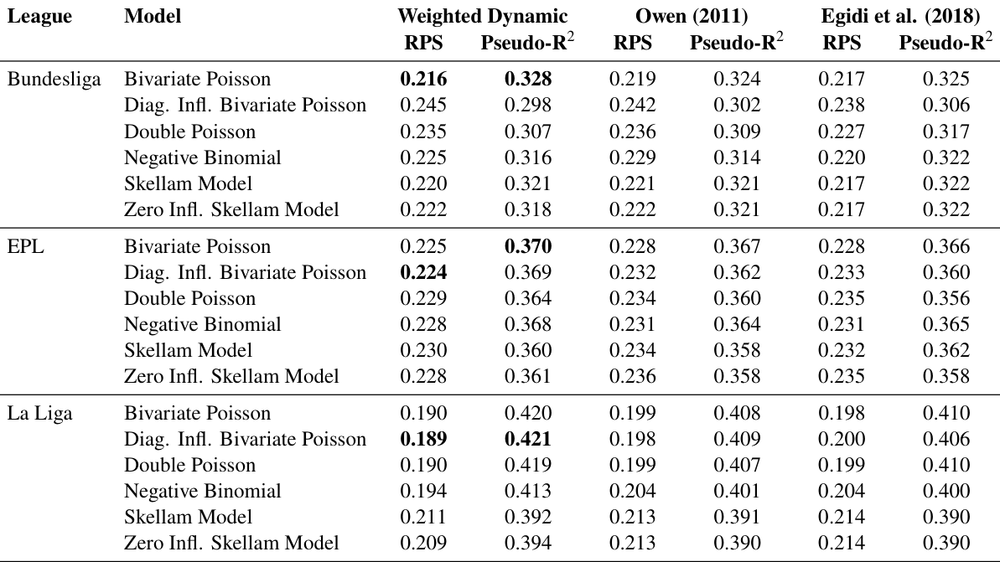

**Table 4:** Ranked Probability Score (RPS) and Pseudo-R2 for the proposed weighted dynamic method, Owen (2011) method and Egidi et al. (2018) method, evaluated on the second half of the 2024/2025 season for for the Bundesliga, English Premier League (EPL), and La Liga. 

|**League**|**Model**|**Weight**|**ed Dynamic**|**Owe**|**n (2011)**|**Egidi**|**et al. (2018)**|
|---|---|---|---|---|---|---|---|
|||**RPS**|**Pseudo-R**2|**RPS**|**Pseudo-R**2|**RPS**|**Pseudo-R**2|
|Bundesliga|Bivariate Poisson|**0.222**|**0.336**|0.224|0.334|0.223|0.335|
||Diag. Infl. Bivariate Poisson|0.237|0.319|0.237|0.321|0.237|0.320|
||Double Poisson|0.229|0.328|0.234|0.325|0.234|0.324|
||Negative Binomial|0.226|0.330|0.232|0.327|0.232|0.326|
||Skellam Model|0.225|0.333|0.228|0.331|0.226|0.332|
||Zero Infl. Skellam Model|0.225|0.334|0.228|0.332|0.226|0.332|
|EPL|Bivariate Poisson|**0.205**|**0.380**|0.206|0.378|0.207|0.378|
||Diag. Infl. Bivariate Poisson|0.212|0.371|0.210|0.371|0.209|0.375|
||Double Poisson|0.208|0.377|0.207|0.377|0.206|0.378|
||Negative Binomial|0.208|0.376|0.206|0.377|0.207|0.376|
||Skellam Model|0.213|0.367|0.213|0.367|0.211|0.369|
||Zero Infl. Skellam Model|0.214|0.365|0.212|0.369|0.211|0.369|
|La Liga|Bivariate Poisson|**0.200**|**0.375**|0.202|0.373|0.201|0.374|
||Diag. Infl. Bivariate Poisson|0.200|0.374|0.202|0.374|0.202|0.373|
||Double Poisson|0.200|0.374|0.201|0.374|0.201|0.374|
||Negative Binomial|0.202|0.372|0.204|0.370|0.202|0.372|
||Skellam Model|**0.200**|**0.375**|0.203|0.372|0.206|0.369|
||Zero Infl. Skellam Model|**0.200**|**0.375**|0.203|0.373|0.205|0.371|

> 表格版面核对：以下截图保留原始单元格关系，合并单元格及复杂表头以截图为准。

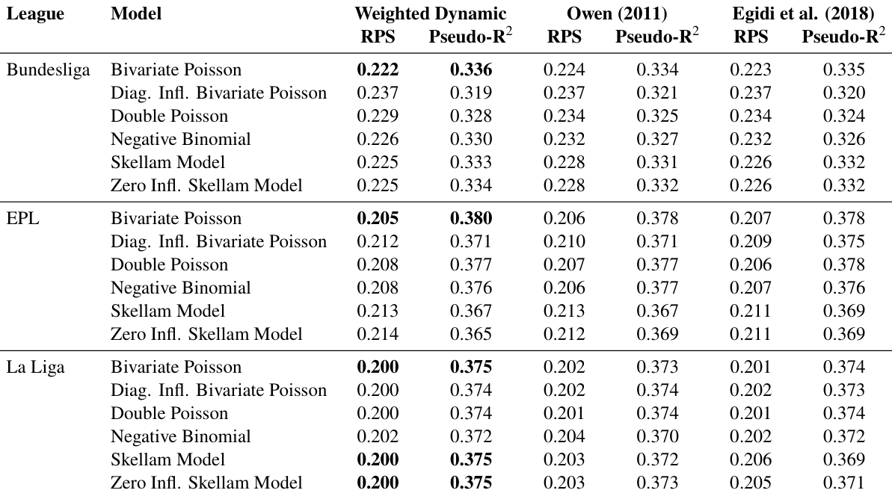

---

## PDF 第 19 页

[回查原始 PDF 第 19 页](./2025_Macri_足球贝叶斯加权动态模型_arXiv.pdf#page=19)

forecasting the remaining half-season, the best model for the Bundesliga and EPL is the bivariate Poisson, while in La Liga it is the diagonal-inflated bivariate Poisson. 

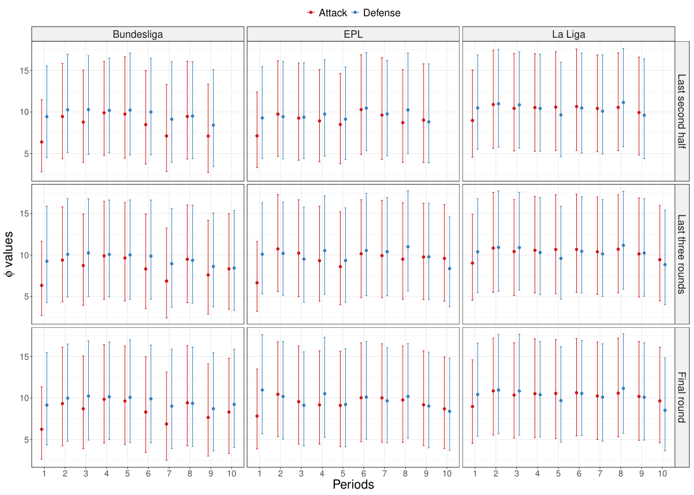

<!-- Start of picture text -->
Attack Defense Bundesliga EPL La Liga 15 10 5 15 10 5 15 10 5 1 2 3 4 5 6 7 8 9 10 1 2 3 4 5 6 7 8 9 10 1 2 3 4 5 6 7 8 9 10 Periods Last second half valuesφ Last three rounds Final round <!-- End of picture text -->

**Figure 4:** Posterior means (points) and 95% credible intervals (error bars) of the commensurate parameters for offensive (red) and defensive (blue) abilities, under the three predictive scenarios for the Bundesliga, English Premier League (EPL), and La Liga. 

## **Appendix C Computational performance and convergence diagnostics** 

In terms of computation time, the proposed weighted dynamic approach outperforms the dynamic formulations of Owen (2011) and Egidi et al. (2018) in all scenarios. Figure 5 shows the distribution of the elapsed computation times (in seconds) for each method, divided by league and by the six goal-based models considered, evaluated in the final round of the 2024/2025 season scenario. Specifically, for each model–league pair we performed ten independent MCMC fits with four independent and parallel chains, each consisting of 2000 iterations, with the initial 1000 iterations discarded as burn-in. Across all leagues and models, the weighted dynamic model consistently requires the least computation time to reach convergence. The median run-time under the weighted dynamic specification is lower than those of Owen (2011) and Egidi et al. (2018) methods for every combination of league and model. Notably, in the most computationally demanding setting – the zero-inflated Skellam model – our weighted dynamic model for the EPL is 32% faster than Owen’s version and 55% faster than Egidi et al. (2018) approach. Even for relatively simpler models such as the double Poisson, the weighted dynamic version reduces the runtime by approximately 32% with respect to Owen (2011) and by 31% with respect to Egidi et al.

---

## PDF 第 20 页

[回查原始 PDF 第 20 页](./2025_Macri_足球贝叶斯加权动态模型_arXiv.pdf#page=20)

(2018) for the Bundesliga. In La Liga the weighted dynamic negative binomial model is 40% faster than Owen (2011) and Egidi et al. (2018). 

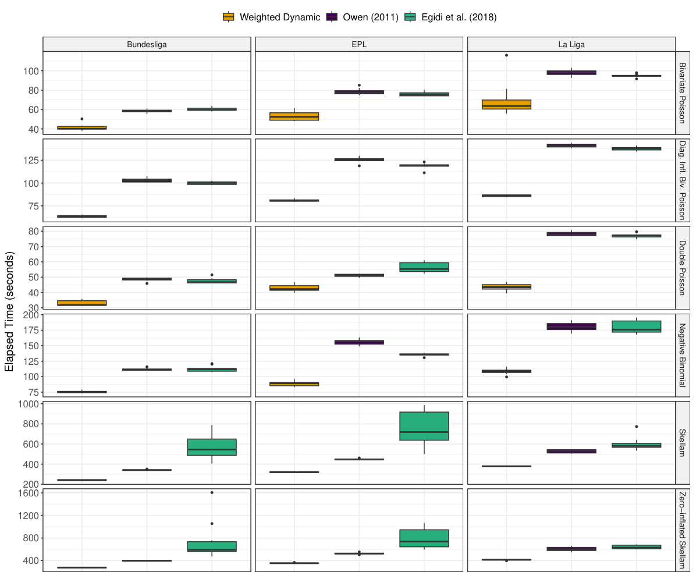

<!-- Start of picture text -->
Weighted Dynamic Owen (2011) Egidi et al. (2018) Bundesliga EPL La Liga 100 80 60 40 125 100 75 80 70 60 50 40 30 200 175 150 125 100 75 1000 800 600 400 200 1600 1200 800 400 Bivariate Poisson Diag. Infl. Biv. Poisson Double Poisson Elapsed Time (seconds) Negative Binomial Skellam Zero−inflated Skellam <!-- End of picture text -->

**Figure 5:** Boxplots of elapsed computation times (in seconds). Results from the proposed weighted dynamic method are shown alongside corresponding values from Owen (2011) and Egidi et al. (2018), all evaluated at the final round of the 2024/2025 season scenario. 

All three fitting methods achieved satisfactory convergence diagnostics for all the evaluated scenarios. In particular, we verified that the MCMC chains for each model and method yielded Gelman-Rubin statistic _𝑅_ˆ (Gelman and Rubin, 1992) very close to 1.00 and large bulk and tail effective sample sizes, indicating stable convergence. Table 5 shows a summary of the convergence metrics of the weighted dynamic method for the final round of the 2024/2025 season scenario. Specifically, the means of the Gelman-Rubin statistic _𝑅_ˆ , bulk and tail effective sample sizes is shown for the _𝜷_att _, 𝜷_def _, 𝝓_ att and _𝝓_ def parameters. This suggests that the substantial computational efficiency of the weighted dynamic approach does not come at the expense of sampler stability or accuracy. Thus, the weighted dynamic model not only provides flexibility for dynamic team-specific parameters, but does so with a lower computational cost. 

Similar analyses on computational time and convergence for the other two predictive scenarios (last three rounds and the second half of the 2024/2025 season) are presented in Figures 6 and 7, as well as Tables 6 and 7.

---

## PDF 第 21 页

[回查原始 PDF 第 21 页](./2025_Macri_足球贝叶斯加权动态模型_arXiv.pdf#page=21)

**Table 5:** MCMC convergence diagnostics: _𝑅_ˆ , bulk and tail effective sample sizes (ESS) mean of the _𝜷_att _, 𝜷_def _, 𝝓_ att and _𝝓_ def parameters for the proposed weighted dynamic method, all evaluated at the final round of the 2024/2025 season scenario. 

||||_𝛽_**att**|||_𝛽_**def**|||_𝜙_**att**|||_𝜙_**def**||
|---|---|---|---|---|---|---|---|---|---|---|---|---|---|
|**League**|**Model**|¯ˆ_𝑅_|**Bulk ESS**|**Tail ESS**|¯ˆ_𝑅_|**Bulk ESS**|**Tail ESS**|¯ˆ_𝑅_|**Bulk ESS**|**Tail ESS**| ¯ˆ_𝑅_|**Bulk ESS**|**Tail ESS**|
|Bundesliga|Bivariate Poisson|1.00|4358|2889|1.00|4482|2960|1.00|2980|2742|1.00|3202|2711|
||Diag. Infl. Biv. Poisson|1.00|4728|3020|1.00|4997|3061|1.00|3882|2940|1.00|4073|3157|
||l Double Poisson|100|4917|3008|100|5085|3012|100|4186|3032|100|4089|2839|
|| Negative Binomial|. 1.00|4036|3225|. 1.00|4993|3101|. 1.00|3658|2960|. 1.00|3878|2900|
|| Skellam Model|100|4772|3550|100|4802|3502|100|3370|3411|100|3431|3187|
|| Zero Infl. Skellam Model|. 1.00|4915|3554|. 1.00|4962|3567|. 1.00|3384|3338|. 1.00|3424|3287|
|EPL|Bivariate Poisson|1.00|4473|2903|1.00|4580|2980|1.00|2948|2671|1.00|3240|2858|
||Diag. Infl. Biv. Poisson |1.00 |4637 |3016 |1.00 |4805 |2983 |1.00 |3462 |2981 |1.00 |3675 |2832 |
||Double Poisson|1.00|4938|2951|1.00|5197|2960|1.00|3888|3114|1.00|3752|2931|
||Negative Binomial Skellam Model|1.00 1.00|3560 4253|3024 3299|1.00 1.00|4824 4344|3004 3312|1.00 1.00|3584 3415|3100 3122|1.00 1.00|3552 3189|3006 2978|
||Zero Infl. Skellam Model|1.00|4478|3370|1.00|4621|3380|1.00|3444|3235|1.00|3244|3074|
|La Liga|Bivariate Poisson|1.00|3898|2818|1.00|4100|2886|1.00|2993|2723|1.00|2933|2627|
||Diag. Infl. Biv. Poisson|1.00|4289|2980|1.00|4583|3027|1.00|3805|2891|1.00|3592|2942|
||Double Poisson|1.00|4655|2942|1.00|4820|2971|1.00|4099|3121|1.00|4100|3035|
||Negative Binomial Skellam Model|1.00 1.00|3059 3683|2917 3168|1.00 1.00|4523 3752|2911 3187|1.00 1.00|3844 3187|2878 2793|1.00 1.00|3615 3170|2887 2978|
||Zero Infl. Skellam Model|1.00|4056|3287|1.00|4062|3263|1.00|3382|3012|1.00|3535|3179|
||||We|ighted Dyn|amic|Owen (20|11) Eg|idi et al|. (2018)|||||
||Bundesliga|||||EPL|||||La Liga|||
|80|||||||||||||Bivariat|
|60|||||||||||||e Poiss|
|40|||||||||||||on|
|125|||||||||||||Diag. Infl.|
|100|||||||||||||Biv.|
|75|||||||||||||Poisson|
|70||||||||||||||
|60 )|||||||||||||Dou|
|50 onds|||||||||||||ble Pois|
|40 (sec|||||||||||||son|
|30 e||||||||||||||
|im||||||||||||||
|150 Elapsed T|||||||||||||Negative Bin|
|100 |||||||||||||omial|
|1000||||||||||||||
|750|||||||||||||Skellam|
|500||||||||||||||
|250||||||||||||||
|1500|||||||||||||Zero−infla|
|1000|||||||||||||ted|
|500|||||||||||||Skellam|

> 表格版面核对：以下截图保留原始单元格关系，合并单元格及复杂表头以截图为准。

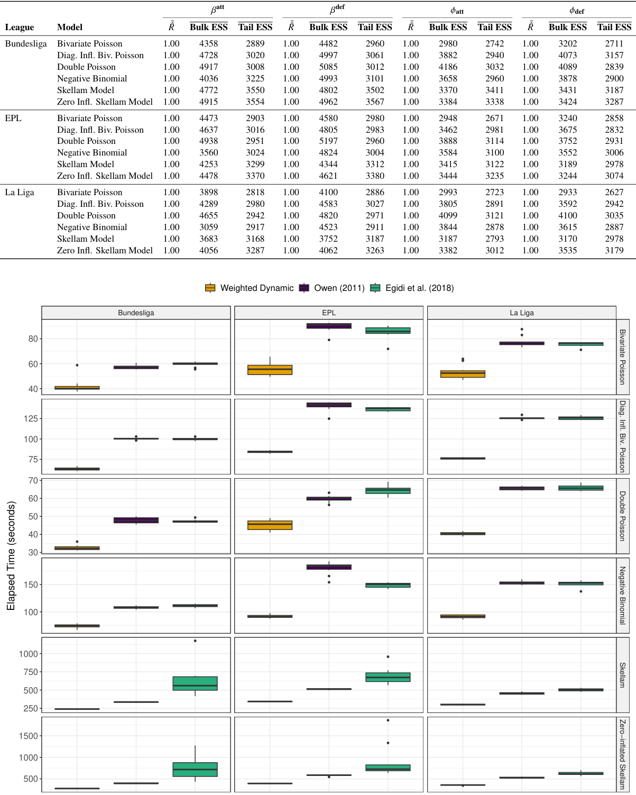

**Figure 6:** Boxplots of elapsed computation times (in seconds). Results from the proposed weighted dynamic method are shown alongside corresponding values from Owen (2011) and Egidi et al. (2018), all evaluated at the last three matches of the 2024/2025 season scenario.

---

## PDF 第 22 页

[回查原始 PDF 第 22 页](./2025_Macri_足球贝叶斯加权动态模型_arXiv.pdf#page=22)

**Table 6:** MCMC convergence diagnostics: _𝑅_ˆ , bulk and tail effective sample sizes (ESS) mean of the _𝜷_att _, 𝜷_def _, 𝝓_ att and _𝝓_ def parameters for the proposed weighted dynamic method, all evaluated at the last three round of the 2024/2025 season scenario. 

||||_𝛽_**att**|||_𝛽_**def**|||_𝜙_**att**|||_𝜙_**def**||
|---|---|---|---|---|---|---|---|---|---|---|---|---|---|
|**League**|**Model**|¯ˆ_𝑅_|**Bulk ESS**|**Tail ESS**|¯ˆ_𝑅_|**Bulk ESS**|**Tail ESS**|¯ˆ_𝑅_|**Bulk ESS**|**Tail ESS**|¯ˆ_𝑅_|**Bulk ESS**|**Tail ESS**|
|Bundesliga|Bivariate Poisson|1.00|4532|2975|1.00|4908|3048|1.00|3206|2813|1.00|3436|3008|
||Diag. Infl. Biv. Poisson|1.00|4722|3046|1.00|4796|3014|1.00|3604|2972|1.00|3830|2987|
||Double Poisson|1.00|5013|3005|1.00|5258|3040|1.00|4058|2998|1.00|4248|3021|
||Negative Binomial|1.00|3709|3111|1.00|5273|3064|1.00|3870|2979|1.00|3984|3023|
||Skellam Model|1.00|4724|3469|1.00|4841|3492|1.00|3308|3214|1.00|3254|2999|
||Zero Infl. Skellam Model|1.00|4788|3552|1.00|4862|3557|1.00|3364|3254|1.00|3481|3337|
|EPL|Bivariate Poisson|1.00|4302|2885|1.00|4413|2920|1.00|3079|2829|1.00|3002|2832|
||Diag. Infl. Biv. Poisson|1.00|4635|2990|1.00|4785|2989|1.00|3434|3057|1.00|3529|2957|
||Double Poisson|1.00|4868|2978|1.00|5008|2964|1.00|3647|2841|1.00|3939|2914|
||Negative Binomial|1.00|3536|3022|1.00|4705|2963|1.00|3540|2868|1.00|3427|2675|
||Skellam Model|1.00|4643|3447|1.00|4781|3457|1.00|3456|3226|1.00|3390|3116|
||Zero Infl. Skellam Model|1.00|4628|3409|1.00|4772|3440|1.00|3241|3206|1.00|3338|3084|
|La Liga|Bivariate Poisson|1.00|4129|2888|1.00|4026|2884|1.00|2894|2843|1.00|3037|2710|
||Diag. Infl. Biv. Poisson|1.00|4451|3016|1.00|4584|3000|1.00|3753|2999|1.00|3651|2940|
||Double Poisson|1.00|4839|2969|1.00|4863|2938|1.00|4056|2887|1.00|4029|2939|
||Negative Binomial|1.00|2873|2821|1.00|4283|2892|1.00|3862|2964|1.00|3562|2886|
||Skellam Model|1.00|4210|3303|1.00|4288|3292|1.00|3592|3101|1.00|3450|2919|
||Zero Infl. Skellam Model|1.00|4259|3307|1.00|4342|3317|1.00|3221|3005|1.00|3289|2957|

> 表格版面核对：以下截图保留原始单元格关系，合并单元格及复杂表头以截图为准。

**Table 7:** MCMC convergence diagnostics: _𝑅_ˆ , bulk and tail effective sample sizes (ESS) mean of the _𝜷_att _, 𝜷_def _, 𝝓_ att and _𝝓_ def parameters for the proposed weighted dynamic method, all evaluated at the second half of the 2024/2025 season scenario. 

||||_𝛽_**att**|||_𝛽_**def**|||_𝜙_**att**|||_𝜙_**def**||
|---|---|---|---|---|---|---|---|---|---|---|---|---|---|
|**League**|**Model**|¯ˆ_𝑅_|**Bulk ESS**|**Tail ESS**|¯ˆ_𝑅_|**Bulk ESS**|**Tail ESS**|¯ˆ_𝑅_|**Bulk ESS**|**Tail ESS**|¯ˆ_𝑅_|**Bulk ESS**|**Tail ESS**|
|Bundesliga|Bivariate Poisson|1.00|4980|3057|1.00|5358|3135|1.00|3225|2945|1.00|3584|2998|
||Diag. Infl. Biv. Poisson|1.00|4784|3157|1.00|4949|3128|1.00|3602|2981|1.00|3552|2974|
||Double Poisson|1.00|5298|3158|1.00|5502|3181|1.00|4151|3136|1.00|4194|3099|
||Negative Binomial|1.00|4517|3365|1.00|5063|3218|1.00|3877|3129|1.00|3789|3151|
||Skellam Model|1.00|4736|3501|1.00|4811|3536|1.00|3495|3385|1.00|3410|3324|
||Zero Infl. Skellam Model|1.00|4830|3592|1.00|4832|3562|1.00|3432|3372|1.00|3383|3340|
|EPL|Bivariate Poisson|1.00|4894|2994|1.00|5053|2971|1.00|3152|2855|1.00|3205|2841|
||Diag. Infl. Biv. Poisson|1.00|5361|3112|1.00|5581|3096|1.00|3831|3102|1.00|3856|3145|
||Double Poisson|1.00|5288|3017|1.00|5561|3023|1.00|3968|3003|1.00|3855|3083|
||Negative Binomial|1.00|4330|3294|1.00|5161|3199|1.00|3605|2939|1.00|3642|3191|
||Skellam Model|1.00|4707|3432|1.00|4828|3475|1.00|3403|3192|1.00|3430|3147|
||Zero Infl. Skellam Model|1.00|4610|3374|1.00|4722|3407|1.00|3358|3199|1.00|3299|3062|
|La Liga|Bivariate Poisson|1.00|3898|2818|1.00|4100|2886|1.00|2993|2723|1.00|2993|2627|
||Diag. Infl. Biv. Poisson|1.00|4289|2980|1.00|4583|3027|1.00|3805|2891|1.00|3592|2947|
||Double Poisson|1.00|4655|2942|1.00|4820|2971|1.00|3491|3221|1.00|3509|3045|
||Negative Binomial|1.00|3059|2917|1.00|4523|2911|1.00|3844|2878|1.00|3615|2887|
||Skellam Model|1.00|3683|3168|1.00|3752|3187|1.00|3187|2793|1.00|3170|2978|
||Zero Infl. Skellam Model|1.00|4056|3287|1.00|4062|3263|1.00|3382|3012|1.00|3535|3179|

> 表格版面核对：以下截图保留原始单元格关系，合并单元格及复杂表头以截图为准。

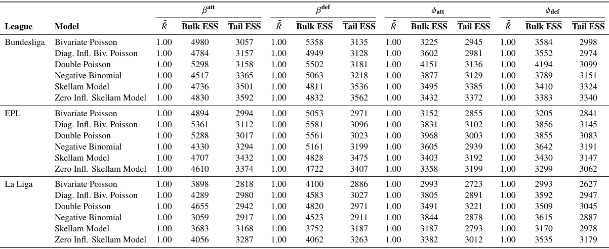

---

## PDF 第 23 页

[回查原始 PDF 第 23 页](./2025_Macri_足球贝叶斯加权动态模型_arXiv.pdf#page=23)

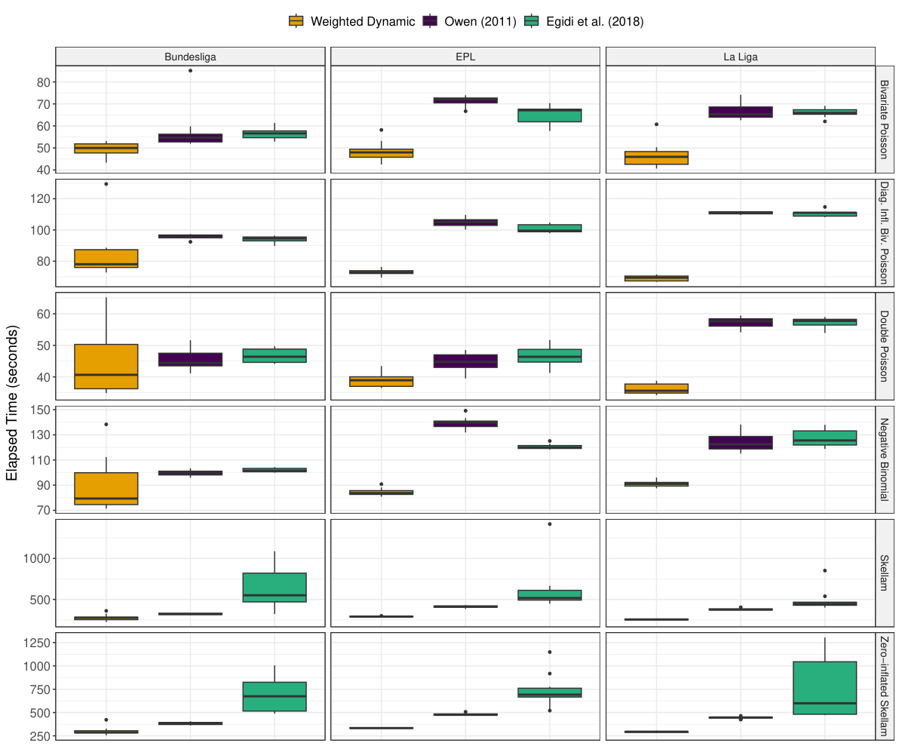

<!-- Start of picture text -->
Weighted Dynamic Owen (2011) Egidi et al. (2018) Bundesliga EPL La Liga 80 70 60 50 40 120 100 80 60 50 40 150 130 110 90 70 1000 500 1250 1000 750 500 250 Bivariate Poisson Diag. Infl. Biv. Poisson Double Poisson Elapsed Time (seconds) Negative Binomial Skellam Zero−inflated Skellam <!-- End of picture text -->

**Figure 7:** Boxplots of elapsed computation times (in seconds). Results from the proposed weighted dynamic method are shown alongside corresponding values from Owen (2011) and Egidi et al. (2018), all evaluated at the second half of the 2024/2025 season scenario. 

## **References** 

- Alt, E. M., Chen, X., Carvalho, L. M., and Ibrahim, J. G. (2025). hdbayes: An R package for Bayesian analysis of generalized linear models using historical data. _arXiv preprint arXiv:2506.20060_ . 

- Baio, G. and Blangiardo, M. (2010). Bayesian hierarchical model for the prediction of football results. _Journal of Applied Statistics_ , 37(2):253–264. 

- Breiman, L. (2001). Random forests. _Machine Learning_ , 45(1):5–32. 

- Brier, G. W. (1950). Verification of forecasts expressed in terms of probability. _Monthey Weather Review,_ , 78(1):1–3. 

- Carpenter, B., Gelman, A., Hoffman, M. D., Lee, D., Goodrich, B., Betancourt, M., Brubaker, M., Guo, J., Li, P., and Riddell, A. (2017). Stan: A probabilistic programming language. _Journal of Statistical Software_ , 76(1):1–32.

---

## PDF 第 24 页

[回查原始 PDF 第 24 页](./2025_Macri_足球贝叶斯加权动态模型_arXiv.pdf#page=24)

- Carpita, M., Ciavolino, E., and Pasca, P. (2019). Exploring and modelling team performances of the Kaggle European soccer database. _Statistical Modelling_ , 19(1):74–101. 

- Carpita, M., Sandri, M., Simonetto, A., and Zuccolotto, P. (2015). Discovering the drivers of football match outcomes with data mining. _Quality Technology & Quantitative Management_ , 12(4):561–577. 

- Chen, N., Carlin, B. P., and Hobbs, B. P. (2018). Web-based statistical tools for the analysis and design of clinical trials that incorporate historical controls. _Computational Statistics & Data Analysis_ , 127:50–68. 

- Dixon, M. J. and Coles, S. G. (1997). Modelling association football scores and inefficiencies in the football betting market. _Journal of the Royal Statistical Society: Series C (Applied Statistics)_ , 46(2):265–280. 

- Dobson, S., Goddard, J. A., and Dobson, S. (2001). _The economics of football_ , volume 10. Cambridge University Press Cambridge. 

- Egidi, L., Macr`ı-Demartino, R., and Palaskas., V. (2025). _footBayes: Fitting Bayesian and MLE Football Models_ . R package version 2.1.0. 

- Egidi, L., Pauli, F., and Torelli, N. (2018). Combining historical data and bookmakers’ odds in modelling football scores. _Statistical Modelling_ , 18(5-6):436–459. 

- Egidi, L. and Torelli, N. (2021). Comparing goal-based and result-based approaches in modelling football outcomes. _Social Indicators Research_ , 156(2):801–813. 

- Epstein, E. S. (1969). A scoring system for probability forecasts of ranked categories. _Journal of Applied Meteorology (1962-1982)_ , 8(6):985–987. 

- Gelman, A. (2006). Prior distributions for variance parameters in hierarchical models (comment on article by Browne and Draper). _Bayesian Analysis_ , 1(3):515–534. 

- Gelman, A., Jakulin, A., Pittau, M. G., and Su, Y.-S. (2008). A weakly informative default prior distribution for logistic and other regression models. _The Annals of Applied Statistics_ , 2(4):1360 – 1383. 

- Gelman, A. and Rubin, D. B. (1992). Inference from iterative simulation using multiple sequences. _Statistical science_ , 7(4):457–472. 

- Groll, A. and Abedieh, J. (2013). Spain retains its title and sets a new record – generalized linear mixed models on European football championships. _Journal of Quantitative Analysis in Sports_ , 9(1):51–66. 

- Groll, A., Cristophe, L., Hans, V. E., and Gunther, S. (2019a). A hybrid random forest to predict soccer matches in international tournaments. _Journal of Quantitative Analysis in Sports_ , 15(4):271–287. 

- Groll, A., Hvattum, L. M., Ley, C., Popp, F., Schauberger, G., Van Eetvelde, H., and Zeileis, A. (2021). Hybrid machine learning forecasts for the UEFA EURO 2020. _arXiv preprint arXiv:2106.05799_ . 

- Groll, A., Hvattum, L. M., Ley, C., Sternemann, J., Schauberger, G., and Zeileis, A. (2024). Modeling and prediction of the uefa euro 2024 via combined statistical learning approaches. _arXiv preprint arXiv:2410.09068_ . 

- Groll, A., Ley, C., Schauberger, G., Van Eetvelde, H., and Zeileis, A. (2019b). Hybrid machine learning forecasts for the fifa women’s world cup 2019. _arXiv preprint arXiv:1906.01131_ .

---

## PDF 第 25 页

[回查原始 PDF 第 25 页](./2025_Macri_足球贝叶斯加权动态模型_arXiv.pdf#page=25)

- Hobbs, B. P., Carlin, B. P., Mandrekar, S. J., and Sargent, D. J. (2011). Hierarchical commensurate and power prior models for adaptive incorporation of historical information in clinical trials. _Biometrics_ , 67(3):1047–1056. 

- Hobbs, B. P., Sargent, D. J., and Carlin, B. P. (2012). Commensurate priors for incorporating historical information in clinical trials using general and generalized linear models. _Bayesian Analysis_ , 7(3):639–674. 

- Hong, H., Fu, H., and Carlin, B. P. (2018). Power and commensurate priors for synthesizing aggregate and individual patient level data in network meta-analysis. _Journal of the Royal Statistical Society Series C: Applied Statistics_ , 67(4):1047–1069. 

- Karlis, D. and Ntzoufras, I. (2003). Analysis of sports data by using bivariate Poisson models. _Journal of the Royal Statistical Society: Series D (The Statistician)_ , 52(3):381–393. 

- Karlis, D. and Ntzoufras, I. (2009). Bayesian modelling of football outcomes: using the Skellam’s distribution for the goal difference. _IMA Journal of Management Mathematics_ , 20(2):133–145. 

- Koning, R. H. (2000). Balance in competition in Dutch soccer. _Journal of the Royal Statistical Society: Series D (The Statistician)_ , 49(3):419–431. 

- Koopman, S. J. and Lit, R. (2015). A dynamic bivariate Poisson model for analysing and forecasting match results in the English Premier League. _Journal of the Royal Statistical Society. Series A (Statistics in Society)_ , 178(1):167–186. 

- Koopman, S. J. and Lit, R. (2019). Forecasting football match results in national league competitions using score-driven time series models. _International Journal of Forecasting_ , 35(2):797–809. 

- Macr`ı Demartino, R., Egidi, L., and Torelli, N. (2025). Alternative ranking measures to predict international football results. _Computational Statistics_ , 40(4):1899–1917. 

- Maher, M. J. (1982). Modelling association football scores. _Statistica Neerlandica_ , 36(3):109–118. 

- Mitchell, T. J. and Beauchamp, J. J. (1988). Bayesian variable selection in linear regression. _Journal of the american statistical association_ , 83(404):1023–1032. 

- Murray, T. A., Hobbs, B. P., and Carlin, B. P. (2015). Combining nonexchangeable functional or survival data sources in oncology using generalized mixture commensurate priors. _The annals of applied statistics_ , 9(3):1549. 

- Ntzoufras, I. (2011). _Bayesian Modeling Using WinBUGS_ , volume 698. John Wiley & Sons, Hoboken, New Jersey, USA. 

- Ouma, L. O., Grayling, M. J., Wason, J. M., and Zheng, H. (2022). Bayesian modelling strategies for borrowing of information in randomised basket trials. _Journal of the Royal Statistical Society Series C: Applied Statistics_ , 71(5):2014–2037. 

- Owen, A. (2011). Dynamic Bayesian forecasting models of football match outcomes with estimation of the evolution variance parameter. _IMA Journal of Management Mathematics_ , 22(2):99–113.

---

## PDF 第 26 页

[回查原始 PDF 第 26 页](./2025_Macri_足球贝叶斯加权动态模型_arXiv.pdf#page=26)

- Pocock, S. J. (1976). The combination of randomized and historical controls in clinical trials. _Journal of chronic diseases_ , 29(3):175–188. 

- R Core Team (2025). _R: A Language and Environment for Statistical Computing_ . R Foundation for Statistical Computing, Vienna, Austria. 

- Reep, C., Pollard, R., and Benjamin, B. (1971). Skill and chance in ball games. _Journal of the Royal Statistical Society Series A: Statistics in Society_ , 134(4):623–629. 

- Rue, H. and Øyvind Salvesen (2000). Prediction and retrospective analysis of soccer matches in a league. _Journal of the Royal Statistical Society. Series D (The Statistician)_ , 49(3):399–418. 

- Schauberger, G. and Groll, A. (2018). Predicting matches in international football tournaments with random forests. _Statistical Modelling_ , 18(5-6):460–482. 

- Skellam, J. G. (1946). The frequency distribution of the difference between two Poisson variates belonging to different populations. _Journal of the Royal Statistical Society Series A: Statistics in Society_ , 109(3):296–296. 

- Spiegelhalter, D. and Ng, Y.-L. (2009). One match to go! _Significance_ , 6(4):151–153. 

- Zheng, H. and Wason, J. M. (2022). Borrowing of information across patient subgroups in a basket trial based on distributional discrepancy. _Biostatistics_ , 23(1):120–135.

---

## 转换附录：作者 HTML 公式补充

> 以下为同一 arXiv 版本 HTML 的原始 LaTeX。由于部分公式无编号或 PDF 布局切分不同，未自动定位到逐页正文；此附录是转换补充，不是论文新增结论。公式样式以 PDF 为准。

### S2.Ex1

[作者 HTML 原式](https://arxiv.org/html/2508.05891v1#S2.Ex1)

$$
\displaystyle\log\left(\lambda_{3,n}\right) \displaystyle=\eta_{0}.
$$

### S2.Ex2

[作者 HTML 原式](https://arxiv.org/html/2508.05891v1#S2.Ex2)

$$
X_{i,n}\sim\mathrm{NB}(\lambda_{1,n},\gamma),\quad Y_{j,n}\sim\mathrm{NB}(\lambda_{2,n},\gamma),
$$

### S2.EGx1

[作者 HTML 原式](https://arxiv.org/html/2508.05891v1#S2.EGx1)

$$
\displaystyle Z_{n}=X_{i,n}-Y_{j,n}.
$$

### S2.Ex4

[作者 HTML 原式](https://arxiv.org/html/2508.05891v1#S2.Ex4)

$$
\mathbb{P}_{X_{i,n},Y_{j,n}}(x_{i,n},y_{j,n})=\begin{cases}(1-\omega)\operatorname{BP}\left(\lambda_{1,n},\lambda_{2.n},\lambda_{3.n}\right)&\text{ if }x_{i,n}\neq y_{j,n}\\
(1-\omega)\operatorname{BP}\left(\lambda_{1,n},\lambda_{2,n},\lambda_{3,n}\right)+\omega D(x_{n},\xi)&\text{ if }x_{i,n}=y_{j,n}\end{cases},
$$

### S2.Ex5

[作者 HTML 原式](https://arxiv.org/html/2508.05891v1#S2.Ex5)

$$
\mathbb{P}_{Z_{n}}(z_{n})=\begin{cases}(1-\omega)\operatorname{SM}\left(\lambda_{1,n},\lambda_{2,n}\right)&\text{ if }z_{n}\neq 0\\
(1-\omega)\operatorname{SM}\left(\lambda_{1,n},\lambda_{2,n}\right)+\omega D(0,\xi)&\text{ if }z_{n}=0\end{cases},
$$

### S4.Ex6

[作者 HTML 原式](https://arxiv.org/html/2508.05891v1#S4.Ex6)

$$
\displaystyle\phi_{\text{att},\tau},\phi_{\text{def},\tau}\mid p_{l} \displaystyle\sim\mathrm{N}^{+}(100,0.1)\times(1-p_{l})+\mathrm{N}^{+}(0,5)\times p_{l},
$$

### S4.EGx2

[作者 HTML 原式](https://arxiv.org/html/2508.05891v1#S4.EGx2)

$$
\displaystyle\sigma,\sigma_{\text{att}},\sigma_{\text{def}}\sim\text{Cauchy}^{+}(0,5),
$$

### S4.EGx3

[作者 HTML 原式](https://arxiv.org/html/2508.05891v1#S4.EGx3)

$$
\displaystyle\text{home}\sim\mathrm{N}(0,5).
$$

### S4.EGx4

[作者 HTML 原式](https://arxiv.org/html/2508.05891v1#S4.EGx4)

$$
\displaystyle p(\tilde{\mathcal{D}}|\mathcal{D})=\int p(\tilde{\mathcal{D}}|\bm{\theta})\pi(\bm{\theta}|\mathcal{D})d\bm{\theta}.
$$

### S4.Ex10

[作者 HTML 原式](https://arxiv.org/html/2508.05891v1#S4.Ex10)

$$
\text{Brier}=\frac{1}{M}\sum_{m=1}^{M}\sum_{r=1}^{3}(p_{r,m}-\delta_{r,m})^{2},
$$

### S4.EGx5

[作者 HTML 原式](https://arxiv.org/html/2508.05891v1#S4.EGx5)

$$
\displaystyle\text{ACP}=\frac{1}{M}\sum_{m=1}^{M}p_{o,m},
$$

### A1.EGx6

[作者 HTML 原式](https://arxiv.org/html/2508.05891v1#A1.EGx6)

$$
\displaystyle\text{RPS}=\frac{1}{3-1}\sum_{r=1}^{3-1}\left(\sum_{l=1}^{r}p_{l,m}-\sum_{l=1}^{r}\delta_{l,m}\right)^{2}.
$$

### A1.EGx7

[作者 HTML 原式](https://arxiv.org/html/2508.05891v1#A1.EGx7)

$$
\displaystyle\text{Pseudo-R}^{2}=\Bigl(\prod_{m=1}^{M}p_{o,m}\Bigr)^{1/M}.
$$
